# dima6312/gr8hopper Wiki

Version: 1

## Overview

### Home

<details>
<summary>Relevant source files</summary>
The following files were used as context for generating this wiki page:

- [README.md](https://github.com/dima6312/gr8hopper/blob/main/README.md)
- [package.json](https://github.com/dima6312/gr8hopper/blob/main/package.json)
- [src/index.ts](https://github.com/dima6312/gr8hopper/blob/main/src/index.ts)
- [src/server.ts](https://github.com/dima6312/gr8hopper/blob/main/src/server.ts)
- [src/admin-html.ts](https://github.com/dima6312/gr8hopper/blob/main/src/admin-html.ts)
- [CONTRIBUTING.md](https://github.com/dima6312/gr8hopper/blob/main/CONTRIBUTING.md)
- [SECURITY.md](https://github.com/dima6312/gr8hopper/blob/main/SECURITY.md)
</details>

# Home

`gr8hopper` is a lightweight, performance-first URL redirect service designed to handle complex, parameter-driven routing logic. It provides a simple admin UI to manage redirect routes and can be deployed to high-performance edge environments like Cloudflare Workers or self-hosted on any VPS using Node.js, Bun, or Docker. The core strength of `gr8hopper` is centralizing dynamic redirect logic, allowing for clean source data in CRMs or contact lists while the service handles the complex routing.

Built on the Hono web framework, `gr8hopper` has a minimal footprint and is optimized for speed, primarily through an aggressive caching strategy. While powerful enough for advanced scenarios, its simplicity also makes it an excellent general-purpose redirector.

Sources: [README.md:7-21](), [package.json:10-11]()

## Core Features

| Feature | Description |
| :--- | :--- |
| **Admin UI** | A self-contained, responsive web interface for adding, editing, deleting, and managing redirect routes and global settings. Sources: [README.md:23](), [src/admin-html.ts]() |
| **Parameter Rewriting** | Dynamically substitutes placeholders in the destination URL (e.g., `{param}`) with values from the source URL's query parameters or path segments. Sources: [README.md:24]() |
| **Pattern Routes** | Supports advanced route matching using wildcards (`*`, `**`), named parameters (`:param`, `{param}`), and query string patterns. Sources: [README.md:106-112]() |
| **Edge Efficiency** | Designed for edge deployment on Cloudflare Workers, leveraging aggressive `301` caching to serve subsequent requests directly from the CDN edge, minimizing code execution. Sources: [README.md:25](), [README.md:214-216]() |
| **Standalone Deployment** | Can be deployed as a self-contained service on a VPS via Node.js, Bun, or a provided Docker image. Sources: [README.md:26](), [src/server.ts]() |
| **Minimal Footprint** | Built on the zero-dependency, lightweight Hono web framework, ensuring fast startup and low resource usage. Sources: [README.md:27]() |

## Architecture Overview

`gr8hopper` is built with a flexible architecture that supports two primary deployment targets: serverless (Cloudflare Workers) and traditional servers (VPS/Docker). This is achieved through separate entry points that share common handlers, storage adapters, and middleware.

Sources: [CONTRIBUTING.md:32-40](), [README.md:281-298]()

This diagram illustrates the high-level project structure.

```mermaid
graph TD
    subgraph "Entry Points"
        A1[src/index.ts<br>(Cloudflare Workers)]
        A2[src/server.ts<br>(Node.js/VPS)]
    end

    subgraph "Core Logic"
        B1[Handlers<br>(redirect.ts, admin.ts)]
        B2[Middleware<br>(auth.ts)]
    end

    subgraph "Data Storage"
        C1[Storage Adapter Interface<br>(adapter.ts)]
        C2[KVAdapter<br>(kv.ts)]
        C3[JsonFileAdapter<br>(json-file.ts)]
    end

    D[Hono Framework]

    A1 --> D
    A2 --> D
    D --> B1
    D --> B2
    B1 --> C1
    C1 --> C2
    C1 --> C3
```

### Deployment Environments

#### Cloudflare Workers
This is the recommended environment for production due to its performance and scalability.

-   **Entry Point**: `src/index.ts`
-   **Storage**: Uses Cloudflare KV via the `KVAdapter`. Route and settings data is stored in a globally distributed key-value store.
-   **Initialization**: Handlers and configuration are initialized on the first request to a worker instance (cold start) and then cached for subsequent requests to improve performance.
-   **Security**: Admin credentials and Cloudflare API tokens are managed securely using Wrangler secrets.

Sources: [src/index.ts:13-48](), [README.md:329-332]()

The following diagram shows the request flow for a Cloudflare Worker deployment.

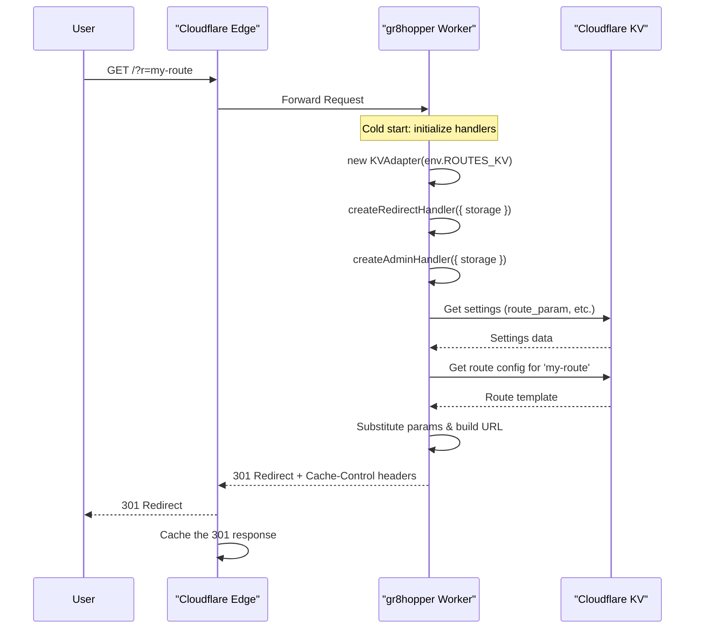
Sources: [src/index.ts:19-79](), [README.md:65-83]()

#### VPS (Node.js/Docker)
This environment is for self-hosting the service on a virtual private server.

-   **Entry Point**: `src/server.ts`
-   **Storage**: Uses a local JSON file (`routes.json` by default) via the `JsonFileAdapter`. The location is configurable with the `CONFIG_FILE` environment variable.
-   **Server**: Uses `@hono/node-server` to run the Hono application.
-   **Security**: Admin credentials must be provided via `ADMIN_USERNAME` and `ADMIN_PASSWORD` environment variables. The application will exit on startup if they are not set. The username 'admin' is explicitly rejected for security.

Sources: [src/server.ts:1-150](), [README.md:371-379]()

### Redirect Logic
The core function of `gr8hopper` is to process an incoming request, find a matching route, and issue a `301` redirect to a dynamically constructed destination URL.

This diagram shows the redirect decision flow.

```mermaid
flowchart TD
    A[Request Received<br>/?r=partner-a&id=123] --> B{Edge Cache Hit?}
    B -- Yes --> C[Return Cached 301<br>(<1ms)]
    B -- No --> D[Lookup Route Config<br>ID: 'partner-a']
    D --> E[Found Route?]
    E -- Yes --> F[Substitute Placeholders<br>template: site.com/{id}<br>params: {id: '123'}]
    F --> G[Construct Final URL<br>site.com/123]
    G --> H[Return 301 Redirect<br>& Cache Response]
    E -- No --> I[Redirect to Fallback URL]
    H --> J[Response Sent]
    C --> J
    I --> J
```
Sources: [README.md:65-83]()

#### Template Placeholders
The destination URL `template` can contain placeholders in the format `{param}` which are replaced by values from the incoming request.

| Placeholder | Source | Example |
| :--- | :--- | :--- |
| `{route}` | The ID of the matched route (URL-encoded). | `partner-a` |
| `{anyParam}` | A URL query parameter from the source request. | `?anyParam=value` |
| `{*}` | A wildcard path segment from a pattern route. | `/files/image.jpg` -> `{*: 'image.jpg'}` |

Missing placeholders are intentionally left as-is in the final URL to make configuration errors visible.

Sources: [README.md:96-104]()

#### Query Parameter Passthrough
If a route has `passthrough: true`, all query parameters from the source URL (e.g., UTM tags) are appended to the destination URL. This is an opt-in feature. Parameters already defined in the destination template take precedence.

Sources: [README.md:162-171]()

## Admin Panel
The admin panel is a single-page application embedded directly into the binary, accessible at the `/admin` path (or a custom path set by `ADMIN_PATH`). It provides full management of routes and settings.

Sources: [src/admin-html.ts:1-6](), [README.md:195-202]()

### API Endpoints
The admin panel communicates with the backend via a set of RESTful API endpoints. All admin endpoints are protected by HTTP Basic Authentication.

Sources: [README.md:204-212](), [src/server.ts:129-131](), [src/index.ts:70-75]()

| Method | Endpoint | Description |
| :--- | :--- | :--- |
| `GET` | `/admin/routes` | List all routes. |
| `GET` | `/admin/routes/:id` | Get a single route by its ID. |
| `POST` | `/admin/routes` | Create a new route. |
| `PUT` | `/admin/routes/:id` | Update an existing route. |
| `DELETE` | `/admin/routes/:id` | Delete a route. |
| `GET` | `/admin/settings` | Get global settings. |
| `PUT` | `/admin/settings` | Update global settings. |
| `GET` | `/admin/export` | Export all routes and settings as a JSON file. |
| `POST` | `/admin/import` | Import routes and settings from a JSON file, replacing all existing data. |

## Configuration

### Environment Variables
The application is configured using environment variables, which differ slightly between deployment platforms.

| Variable | Default | Platform | Description |
| :--- | :--- | :--- | :--- |
| `PORT` | `3000` | VPS | HTTP server port. |
| `CONFIG_FILE` | `./routes.json` | VPS | Path to the JSON file for storing routes. |
| `ADMIN_USERNAME` | **(required)** | Both | Admin panel username. Cannot be 'admin'. |
| `ADMIN_PASSWORD` | **(required)** | Both | Admin panel password. |
| `ADMIN_PATH` | `admin` | Both | URL path for the admin panel. |
| `CLOUDFLARE_API_TOKEN` | (optional) | CF Workers | API token for purging the Cloudflare cache. |
| `CLOUDFLARE_ZONE_ID` | (optional) | CF Workers | Zone ID for purging the Cloudflare cache. |

Sources: [README.md:186-193](), [src/server.ts:60-63, 110-117](), [src/index.ts:43-46]()

### Route Schema
Each redirect is defined by a route object with the following structure.

| Field | Type | Required | Description |
| :--- | :--- | :--- | :--- |
| `id` | string | Yes | The unique identifier for the route, which can be a simple string or a path pattern. |
| `template` | string | Yes | The target URL, which can include `{param}` placeholders. |
| `active` | boolean | Yes | Toggles whether the redirect is enabled or disabled. |
| `passthrough` | boolean | No | If true, appends query parameters from the source URL to the destination. Defaults to `false`. |

Sources: [README.md:88-94]()

### Global Settings
These settings apply to the entire service and are managed in the admin panel.

| Field | Type | Default | Description |
| :--- | :--- | :--- | :--- |
| `fallback_url` | string | `/not-found` | URL to redirect to when no matching route is found. |
| `cache_ttl` | number | `604800` | Browser cache duration in seconds (1 week). |
| `route_param` | string | `r` | The query parameter name used for simple route selection (e.g., `?r=my-route`). |

Sources: [README.md:173-178]()

## Security
Security is a critical aspect of `gr8hopper`.

-   **Authentication**: The admin panel and its API are protected by HTTP Basic Authentication. `ADMIN_USERNAME` and `ADMIN_PASSWORD` are mandatory environment variables.
-   **Transport Security**: Production deployments must use HTTPS to protect credentials in transit.
-   **Input Validation**: Route IDs are sanitized, and destination URL templates are validated to block dangerous schemes like `javascript:`.
-   **Rate Limiting**: It is recommended to configure rate limiting on the `/admin` path at the CDN or reverse proxy level to prevent brute-force attacks.

Sources: [SECURITY.md:14-20, 48-53](), [README.md:465-489](), [src/server.ts:66-89]()

## Development and Contribution
The project uses TypeScript and can be developed locally for either Cloudflare Workers or Node.js environments.

-   **Dependencies**: Managed with `npm`. Key dependencies include `hono` and `@hono/node-server`.
-   **Local Development**:
    -   `npm run dev`: Starts a local development server for Cloudflare Workers using `wrangler`.
    -   `npm run dev:node`: Starts a local development server for Node.js using `tsx`.
-   **Code Style**: The project enforces a strict TypeScript configuration and consistent code style. JSDoc comments are used for public functions.

Sources: [CONTRIBUTING.md:5-29](), [package.json:12-15]()

### gr8hopper vs. Other Tools

<details>
<summary>Relevant source files</summary>
The following files were used as context for generating this wiki page:

- [CONTRIBUTING.md](https://github.com/dima6312/gr8hopper/blob/main/CONTRIBUTING.md)
- [README.md](https://github.com/dima6312/gr8hopper/blob/main/README.md)
- [package.json](https://github.com/dima6312/gr8hopper/blob/main/package.json)
- [SECURITY.md](https://github.com/dima6312/gr8hopper/blob/main/SECURITY.md)
- [src/admin-html.ts](https://github.com/dima6312/gr8hopper/blob/main/src/admin-html.ts)
- [src/server.ts](https://github.com/dima6312/gr8hopper/blob/main/src/server.ts)
- [src/index.ts](https://github.com/dima6312/gr8hopper/blob/main/src/index.ts)
</details>

# gr8hopper vs. Other Tools

## Introduction

`gr8hopper` is a lightweight, performance-first URL redirect service designed specifically to handle complex, parameter-driven routing logic. Its primary purpose is to centralize and simplify redirection scenarios where traffic must be routed to numerous destinations based on dynamic URL parameters. This focus distinguishes it from general-purpose URL shorteners or comprehensive SaaS marketing platforms.

While excelling in advanced use cases, its minimal footprint, simple UI, and high performance on edge infrastructure also make it a strong choice for general-purpose redirection. It is ideal for users who need flexible, self-hosted routing without the overhead of analytics, click-tracking, and other features found in larger tools. Conversely, it is not intended to replace platforms like Bitly or Rebrandly for users who require full SaaS analytics suites.

*Sources: [README.md:12-29]()*

## Core Differentiators

### Parameter-Driven and Pattern-Based Routing

The core feature that sets `gr8hopper` apart is its advanced routing engine. Unlike basic shorteners that map a single short URL to a single long URL, `gr8hopper` uses templates and patterns to dynamically construct destination URLs.

*Sources: [README.md:12-14]()*

#### Key Routing Capabilities:

*   **Parameter Substitution**: `gr8hopper` can take query parameters from a source URL and substitute them into the destination template using `{placeholder}` syntax.
*   **Pattern Routes**: Route IDs can be defined as patterns to match against the request path, capturing segments for use in the destination URL.
*   **Query Parameter Passthrough**: An optional `passthrough` flag allows all non-captured query parameters (like UTM tags) from the source request to be appended to the destination URL.

*Sources: [README.md:104-113, 116-131, 163-172]()*

The following diagram illustrates the relationship between a request, a route definition, and the final redirected URL.

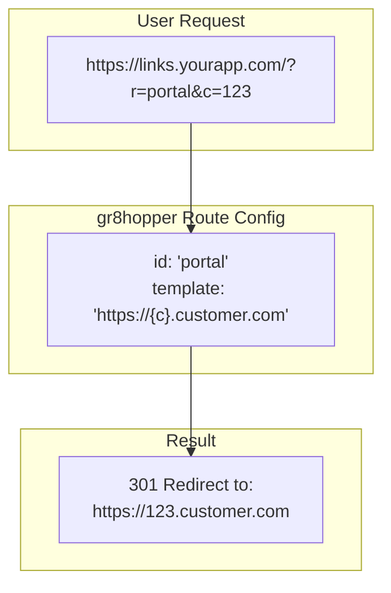
This diagram shows how a request to `gr8hopper` with route `portal` and parameter `c=123` is mapped to a dynamic customer domain.
*Sources: [README.md:21-25, 93-102]()*

### Architectural Simplicity and Minimal Footprint

`gr8hopper` is built on the [Hono](https://hono.dev/) web framework, which is known for being ultra-lightweight and having zero dependencies. This results in a minimal application footprint, making it fast and efficient.

*Sources: [README.md:44](), [package.json:56-57]()*

| Aspect | gr8hopper | Other Tools (e.g., Shlink) |
| :--- | :--- | :--- |
| **Framework** | Hono (zero-dependency) | Heavier frameworks (e.g., Symfony/Laravel) |
| **Dependencies** | Minimal (`hono`, `@hono/node-server`) | Heavy (ORM, multiple libraries) |
| **State** | Stateless (logic only) | Stateful (requires database for clicks/visits) |
| **Focus** | High-performance routing | Full link management with analytics |

*Sources: [README.md:48-53](), [package.json:56-57]()*

The following diagram shows the simple component architecture of `gr8hopper`.

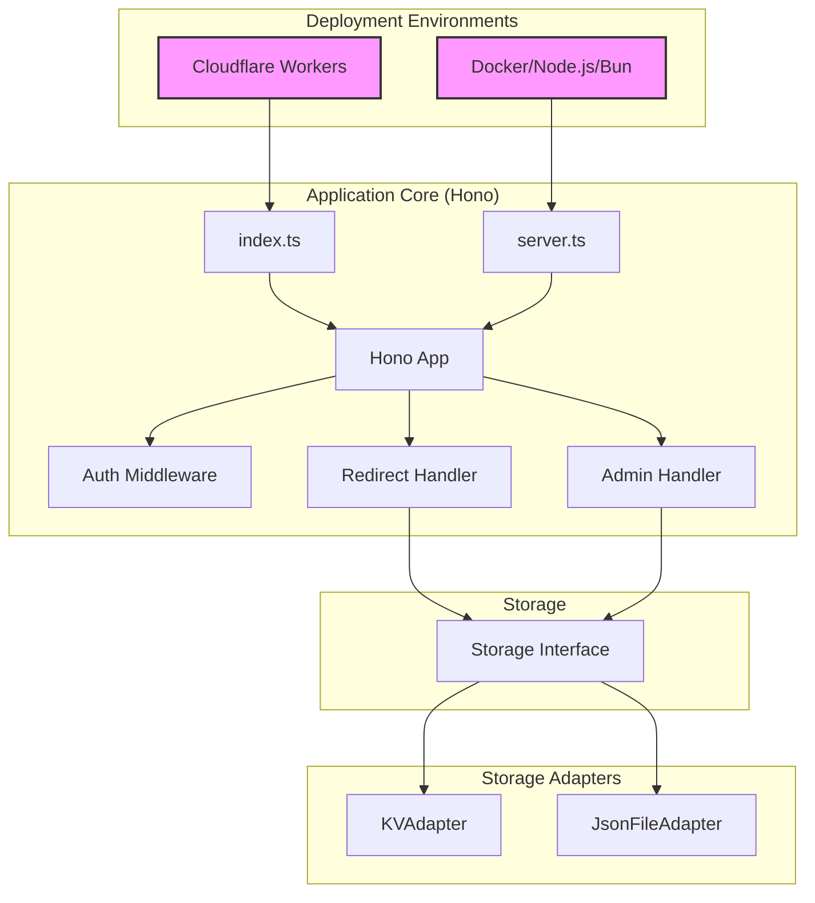
This diagram shows the two main entry points (`index.ts` for Cloudflare, `server.ts` for Node.js) that use a shared Hono application core, which in turn interacts with swappable storage adapters.
*Sources: [src/index.ts:1-11](), [src/server.ts:4-14](), [CONTRIBUTING.md:33-40]()*

### Deployment Flexibility

`gr8hopper` is designed to be deployed in multiple environments, offering a key advantage over tools locked into a specific ecosystem.

*   **Edge (Cloudflare Workers)**: For zero-cost, globally distributed, high-performance production deployments. This is the recommended approach.
*   **VPS (Docker/Node.js/Bun)**: For self-hosting on any virtual private server or on-premise infrastructure.

This flexibility allows developers to choose the best hosting model for their needs, from serverless edge to traditional servers.

*Sources: [README.md:10](), [README.md:309-328, 331-359](), [src/index.ts](), [src/server.ts]()*

### Comparison Summary

The following table, derived from the project's `README.md`, summarizes the key differences between `gr8hopper` and other redirect tools.

| Tool | Multi-domain param routing | Edge (Workers) | Admin UI | Size/Deps | Primary Use Case |
| :--- | :--- | :--- | :--- | :--- | :--- |
| **gr8hopper** | ✅ Core feature | ✅ Workers/Docker | ✅ Simple | Tiny (Minimal) | Complex, dynamic routing |
| Shlink | ❌ Basic shortener | ❌ | ✅ Full | Heavy | General-purpose URL shortening |
| re:Director | ❌ | ❌ | ✅ | Medium | Basic redirection |
| RedirHub | ❌ SaaS only | N/A | ✅ | N/A | SaaS-based redirection |
| urllo | ❌ Paid SaaS | N/A | ✅ Advanced | N/A | SaaS-based redirection |

*Sources: [README.md:48-53]()*

## Performance and Caching vs. Analytics

A fundamental design choice in `gr8hopper` is the deliberate omission of click-tracking and analytics. This directly contributes to its high performance and low maintenance overhead.

*Sources: [README.md:496-502]()*

### Redirect and Caching Flow

`gr8hopper` employs an aggressive caching strategy to ensure subsequent requests for the same URL are served directly from a CDN edge cache, avoiding code execution entirely.

1.  **First Request**: The application code executes, looks up the route, constructs the destination URL, and returns a `301` redirect with long-lived cache headers.
2.  **Subsequent Requests**: Served directly from the CDN or browser cache, resulting in sub-millisecond response times.

*Sources: [README.md:231-235]()*

This flow is visualized below:
```mermaid
flowchart TD
    A[Request: /?r=partner&id=123] --> B{Edge Cache Hit?};
    B -- No --> C[Execute Worker/Node.js];
    C --> D[Look up route config];
    D --> E[Substitute {params}];
    E --> F[Return 301 Redirect + Cache Headers];
    F --> G[Cache at Edge & Browser];
    B -- Yes --> H[Return cached 301 (<1ms)];

    subgraph "gr8hopper Execution"
        C
        D
        E
        F
    end
```
This diagram shows the request lifecycle, highlighting how cache hits bypass application logic for maximum performance.
*Sources: [README.md:68-91]()*

### No Click Tracking

By not storing data for every click, `gr8hopper` avoids the need for a database to manage analytics data. This has several benefits:

*   **Performance**: No database writes or reads are required on the redirect path.
*   **Maintenance**: No database to scale, back up, or clean up.
*   **Privacy**: No user IPs or other personal data is tracked or stored.

For analytics, the recommended approach is to use UTM parameters in the destination templates, which allows tracking in external tools like Google Analytics.

*Sources: [README.md:496-505]()*

## Security Posture

`gr8hopper`'s simplicity also contributes to a focused security model. Unlike larger platforms, its attack surface is smaller.

*   **Authentication**: Admin endpoints are protected by HTTP Basic Authentication.
*   **Input Validation**: Route IDs and template URLs are sanitized and validated to prevent injection attacks (`javascript:` schemes, etc.).
*   **Statelessness**: The service itself is stateless and does not store user data, reducing privacy risks.

Other tools that store user click data and have more complex features inherently have a larger surface area for potential vulnerabilities.

*Sources: [SECURITY.md:18-26, 40-46](), [README.md:483-489]()*

## Conclusion

`gr8hopper` carves out a specific niche in the landscape of URL redirection tools. It is not a direct competitor to analytics-heavy platforms like Bitly or full-featured self-hosted shorteners like Shlink. Instead, it is the ideal solution for developers and organizations that require a high-performance, lightweight, and flexible engine for complex, parameter-based redirects. Its ability to run on serverless edge platforms or traditional servers, combined with its minimal architectural footprint, makes it a powerful and efficient tool for centralizing dynamic routing logic.

*Sources: [README.md:12-29, 40-46]()*


## Getting Started

### Quick Start Guide

<details>
<summary>Relevant source files</summary>
The following files were used as context for generating this wiki page:

- [CONTRIBUTING.md](https://github.com/dima6312/gr8hopper/blob/main/CONTRIBUTING.md)
- [README.md](https://github.com/dima6312/gr8hopper/blob/main/README.md)
- [src/admin-html.ts](https://github.com/dima6312/gr8hopper/blob/main/src/admin-html.ts)
- [package.json](https://github.com/dima6312/gr8hopper/blob/main/package.json)
- [SECURITY.md](https://github.com/dima6312/gr8hopper/blob/main/SECURITY.md)
- [src/server.ts](https://github.com/dima6312/gr8hopper/blob/main/src/server.ts)
- [src/index.ts](https://github.com/dima6312/gr8hopper/blob/main/src/index.ts)
- [src/handlers/admin.ts](https://github.com/dima6312/gr8hopper/blob/main/src/handlers/admin.ts)
</details>

# Quick Start Guide

gr8hopper is a lightweight, performance-first URL redirect service designed for complex, parameter-driven routing. It allows you to centralize redirect logic, whether you're routing traffic to different domains based on dynamic parameters or just need a simple, self-hosted redirector. It can be deployed to the edge on Cloudflare Workers for minimal latency or as a standalone service on any VPS using Node.js, Bun, or Docker.

This guide provides instructions for deploying and configuring gr8hopper. It covers the primary deployment methods, environment configuration, and an overview of the admin interface for managing redirects.

Sources: [README.md:7-29]()

## Deployment

gr8hopper offers two primary deployment models: a Docker container for VPS environments and a serverless deployment on Cloudflare Workers for edge performance.

Sources: [README.md:46-54, 303-311]()

### Docker (VPS/Self-Hosted)

The easiest way to get started is by using the official Docker image. This method is suitable for any virtual private server (VPS) or local machine.

**1. Run the Docker Container:**

Use the following command to run the gr8hopper container. You must provide an admin username and password.

```bash
docker run -d --restart unless-stopped \
  -p 3000:3000 \
  -e ADMIN_USERNAME=your-username \
  -e ADMIN_PASSWORD=your-secure-password \
  -v gr8hopper-data:/app/data \
  --name gr8hopper \
  ghcr.io/dima6312/gr8hopper:latest
```

Sources: [README.md:47-54]()

**2. Docker Compose (Recommended):**

For a more robust setup, use Docker Compose. Create a `docker-compose.yml` file and a corresponding `.env` file for your credentials.

*`docker-compose.yml`*
```yaml
services:
  gr8hopper:
    build:
      context: .
      dockerfile: examples/Dockerfile
    container_name: gr8hopper
    ports:
      - "3000:3000"
    environment:
      - ADMIN_USERNAME=${ADMIN_USERNAME:?ADMIN_USERNAME is required}
      - ADMIN_PASSWORD=${ADMIN_PASSWORD:?ADMIN_PASSWORD is required}
      - ADMIN_PATH=${ADMIN_PATH:-admin}
      - CONFIG_FILE=/app/data/routes.json
      - PORT=3000
    volumes:
      - gr8hopper-data:/app/data
    restart: unless-stopped
```

*`.env`*
```
ADMIN_USERNAME=your-unique-username
ADMIN_PASSWORD=a-very-secure-password
```

This configuration uses a named volume `gr8hopper-data` to persist the `routes.json` file, which stores all your redirect configurations.

Sources: [README.md:330-354]()

The following diagram illustrates the Docker deployment architecture.

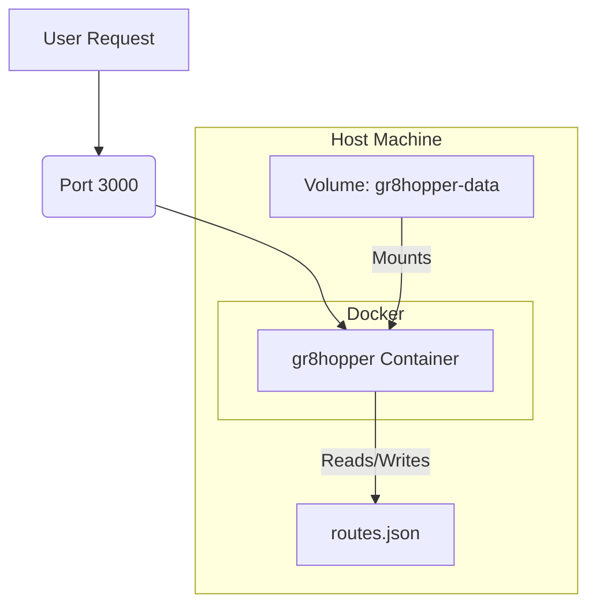

Sources: [README.md:47-54, 349-350](), [src/server.ts:140-141]()

### Cloudflare Workers (Edge)

Deploying to Cloudflare Workers provides a zero-cost, high-performance solution that runs on Cloudflare's global edge network. Redirects are stored in Cloudflare KV.

**1. Create a KV Namespace:**
This namespace will store your routes and settings.
```bash
npx wrangler kv namespace create ROUTES_KV
```

**2. Configure `wrangler.production.toml`:**
Copy the example file and add the KV namespace ID from the previous step.
```bash
cp wrangler.production.toml.example wrangler.production.toml
# Edit wrangler.production.toml and add your KV ID
```

**3. Set Admin Credentials:**
Store your admin credentials securely as secrets.
```bash
npx wrangler secret put ADMIN_USERNAME
npx wrangler secret put ADMIN_PASSWORD
```

**4. Deploy:**
```bash
npm run deploy
```

Sources: [README.md:304-325]()

The diagram below shows the Cloudflare Workers architecture.

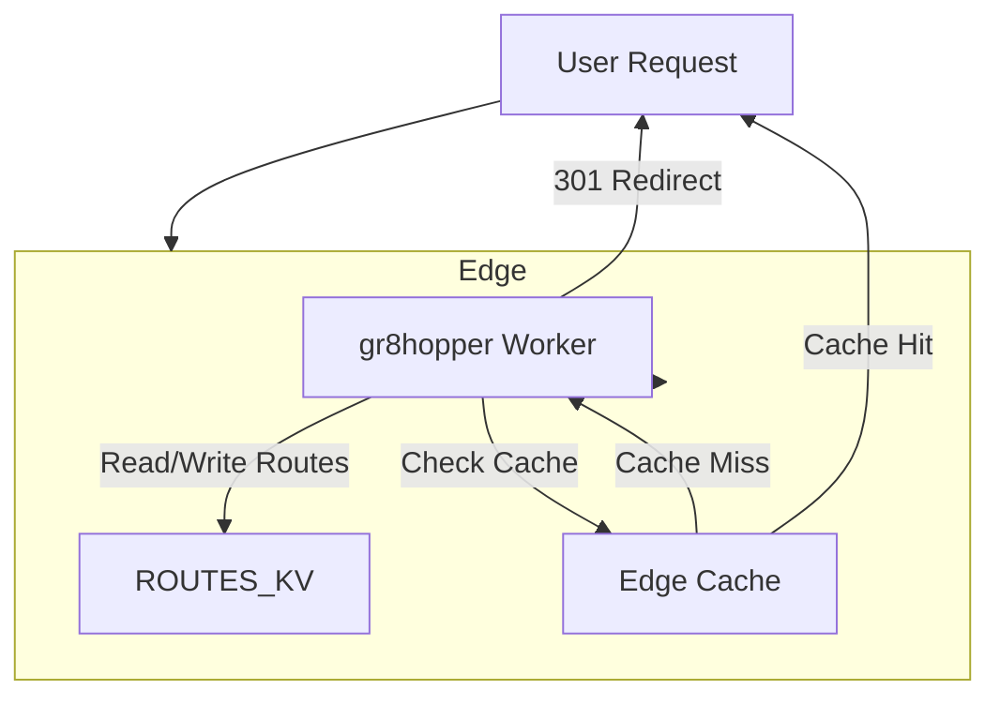

Sources: [README.md:61-82, 196-200, 286-288]()

## Configuration

Configuration is managed through environment variables and a web-based admin panel.

### Environment Variables

These variables are essential for setting up the service, especially for authentication.

| Variable | Default | Platform | Description |
|---|---|---|---|
| `PORT` | `3000` | VPS | HTTP server port. |
| `CONFIG_FILE` | `./routes.json` | VPS | Path to the JSON file for storing routes. |
| `ADMIN_USERNAME` | **(required)** | Both | Admin panel username. Using 'admin' is forbidden. |
| `ADMIN_PASSWORD` | **(required)** | Both | Admin panel password. |
| `ADMIN_PATH` | `admin` | Both | URL path for the admin panel. |
| `CLOUDFLARE_API_TOKEN` | `undefined` | CF | API token for purging the Cloudflare cache. |
| `CLOUDFLARE_ZONE_ID` | `undefined` | CF | Zone ID for purging the Cloudflare cache. |

Sources: [README.md:144-151](), [src/server.ts:93-96, 100-116](), [src/index.ts:47-56]()

### Admin Panel Settings

Global settings can be configured in the admin panel under the "Settings" section.

| Field | Default | Description |
|---|---|---|
| `fallback_url` | `/not-found` | The URL to redirect to when a requested route is not found. |
| `cache_ttl` | `604800` | The browser cache duration in seconds (default is 1 week). |
| `route_param` | `r` | The URL query parameter used to select the redirect route (e.g., `?r=my-route`). |

Sources: [README.md:155-160](), [src/admin-html.ts:1330-1349]()

## Admin Panel & API

The admin panel provides a UI for managing all aspects of gr8hopper. It is accessible at `/admin` by default and is protected by Basic Authentication using the `ADMIN_USERNAME` and `ADMIN_PASSWORD`.

Sources: [README.md:153](), [src/server.ts:157-159]()

### Features
- **Route Management**: Create, edit, delete, and toggle redirect routes.
- **Settings**: Configure global options like fallback URL and cache duration.
- **Import/Export**: Backup and restore all routes and settings via a JSON file.
- **Cache Purge**: (Cloudflare only) A button to purge all cached redirects from the CDN.

Sources: [README.md:155-164](), [src/admin-html.ts:1360-1372, 1388-1411]()

### Admin API Endpoints

The admin UI is powered by a set of RESTful API endpoints.

| Method | Endpoint | Description |
|---|---|---|
| `GET` | `/admin/routes` | List all routes. |
| `POST` | `/admin/routes` | Create a new route. |
| `GET` | `/admin/routes/:id` | Get a single route's configuration. |
| `PATCH` | `/admin/routes/:id` | Update an existing route (partial updates supported). |
| `DELETE` | `/admin/routes/:id` | Delete a route. |
| `GET` | `/admin/settings` | Get global settings. |
| `PUT` | `/admin/settings` | Update global settings. |
| `GET` | `/admin/export` | Export all routes and settings as a JSON file. |
| `POST` | `/admin/import` | Import a JSON file, replacing all existing routes. |
| `POST` | `/admin/purge-cache` | Purge the Cloudflare CDN cache. |

Sources: [README.md:168-177](), [src/handlers/admin.ts]()

The following sequence diagram shows the flow for creating a new route via the admin panel.

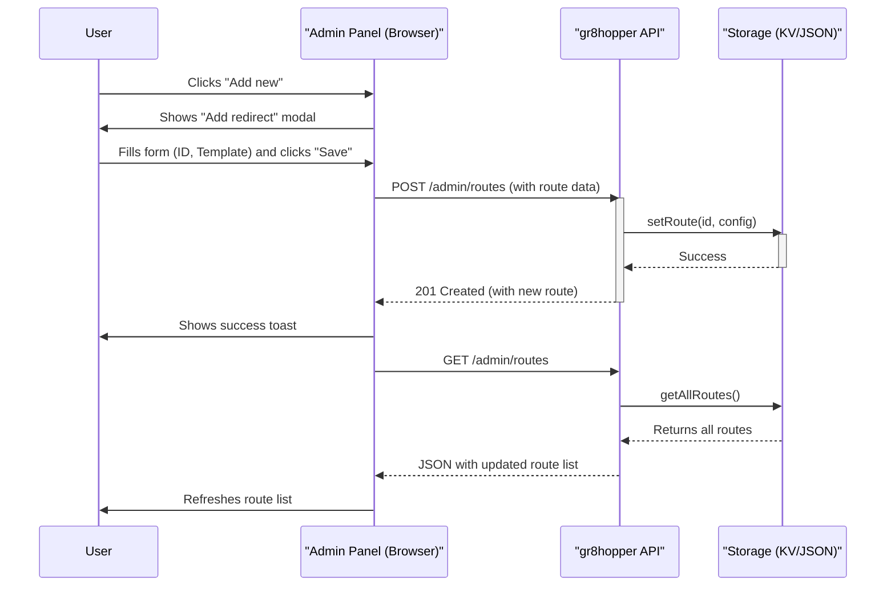

Sources: [src/admin-html.ts:2000-2030, 1612-1623](), [src/handlers/admin.ts:100-123]()

## How It Works: The Redirect Flow

gr8hopper's core function is to process an incoming URL, find a matching route, and issue a permanent (301) redirect. It uses aggressive caching to ensure high performance.

This diagram illustrates the redirect process.

```mermaid
flowchart TD
    A[Request: /?r=partner-a&id=123] --> B{Edge Cache Hit?};
    B -- Yes --> C[Return Cached 301<br/>(<1ms)];
    B -- No --> D[Look up route config<br/>(ID: 'partner-a')];
    D --> E[Substitute {params}<br/>template: partner.com/{id}<br/>result: partner.com/123];
    E --> F[Return 301 Redirect];
    F --> G[Cache redirect at Edge];
    C --> H((End));
    G --> H;
```

Sources: [README.md:61-82]()

### Route Configuration

A route is defined by a unique ID, a destination template, and its status.

| Field | Type | Required | Description |
|---|---|---|---|
| `id` | string | Yes | The unique identifier for the route, used in the URL (`?r=id`). Can be a pattern. |
| `template` | string | Yes | The target URL, with `{param}` placeholders for dynamic values. |
| `active` | boolean | Yes | Toggles whether the redirect is enabled or disabled. |
| `passthrough` | boolean | No | If true, appends query parameters from the source URL to the destination. |

Sources: [README.md:88-93, 1100-1103]()

**Example:**
- **Route Config**: `{ "id": "partner-a", "template": "https://partner-a.com/product/{id}?ref={route}" }`
- **Incoming Request**: `https://your-domain.com/?r=partner-a&id=12345`
- **Resulting Redirect**: `301 Redirect` to `https://partner-a.com/product/12345?ref=partner-a`

The `{route}` placeholder is automatically replaced with the route's ID. Other placeholders like `{id}` are populated from the query parameters of the incoming request.

Sources: [README.md:85-103]()


## Deployment

### Deploying with Docker

<details>
<summary>Relevant source files</summary>
The following files were used as context for generating this wiki page:

- [README.md](https://github.com/dima6312/gr8hopper/blob/main/README.md)
- [examples/docker-compose.yml](https://github.com/dima6312/gr8hopper/blob/main/examples/docker-compose.yml)
- [package.json](https://github.com/dima6312/gr8hopper/blob/main/package.json)
- [src/server.ts](https://github.com/dima6312/gr8hopper/blob/main/src/server.ts)
- [SECURITY.md](https://github.com/dima6312/gr8hopper/blob/main/SECURITY.md)
- [src/admin-html.ts](https://github.com/dima6312/gr8hopper/blob/main/src/admin-html.ts)
- [src/index.ts](https://github.com/dima6312/gr8hopper/blob/main/src/index.ts)
- [CONTRIBUTING.md](https://github.com/dima6312/gr8hopper/blob/main/CONTRIBUTING.md)
</details>

# Deploying with Docker

`gr8hopper` provides a lightweight and portable deployment option using Docker, making it easy to run the service on any Virtual Private Server (VPS) or machine with Docker installed. This method is presented as an alternative to the edge deployment on Cloudflare Workers and is ideal for self-hosted environments. The Docker image is built on a minimal `node:20-alpine` base to ensure a small footprint.

This document covers the architecture of the Docker container, configuration via environment variables, data persistence strategies, and recommended deployment patterns using both `docker run` and `docker-compose`.

*Sources: [README.md:20-22](), [README.md:329-331](), [README.md:364-366]()*

## Deployment Methods

There are two primary ways to deploy `gr8hopper` using Docker: a quick-start `docker run` command for simple setups, and a more robust `docker-compose` method for production environments.

*Sources: [README.md:83](), [README.md:370]()*

### Quick Start with `docker run`

The easiest way to get `gr8hopper` running is with a single `docker run` command. This pulls the latest pre-built image from `ghcr.io`, sets the required environment variables, maps the port, and configures a named volume for data persistence.

```bash
docker run -d --restart unless-stopped \
  -p 3000:3000 \
  -e ADMIN_USERNAME=your-username \
  -e ADMIN_PASSWORD=your-secure-password \
  -v gr8hopper-data:/app/data \
  --name gr8hopper \
  ghcr.io/dima6312/gr8hopper:latest
```

*Sources: [README.md:84-91]()*

This command performs the following actions:
- `-d`: Runs the container in detached mode.
- `--restart unless-stopped`: Ensures the container restarts automatically unless manually stopped.
- `-p 3000:3000`: Maps port 3000 on the host to port 3000 in the container.
- `-e ...`: Sets the mandatory admin credentials.
- `-v gr8hopper-data:/app/data`: Creates a named volume `gr8hopper-data` and mounts it to `/app/data` inside the container, where the `routes.json` file is stored.

*Sources: [README.md:84-91](), [examples/docker-compose.yml:12-13](), [examples/docker-compose.yml:18-20]()*

### Recommended: `docker-compose`

For a more declarative and manageable setup, using `docker-compose` is recommended. The project provides an example `docker-compose.yml` file that defines the service, environment, volumes, and a healthcheck.

*Sources: [README.md:370-372](), [examples/docker-compose.yml]()*

The following diagram illustrates the components managed by Docker Compose.

```mermaid
graph TD
    subgraph Docker Host
        User_Request -- "Port 3000" --> Host_Port_3000
        Host_Port_3000 -- "Maps to" --> Container_Port_3000
        subgraph Docker_Container [gr8hopper Container]
            Container_Port_3000 --> Node_Server
            Node_Server -- "Reads/Writes" --> Config_File[/app/data/routes.json]
        end
        Config_File -- "Persisted via" --> Named_Volume[gr8hopper-data Volume]
    end
```
This diagram shows a user request hitting the host, which forwards it to the container. The Node.js server inside reads and writes its configuration to a file that is persisted on the host via a named Docker volume.

*Sources: [examples/docker-compose.yml:6-7](), [examples/docker-compose.yml:12](), [examples/docker-compose.yml:18-20]()*

#### Service Definition

The `docker-compose.yml` file defines the `gr8hopper` service with key configurations:

```yaml
services:
  gr8hopper:
    build:
      context: ..
      dockerfile: examples/Dockerfile
    container_name: gr8hopper
    ports:
      - "3000:3000"
    environment:
      - ADMIN_USERNAME=${ADMIN_USERNAME:?ADMIN_USERNAME is required}
      - ADMIN_PASSWORD=${ADMIN_PASSWORD:?ADMIN_PASSWORD is required}
      - CONFIG_FILE=/app/data/routes.json
      - ADMIN_PATH=${ADMIN_PATH:-admin}
      - PORT=3000
    volumes:
      - gr8hopper-data:/app/data
    restart: unless-stopped
    healthcheck:
      test: [ "CMD", "node", "-e", "fetch('http://localhost:3000/health').then(r => process.exit(r.ok ? 0 : 1)).catch(() => process.exit(1))" ]
      interval: 30s
      timeout: 10s
      retries: 3

volumes:
  gr8hopper-data:
```
*Note: The healthcheck in `README.md` differs slightly from `examples/docker-compose.yml`, checking `/` instead of `/health` because the `/health` endpoint was removed.*

*Sources: [examples/docker-compose.yml:1-26](), [README.md:393-398]()*

## Container Architecture

The `gr8hopper` Docker image is constructed using a multi-stage build to create a minimal and secure production artifact.

*Sources: [README.md:332-362]()*

### Multi-Stage Dockerfile

The build process is split into two stages: `builder` and `runner`.

1.  **`builder` Stage**: This stage uses a full `node:20-alpine` image to install all dependencies (including `devDependencies`) and build the TypeScript source code into JavaScript.
2.  **`runner` Stage**: This stage starts from a fresh `node:20-alpine` image, installs only production dependencies (`--omit=dev`), and copies the built `dist` directory from the `builder` stage. It also creates a non-root user `gr8hopper` to run the application, enhancing security.

*Sources: [README.md:333-362]()*

The following diagram visualizes the multi-stage build process.

```mermaid
flowchart TD
    subgraph Builder Stage
        A[FROM node:20-alpine] --> B{Copy package*.json}
        B --> C{npm ci}
        C --> D{Copy source code}
        D --> E[npm run build]
    end

    subgraph Runner Stage
        F[FROM node:20-alpine] --> G{Copy package*.json}
        G --> H{npm ci --omit=dev}
        H --> I{Create non-root user 'gr8hopper'}
        I --> J{Set user to 'gr8hopper'}
    end

    E -- "Copy /app/dist" --> J
    J --> K[CMD ["node", "dist/server.js"]]
```
This flow shows the `builder` stage preparing the application build, and the `runner` stage creating a lean, production-ready image by copying only the necessary artifacts and setting up a secure runtime environment.

*Sources: [README.md:333-362](), [package.json:13]()*

### Server Entrypoint

The container's final command is `CMD ["node", "dist/server.js"]`. This executes the Node.js server entrypoint, which is compiled from `src/server.ts`.

This server script is responsible for:
- Reading environment variables.
- Initializing the `JsonFileAdapter` for storage.
- Creating and configuring a `Hono` web server instance.
- Setting up authentication middleware for the admin panel.
- Serving the admin UI and API endpoints.
- Handling public redirect requests.

*Sources: [README.md:361](), [src/server.ts](), [package.json:13]()*

The server startup sequence within the container is as follows:

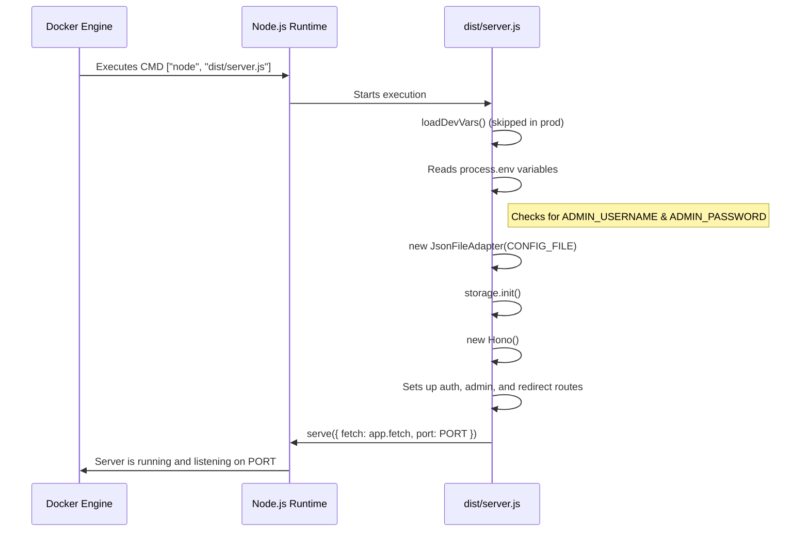
This sequence shows how the `server.ts` script orchestrates the application startup, from configuration validation to starting the web server.

*Sources: [src/server.ts:8-193]()*

## Configuration

Configuration for the Docker deployment is managed exclusively through environment variables.

*Sources: [README.md:215-223](), [examples/docker-compose.yml:8-14]()*

### Environment Variables

The following variables are used to configure the `gr8hopper` container.

| Variable | Required | Default | Description | Source Files |
| :--- | :--- | :--- | :--- | :--- |
| `ADMIN_USERNAME` | **Yes** | - | The username for the admin panel. Cannot be 'admin'. | `src/server.ts:98-106`, `src/server.ts:119-128` |
| `ADMIN_PASSWORD` | **Yes** | - | The password for the admin panel. | `src/server.ts:107-117` |
| `PORT` | No | `3000` | The port the internal Node.js server listens on. | `src/server.ts:89`, `examples/docker-compose.yml:14` |
| `CONFIG_FILE` | No | `./routes.json` | Path inside the container to the routes JSON file. | `src/server.ts:90`, `examples/docker-compose.yml:12` |
| `ADMIN_PATH` | No | `admin` | The URL path for the admin panel (e.g., `/admin`). | `src/server.ts:91`, `examples/docker-compose.yml:13` |

*Sources: [README.md:215-223](), [src/server.ts:89-128](), [examples/docker-compose.yml:8-14]()*

### Data Persistence

In a Docker deployment, routes and settings are stored in a local JSON file specified by the `CONFIG_FILE` environment variable. To prevent data loss when the container is removed or recreated, this file must be stored on a persistent volume.

The recommended approach is to use a named Docker volume (`gr8hopper-data`), which is mounted into the container at `/app/data`. The `CONFIG_FILE` variable is then set to `/app/data/routes.json`.

```mermaid
graph TD
    subgraph Docker Host
        D[gr8hopper-data Volume]
    end

    subgraph gr8hopper Container
        A[Application] -->|Writes to| B[/app/data/routes.json]
    end

    B -- "Mounted to" --> D
```
This diagram shows the application inside the container writing to a file path, which is actually a mount point for a persistent volume on the host, ensuring data survives container restarts.

*Sources: [README.md:88](), [README.md:318-322](), [examples/docker-compose.yml:12](), [examples/docker-compose.yml:18-20]()*

## Security

When deploying with Docker, several security measures are crucial:
- **Mandatory Credentials**: The server will fail to start if `ADMIN_USERNAME` or `ADMIN_PASSWORD` are not provided.
- **Non-Root User**: The container runs the application as the `gr8hopper` user, not `root`, reducing the potential impact of a container compromise.
- **HTTPS**: The Node.js server does not handle HTTPS. It is strongly recommended to place the container behind a reverse proxy like Nginx or Caddy to terminate SSL/TLS and add security headers.
- **Admin Path**: Change the `ADMIN_PATH` to a non-standard value to make the admin panel harder to find for automated scanners.

*Sources: [src/server.ts:98-117](), [README.md:351-354](), [README.md:430-432](), [SECURITY.md:21-24]()*

### Deploying to Cloudflare Workers

<details>
<summary>Relevant source files</summary>
The following files were used as context for generating this wiki page:

- [src/index.ts](https://github.com/dima6312/gr8hopper/blob/main/src/index.ts)
- [README.md](https://github.com/dima6312/gr8hopper/blob/main/README.md)
- [src/handlers/admin.ts](https://github.com/dima6312/gr8hopper/blob/main/src/handlers/admin.ts)
- [package.json](https://github.com/dima6312/gr8hopper/blob/main/package.json)
- [src/admin-html.ts](https://github.com/dima6312/gr8hopper/blob/main/src/admin-html.ts)
- [src/server.ts](https://github.com/dima6312/gr8hopper/blob/main/src/server.ts)

</details>

# Deploying to Cloudflare Workers

Deploying gr8hopper to Cloudflare Workers is the recommended method for production environments. This approach leverages Cloudflare's global edge network to provide a lightweight, high-performance, and cost-effective URL redirect service. The application is designed to be deployed as a single serverless function that uses Cloudflare KV for persistent storage of routes and settings.

This deployment model offers significant advantages, including minimal latency for redirects, aggressive caching at the edge, and zero-maintenance data storage. The entire application, including the admin UI, is self-contained within the Worker, making it a portable and efficient solution.

*Sources: [README.md]()*

## Architecture Overview

When deployed on Cloudflare, gr8hopper consists of a Hono-based application running as a single Worker script. It interfaces with a Cloudflare KV namespace for all data storage and can optionally connect to the Cloudflare API for cache purging.

*Sources: [src/index.ts](), [README.md]()*

The following diagram illustrates the high-level architecture of gr8hopper on Cloudflare Workers.

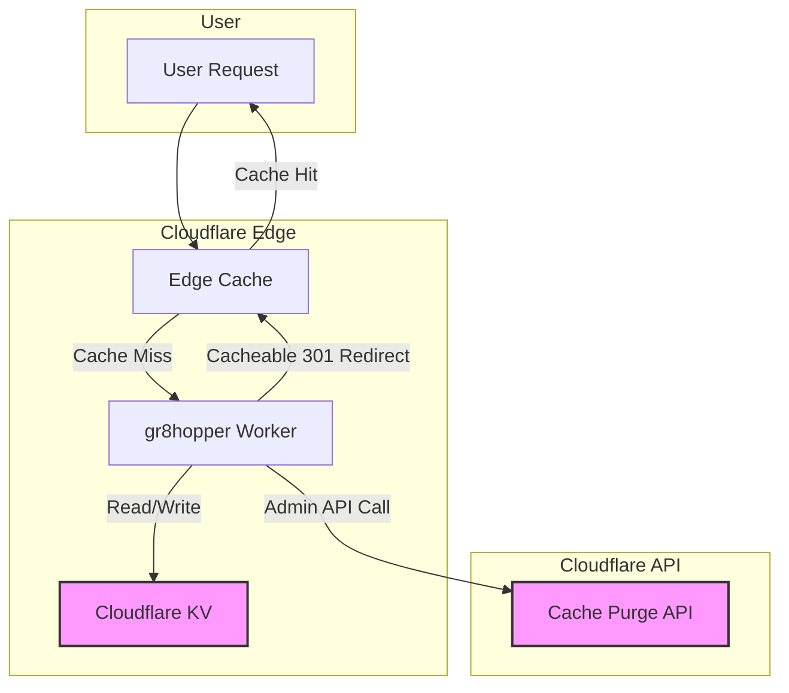

*Sources: [src/index.ts:26-31](), [src/handlers/admin.ts:398-425](), [README.md]()*

## Deployment Steps

The deployment process uses the `wrangler` CLI, the official tool for managing Cloudflare developer products.

*Sources: [README.md](), [package.json:13]()*

### 1. Create a KV Namespace

First, create a KV namespace to store the application's routes and settings. This is a one-time setup.

```bash
npx wrangler kv namespace create ROUTES_KV
```

This command will output a namespace ID, which is required for the next step.

*Sources: [README.md]()*

### 2. Configure `wrangler.production.toml`

Create a `wrangler.production.toml` file by copying the provided example. This file is git-ignored to protect your production-specific IDs.

```bash
cp wrangler.production.toml.example wrangler.production.toml
```

Then, edit `wrangler.production.toml` and insert the KV namespace ID you obtained in the previous step.

```toml
# wrangler.production.toml

# ... other configurations

[[kv_namespaces]]
binding = "ROUTES_KV"
id = "your-production-kv-namespace-id" # <-- Replace with your ID
```

*Sources: [README.md](), [src/index.ts:28]()*

### 3. Set Admin Credentials

Admin credentials are required and must be set as secrets for the Worker.

```bash
npx wrangler secret put ADMIN_USERNAME
npx wrangler secret put ADMIN_PASSWORD
```

The application will fail to start if these secrets are not configured.

*Sources: [README.md](), [src/index.ts:38-46]()*

### 4. (Optional) Configure Cache Purge

To enable the "Purge All" button in the admin UI, set the following secrets. The API token needs `Zone.Cache Purge` permission.

```bash
npx wrangler secret put CLOUDFLARE_API_TOKEN
npx wrangler secret put CLOUDFLARE_ZONE_ID
```

*Sources: [README.md](), [src/index.ts:55-57](), [src/handlers/admin.ts:398-401]()*

### 5. (Optional) Bulk Import Routes

You can pre-populate the KV namespace with routes from a JSON file using an npm script. This is useful for initial setup or CI/CD pipelines.

```bash
# Import routes.json to production KV
npm run import:routes routes.json
```

*Sources: [README.md](), [package.json:15]()*

### 6. Deploy the Worker

Deploy the application to your Cloudflare account using the `deploy` script defined in `package.json`.

```bash
npm run deploy
```

This command bundles the code and uploads it to Cloudflare, applying the configuration from `wrangler.production.toml`.

*Sources: [package.json:13](), [README.md]()*

### 7. (Optional) Add a Custom Domain

After deployment, you can assign a custom domain to your Worker via the Cloudflare Dashboard under **Workers & Pages > [your worker] > Settings > Triggers > Custom Domains**.

*Sources: [README.md]()*

## Configuration

Configuration for the Cloudflare Worker is managed through `wrangler.production.toml` and environment secrets.

### Worker Secrets

Secrets are used for sensitive information and are injected into the Worker environment at runtime.

| Variable | Required | Description |
| :--- | :--- | :--- |
| `ADMIN_USERNAME` | **Yes** | The username for accessing the admin panel. |
| `ADMIN_PASSWORD` | **Yes** | The password for accessing the admin panel. |
| `ADMIN_PATH` | No | Customizes the URL path for the admin panel. Defaults to `admin`. |
| `CLOUDFLARE_API_TOKEN` | No | An API token with `Zone.Cache Purge` permissions. Enables the cache purge feature. |
| `CLOUDFLARE_ZONE_ID` | No | The Zone ID of your domain on Cloudflare. Required for the cache purge feature. |

*Sources: [src/index.ts:35-57](), [README.md]()*

## Request Handling

The Worker entry point is `src/index.ts`. It uses a single Hono app instance to handle all incoming requests. On the first request (cold start), it initializes the storage adapter and request handlers.

This diagram shows the request lifecycle within the worker.

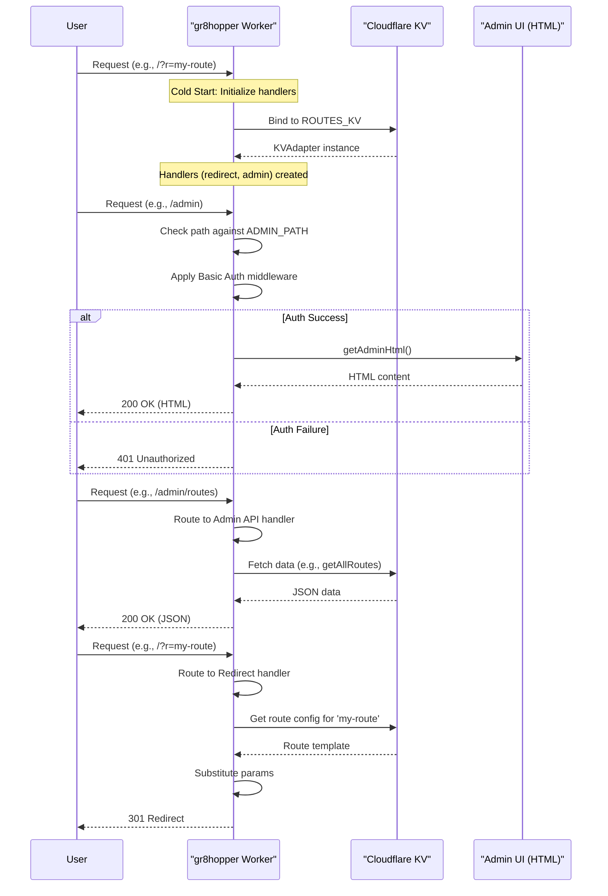

*Sources: [src/index.ts:24-95](), [src/admin-html.ts:5](), [src/handlers/admin.ts:47-54]()*

## Data Storage with Cloudflare KV

For Cloudflare deployments, gr8hopper uses Cloudflare KV as its data store.

- **Adapter:** The `KVAdapter` class, defined in `src/storage/kv.ts`, implements the `StorageAdapter` interface to interact with the KV namespace.
- **Data:** All routes and global settings are stored as key-value pairs.
- **Consistency:** KV has an eventual consistency model. Changes made in the admin UI may take up to 60 seconds to propagate globally to all of Cloudflare's edge locations.

*Sources: [src/index.ts:26-31](), [README.md]()*

## Cache Management

A core feature of the Cloudflare deployment is its aggressive caching strategy to ensure high performance and low cost.

### Caching Strategy

1.  **First Request:** When a unique URL is requested for the first time, the Worker executes, looks up the route in KV, generates the destination URL, and returns a `301 Moved Permanently` redirect. This response includes `Cache-Control` headers.
2.  **Subsequent Requests:** The `301` response is cached at the Cloudflare edge. All subsequent requests for the same URL are served directly from the edge cache, which means the Worker does not execute.

*Sources: [README.md]()*

### Cache Purging

If a redirect destination needs to be updated, the Cloudflare CDN cache must be purged. This can be done via the "Purge All" button in the admin UI, provided the `CLOUDFLARE_API_TOKEN` and `CLOUDFLARE_ZONE_ID` secrets are configured.

The cache purge flow is as follows:

```mermaid
flowchart TD
    A[Admin clicks "Purge All" in UI] --> B{Cache Purge Secrets Configured?};
    B -- Yes --> C[UI sends POST to /admin/purge-cache];
    B -- No --> D[Button is not visible];
    C --> E[Worker sends API request to Cloudflare];
    E --> F{api.cloudflare.com/client/v4/.../purge_cache};
    F -- Success --> G[Cloudflare purges all cached content for the zone];
    G --> H[Worker returns 200 OK to UI];
    F -- Failure --> I[Cloudflare API returns error];
    I --> J[Worker returns 500 to UI];
```

*Sources: [src/handlers/admin.ts:398-425](), [src/admin-html.ts:1288-1320](), [README.md]()*

### Deploying with Node.js/Bun

<details>
<summary>Relevant source files</summary>

The following files were used as context for generating this wiki page:

- [src/server.ts](https://github.com/dima6312/gr8hopper/blob/main/src/server.ts)
- [package.json](https://github.com/dima6312/gr8hopper/blob/main/package.json)
- [README.md](https://github.com/dima6312/gr8hopper/blob/main/README.md)
- [src/index.ts](https://github.com/dima6312/gr8hopper/blob/main/src/index.ts)
- [src/handlers/admin.ts](https://github.com/dima6312/gr8hopper/blob/main/src/handlers/admin.ts)
- [SECURITY.md](https://github.com/dima6312/gr8hopper/blob/main/SECURITY.md)
- [CONTRIBUTING.md](https://github.com/dima6312/gr8hopper/blob/main/CONTRIBUTING.md)
- [src/admin-html.ts](https://github.com/dima6312/gr8hopper/blob/main/src/admin-html.ts)
</details>

# Deploying with Node.js/Bun

This document provides a technical overview of deploying the `gr8hopper` application as a standalone server using Node.js or Bun. This deployment method is suitable for Virtual Private Server (VPS) environments and contrasts with the edge deployment on [Cloudflare Workers](#). The Node.js/Bun server uses a local JSON file for data persistence and is configured via environment variables.

The primary entry point for this deployment model is `src/server.ts`, which leverages the Hono framework and its `@hono/node-server` adapter to create an HTTP server.

Sources: [src/server.ts:4](), [README.md:10]()

## Server Architecture

The Node.js/Bun server is built around the `Hono` web framework, providing a lightweight and fast foundation. The architecture consists of several key components that are initialized and wired together at startup.

The server uses a `JsonFileAdapter` for storing route configurations and global settings, reading from and writing to a local JSON file. It exposes two main sets of routes: public-facing redirect routes and a password-protected admin area for managing the service.

Sources: [src/server.ts:10-15](), [CONTRIBUTING.md:32-37]()

The following diagram illustrates the high-level architecture of the Node.js server:

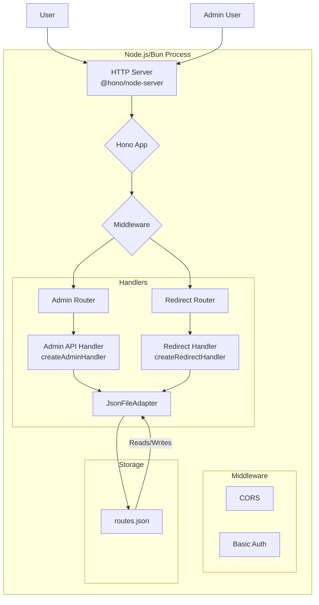
This diagram shows how an incoming request is handled by the Hono server, passed through middleware, and routed to either the Admin or Redirect handler, which in turn interact with the JSON file storage adapter.

Sources: [src/server.ts:162-177](), [src/handlers/admin.ts:18]()

## Configuration

The server is configured exclusively through environment variables. This design choice is ideal for containerized and modern VPS deployments. For local development, a `.dev.vars` file can be used to load these variables automatically, but this is skipped in a `production` environment.

Sources: [src/server.ts:20-28](), [src/server.ts:88-91]()

### Environment Variables

The following table details the environment variables used to configure the server:

| Variable | Default | Description |
|---|---|---|
| `PORT` | `3000` | The HTTP port the server will listen on. |
| `CONFIG_FILE` | `./routes.json` | The file path for storing route and settings data. For Docker, this is `/app/data/routes.json`. |
| `ADMIN_USERNAME` | **(required)** | The username for accessing the admin panel. Cannot be `admin`. |
| `ADMIN_PASSWORD` | **(required)** | The password for accessing the admin panel. |
| `ADMIN_PATH` | `admin` | The URL path for the admin panel (e.g., `http://.../admin`). |

The application will exit with a fatal error if `ADMIN_USERNAME` or `ADMIN_PASSWORD` are not set, or if `ADMIN_USERNAME` is set to the generic value 'admin'.

Sources: [README.md:156-162](), [src/server.ts:93-134]()

### Security Configuration

For production VPS deployments, it is recommended to run the application behind a reverse proxy like Nginx. This allows for HTTPS termination and the addition of important security headers.

```nginx
# Example Nginx snippet for adding security headers
add_header Strict-Transport-Security "max-age=31536000; includeSubDomains" always;
add_header X-Frame-Options "DENY" always;
add_header X-Content-Type-Options "nosniff" always;
add_header Referrer-Policy "no-referrer" always;
```
Sources: [SECURITY.md:72-77]()

## Startup Sequence

When the server starts, it follows a specific sequence to initialize all components before it begins accepting requests.

The sequence diagram below shows the server startup process:

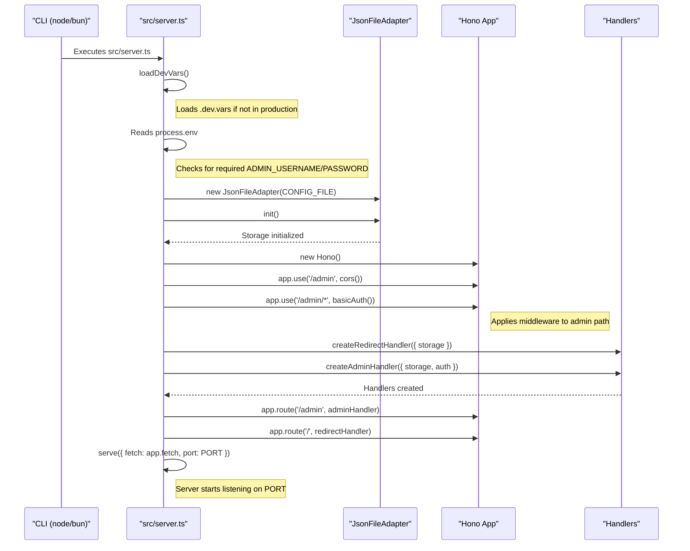
This sequence ensures that all dependencies like storage and handlers are ready before the server begins listening for traffic.

Sources: [src/server.ts:85-188]()

## Request Routing

All incoming requests are handled by a single Hono application instance. Middleware is used to apply authentication and CORS policies to the admin-related paths.

The routing logic is as follows:
1.  Requests to the path defined by `ADMIN_PATH` (e.g., `/admin`) and any sub-paths (e.g., `/admin/routes`) are first processed by CORS and Basic Authentication middleware.
2.  Authenticated requests to the root of the admin path (`/admin` or `/admin/`) serve the admin panel HTML.
3.  Authenticated requests to sub-paths of the admin path are routed to the `adminHandler` for API operations.
4.  All other requests are routed to the `redirectHandler` to be processed as potential redirects.

This flow is visualized in the diagram below:

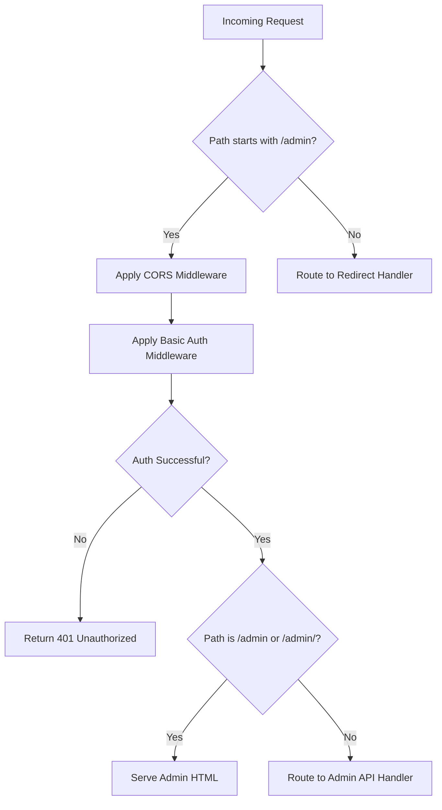
Sources: [src/server.ts:162-177]()

## Deployment & Execution

The `README.md` and `package.json` files outline several methods for deploying and running the server in a Node.js or Bun environment.

### Using NPM/Node.js

The application can be run directly from source or after being built.

-   **Development (with hot-reload):** `npm run dev:node`
-   **Production (from source):** `npm start` (which runs `node dist/server.js`)
-   **Global Install:** `npm install -g gr8hopper` followed by `npx gr8hopper`

Sources: [package.json:11-13](), [README.md:288-299]()

### Using Bun

Bun can run the TypeScript source file directly.

```bash
bun install
ADMIN_USERNAME=your-username ADMIN_PASSWORD=your-password bun run src/server.ts
```
Sources: [README.md:302-303](), [package.json:14]()

### Using Docker

The recommended method for a VPS deployment is using Docker or Docker Compose. The repository provides a `Dockerfile` for building a production-ready image.

**Docker Run Command:**
```bash
docker run -d --restart unless-stopped \
  -p 3000:3000 \
  -e ADMIN_USERNAME=your-username \
  -e ADMIN_PASSWORD=your-secure-password \
  -v gr8hopper-data:/app/data \
  --name gr8hopper \
  ghcr.io/dima6312/gr8hopper:latest
```
This command uses a named volume `gr8hopper-data` to persist the `routes.json` file.

Sources: [README.md:52-60]()

**Docker Compose:**
The `README.md` also provides a `docker-compose.yml` example that uses an `.env` file for credentials and includes a health check.

Sources: [README.md:244-275]()

### Using Systemd

For a more traditional VPS setup, a `systemd` service can be created to manage the Node.js process. This involves creating an environment file for credentials and a service unit file.

**Systemd Service File (`/etc/systemd/system/gr8hopper.service`):**
```ini
[Unit]
Description=Gr8hopper
After=network.target

[Service]
Type=simple
User=www-data
WorkingDirectory=/opt/gr8hopper
ExecStart=/usr/bin/node dist/server.js
EnvironmentFile=/etc/gr8hopper/.env
Environment=PORT=3000
Restart=on-failure

[Install]
WantedBy=multi-user.target
```
This setup requires securing the environment file with appropriate permissions (`chmod 600`).

Sources: [README.md:280-296]()

## Summary

Deploying `gr8hopper` with Node.js or Bun provides a flexible, self-hosted solution for running the redirect service on a VPS. The architecture is simple, relying on a Hono-based server, a single JSON file for state, and environment variables for all configuration. The provided Docker, systemd, and direct execution methods offer multiple pathways for production deployment, with security best practices like using a reverse proxy and strong credentials being paramount.

Sources: [src/server.ts](), [README.md]()


## Core Features

### The Admin UI

<details>
<summary>Relevant source files</summary>
The following files were used as context for generating this wiki page:

- [src/handlers/admin.ts](https://github.com/dima6312/gr8hopper/blob/main/src/handlers/admin.ts)
- [src/admin-html.ts](https://github.com/dima6312/gr8hopper/blob/main/src/admin-html.ts)
- [src/index.ts](https://github.com/dima6312/gr8hopper/blob/main/src/index.ts)
- [src/server.ts](https://github.com/dima6312/gr8hopper/blob/main/src/server.ts)
- [README.md](https://github.com/dima6312/gr8hopper/blob/main/README.md)
- [SECURITY.md](https://github.com/dima6312/gr8hopper/blob/main/SECURITY.md)
- [package.json](https://github.com/dima6312/gr8hopper/blob/main/package.json)
- [CONTRIBUTING.md](https://github.com/dima6312/gr8hopper/blob/main/CONTRIBUTING.md)
</details>

# The Admin UI

The Admin UI is a self-contained web interface for managing the `gr8hopper` redirect service. It provides administrators with a simple, mobile-optimized panel to create, edit, and delete redirect routes, configure global settings, and perform maintenance tasks like importing/exporting configurations and purging the CDN cache. The entire UI is embedded within the application, requiring no separate hosting or dependencies.

Access to the Admin UI and its corresponding API is protected by HTTP Basic Authentication. The interface is served from a customizable path, which defaults to `/admin`. All interactions with the server are handled through a set of RESTful API endpoints, which manipulate the route and settings data stored in either Cloudflare KV or a local JSON file, depending on the deployment environment.

Sources: [README.md](), [src/admin-html.ts](), [src/handlers/admin.ts]()

## Architecture

The Admin UI follows a simple client-server architecture where the "client" is a single-page application (SPA) embedded directly into the server.

-   **Frontend**: A single HTML file containing vanilla JavaScript and CSS. It is generated by the `getAdminHtml` function in `src/admin-html.ts` and served directly by the Hono web server. This approach ensures the application is fully self-contained.
-   **Backend**: A set of API endpoints built with Hono, defined in `src/handlers/admin.ts`. These endpoints handle all business logic for managing routes and settings.
-   **Authentication**: A middleware layer (`basicAuth`) protects all admin-related routes. This is configured in the main entry points (`src/index.ts` for Cloudflare Workers and `src/server.ts` for Node.js).
-   **Storage**: The admin handler interacts with a storage adapter (`StorageAdapter`) to persist data, abstracting away the difference between Cloudflare KV and a JSON file.

Sources: [src/admin-html.ts:5](), [src/handlers/admin.ts:19](), [src/index.ts:13](), [src/server.ts:130]()

The following diagram illustrates the request flow for an admin user interacting with the UI.

```mermaid
sequenceDiagram
    participant User as "Admin User"
    participant Browser as "Browser (Admin UI)"
    participant Server as "Hono Server"
    participant AdminHandler as "Admin API Handler"
    participant Storage as "Storage Adapter (KV/JSON)"

    User->>Browser: Access /admin
    Browser->>Server: GET /admin
    Note over Server: Auth middleware checks credentials
    Server-->>Browser: 200 OK (HTML/JS/CSS)
    Note over Browser: Renders Admin UI

    Browser->>AdminHandler: API Request (e.g., GET /admin/routes)
    AdminHandler->>Storage: getAllRoutes()
    Storage-->>AdminHandler: Returns routes data
    AdminHandler-->>Browser: JSON response
    Note over Browser: Renders routes in the UI
```
*This diagram shows the flow of an admin user loading the Admin UI and fetching the list of routes.*
Sources: [src/index.ts:68-80](), [src/admin-html.ts:1532-1544]()

## Authentication

All endpoints under the admin path (default `/admin`) are protected by HTTP Basic Authentication. The application will not start if the required `ADMIN_USERNAME` and `ADMIN_PASSWORD` environment variables are not set. For security, the username 'admin' is explicitly rejected.

The authentication middleware is applied in the main application entry points, ensuring no unauthenticated access to the admin API or UI is possible.

-   **Cloudflare Workers**: `basicAuth` is applied in `src/index.ts`.
-   **Node.js/VPS**: `basicAuth` is applied in `src/server.ts`.

Sources: [src/server.ts:80-106](), [src/index.ts:36-47](), [SECURITY.md:14-16]()

The authentication flow is visualized below.

```mermaid
sequenceDiagram
    participant User as "Admin User"
    participant Server as "Hono Server"
    participant AdminRoute as "Admin Route/UI"

    User->>Server: GET /admin
    activate Server
    Note over Server: basicAuth middleware intercepts
    Server-->>User: 401 Unauthorized (WWW-Authenticate)
    deactivate Server
    User->>Server: GET /admin (with Auth Header)
    activate Server
    Note over Server: basicAuth validates credentials
    alt Credentials Valid
        Server->>AdminRoute: Forward request
        AdminRoute-->>Server: Response (HTML or JSON)
        Server-->>User: 200 OK
    else Credentials Invalid
        Server-->>User: 401 Unauthorized
    end
    deactivate Server
```
*This diagram shows the HTTP Basic Authentication challenge-response flow.*
Sources: [src/middleware/auth.ts](), [src/server.ts:130-133]()

## UI Components

The Admin UI is constructed from several key components, all rendered from `src/admin-html.ts`.

| Component | Description | Source |
| :--- | :--- | :--- |
| **Header** | Displays the application name, version, and a "Log out" button. | `src/admin-html.ts:1210-1222` |
| **Settings Section** | An expandable panel to configure global settings like `route_param`, `cache_ttl`, and `fallback_url`. | `src/admin-html.ts:1225-1279` |
| **Routes List** | The main area, which lists all redirects. Each entry has an on/off toggle, route ID, destination template, and buttons to edit or delete. | `src/admin-html.ts:1282-1318` |
| **Modals** | Used for creating/editing routes, confirming bulk imports, and confirming CDN cache purges to prevent accidental actions. | `src/admin-html.ts:1329-1481` |
| **Toast Notifications** | Provides non-blocking feedback for actions like saving a route or a failed import. | `src/admin-html.ts:1199-1202`, `1484-1514` |
| **Import/Export Buttons** | Allow administrators to download the entire configuration as a JSON file or upload one to replace the existing setup. | `src/admin-html.ts:1286-1299` |
| **Cache Purge Button** | Appears if Cloudflare credentials are configured, allowing a full CDN cache purge. | `src/admin-html.ts:1262-1276` |

Sources: [src/admin-html.ts]()

## API Endpoints

The Admin UI communicates with the backend via a RESTful API. All endpoints are prefixed with the admin path (e.g., `/admin`).

| Method | Endpoint | Description |
| :--- | :--- | :--- |
| `GET` | `/routes` | Lists all redirect routes. |
| `POST` | `/routes` | Creates a new redirect route. |
| `GET` | `/routes/:id` or `/routes/*` | Retrieves a single route. The wildcard `*` supports IDs with slashes. |
| `PATCH` | `/routes/:id` or `/routes/*` | Updates an existing route (partial updates supported). |
| `DELETE` | `/routes/:id` or `/routes/*` | Deletes a route. |
| `GET` | `/settings` | Retrieves the global settings. |
| `PUT` | `/settings` | Updates the global settings. |
| `GET` | `/export` | Exports all routes and settings as a single JSON file. |
| `POST` | `/import` | Imports a JSON file, replacing all existing routes and settings. |
| `GET` | `/purge-cache/status` | Checks if CDN cache purging is configured and available. |
| `POST` | `/purge-cache` | Triggers a purge of the entire Cloudflare CDN cache. |

Sources: [src/handlers/admin.ts:77-336](), [README.md]()

### Route Management Flow

Creating or updating a route involves validation and interaction with the storage adapter.

```mermaid
flowchart TD
    A[User submits form in UI] --> B{API Request: POST or PATCH /admin/routes}
    B --> C[Admin Handler receives request]
    C --> D[Parse and validate JSON body]
    D -- Invalid --> E[Return 400 Bad Request]
    D -- Valid --> F{Is it a new route?}
    F -- Yes --> G[Validate Route ID pattern]
    G -- Invalid --> E
    G -- Valid --> H[storage.setRoute(id, config)]
    H --> I[Return 201 Created]
    F -- No (Update) --> J[storage.getRoute(id)]
    J -- Not Found --> K[Return 404 Not Found]
    J -- Found --> L[Merge existing config with patch]
    L --> H
    H --> M[Return 200 OK]
```
*This flowchart details the logic for creating and updating a route via the admin API.*
Sources: [src/handlers/admin.ts:121-190]()

### Import/Export

The import/export feature allows for easy backup, restoration, and bulk management of routes.

#### Export
A `GET` request to `/export` retrieves all routes and settings from storage and formats them into a specific JSON structure for download.

Sources: [src/handlers/admin.ts:251-275]()

#### Import
The import process is more complex, involving validation, a full replacement of data, and a rollback mechanism in case of failure.

1.  A `POST` request is sent to `/import` with a JSON file.
2.  The server validates the structure of the `routes` and `settings` objects.
3.  Each route within the file is individually validated for ID format and configuration.
4.  The server backs up the current routes and settings in memory.
5.  All existing routes are deleted, and the new routes are written to storage in a bulk operation.
6.  If settings are included, they are updated.
7.  If any step fails, the server attempts to restore the backup.

Sources: [src/handlers/admin.ts:278-336]()

The following diagram illustrates the import sequence.

```mermaid
sequenceDiagram
    participant UI as "Admin UI"
    participant API as "Admin API (/import)"
    participant Storage as "Storage Adapter"

    UI->>API: POST /import with JSON file
    activate API
    API->>API: Validate JSON structure & content
    alt Validation Fails
        API-->>UI: 400 Bad Request
    else Validation Succeeds
        API->>Storage: Backup existing routes & settings
        Storage-->>API: Backup complete
        API->>Storage: setRoutes(newRoutes, clearExisting=true)
        alt Import Fails
            API->>Storage: Restore from backup
            Storage-->>API: Rollback status
            API-->>UI: 500 Server Error (with rollback info)
        else Import Succeeds
            API->>Storage: setSettings(newSettings) (if any)
            Storage-->>API: Settings updated
            API-->>UI: 200 OK (Import successful)
        end
    end
    deactivate API
```
*This sequence diagram shows the import process, including the critical backup and rollback steps.*
Sources: [src/handlers/admin.ts:338-426]()

### CDN Cache Purging

This feature is exclusive to Cloudflare Worker deployments and provides a button in the UI to purge the CDN cache.

-   **Availability**: The UI first calls `GET /purge-cache/status`. The backend checks for the presence of `CLOUDFLARE_API_TOKEN` and `CLOUDFLARE_ZONE_ID` environment variables to determine if the feature is available.
-   **Execution**: If the user confirms the action, the browser sends a `POST /purge-cache` request. The backend then makes a signed API request to the Cloudflare API to purge everything for the configured zone ID.

Sources: [src/handlers/admin.ts:429-467](), [src/admin-html.ts:1873-1883]()

## Conclusion

The Admin UI is a crucial component of `gr8hopper`, providing a complete and user-friendly solution for managing redirects. Its design as an embedded, self-contained SPA simplifies deployment and maintenance, while the robust backend API offers powerful features like bulk import/export and CDN cache control. The clear separation between the UI, API logic, and storage adapters makes the system modular and easy to extend.

### Redirect Logic and Flow

<details>
<summary>Relevant source files</summary>
The following files were used as context for generating this wiki page:

- [src/handlers/redirect.ts](https://github.com/dima6312/gr8hopper/blob/main/src/handlers/redirect.ts)
- [README.md](https://github.com/dima6312/gr8hopper/blob/main/README.md)
- [src/index.ts](https://github.com/dima6312/gr8hopper/blob/main/src/index.ts)
- [src/server.ts](https://github.com/dima6312/gr8hopper/blob/main/src/server.ts)
- [src/handlers/admin.ts](https://github.com/dima6312/gr8hopper/blob/main/src/handlers/admin.ts)
- [src/admin-html.ts](https://github.com/dima6312/gr8hopper/blob/main/src/admin-html.ts)
- [SECURITY.md](https://github.com/dima6312/gr8hopper/blob/main/SECURITY.md)
</details>

# Redirect Logic and Flow

The core function of gr8hopper is to provide a lightweight, high-performance URL redirection service. It is designed to handle complex, parameter-driven routing logic, allowing dynamic rewriting of URLs based on query parameters and path segments. This system is built to be deployed on edge platforms like Cloudflare Workers for minimal latency or as a standalone service on any VPS.

The redirect logic is centralized, stateless, and prioritizes performance through aggressive caching. It supports simple key-based lookups, powerful path-based pattern matching, and flexible template substitution to construct the final destination URL.

*Sources: [README.md:10-16](), [src/handlers/redirect.ts]()*

## High-Level Request Flow

An incoming request is handled by the main application entry point, which can be either for Cloudflare Workers (`src/index.ts`) or a Node.js server (`src/server.ts`). The entry point initializes the storage adapter and routes the request to the appropriate handler. All non-admin requests are forwarded to the `redirectHandler`.

*Sources: [src/index.ts:25-30, 83-85](), [src/server.ts:133-136]()*

The following diagram shows the sequence of events for a typical redirect request.

```mermaid
sequenceDiagram
    participant User
    participant Edge as "Edge Server (e.g., Cloudflare)"
    participant Gr8hopper as "gr8hopper Worker/Server"
    participant Storage as "Storage (KV / JSON)"

    User->>Edge: GET /?r=my-route&id=123
    Edge->>Edge: Check Edge Cache
    alt Cache Hit
        Edge-->>User: 301 Redirect (from cache)
    else Cache Miss
        Edge->>Gr8hopper: Forward Request
        Gr8hopper->>Storage: Get Settings (route_param, etc.)
        Gr8hopper->>Gr8hopper: Match Route (Query, Path, Pattern)
        Gr8hopper->>Storage: Get Route Config for 'my-route'
        Storage-->>Gr8hopper: Route Template & Config
        Gr8hopper->>Gr8hopper: Substitute Placeholders
        Gr8hopper-->>Edge: 301 Redirect + Cache Headers
        Edge-->>User: 301 Redirect
    end
```
*This diagram illustrates the caching-first approach described in the project documentation.*
*Sources: [README.md:83-107](), [src/handlers/redirect.ts:271-348]()*

## Route Matching Logic

The system attempts to find a matching route in a specific order of precedence. The first active route found is used.

*Sources: [src/handlers/redirect.ts:271-348]()*

```mermaid
flowchart TD
    A[Incoming Request] --> B{Get Settings};
    B --> C{Query Param Match?};
    C -- Yes --> D[Find Route by Query Param];
    D --> E{Route Active?};
    E -- Yes --> F[Build & Return Redirect];
    C -- No --> G[Path Match];
    G --> H{Exact Path Match?};
    H -- Yes --> I[Find Route by Path];
    I --> E;
    H -- No --> J{Pattern Path Match?};
    J -- Yes --> K[Find Matching Pattern];
    K --> E;
    J -- No --> L[Handle Fallback];
    E -- No --> L;
    L --> F;
```
*This flowchart shows the prioritized logic for resolving a redirect request.*

### 1. Query Parameter Match

The system first checks for a route identifier in a specific query parameter. The name of this parameter is defined in the global settings (`route_param`), which defaults to `r`.

- **Example**: `https://your-domain.com/?r=my-route&id=123`
- The system will look for a route with the ID `my-route`.

If a route is found via this method, the system immediately proceeds to build the redirect and does not attempt path matching.

*Sources: [src/handlers/redirect.ts:275-284](), [README.md:200-206]()*

### 2. Path Match (Exact & Pattern)

If no route is identified via the query parameter, the system attempts to match the request's URL path.

*Sources: [src/handlers/redirect.ts:287-348]()*

#### Exact Match
The system first attempts to find a route whose ID is an exact match for the sanitized request path.
- **Example**: A request to `https://your-domain.com/exact-match` will look for a route with the ID `exact-match`.

*Sources: [src/handlers/redirect.ts:295-302]()*

#### Pattern Match
If no exact match is found, the system evaluates a cached list of pattern routes. These routes use special tokens to capture parts of the URL.
- Patterns are sorted by specificity to ensure the most precise match is evaluated first. The scoring is determined by the `getPatternScore` function.
- The first active pattern that matches the request path and query parameters is used.

*Sources: [src/handlers/redirect.ts:305-348](), [README.md:148-164]()*

The supported pattern tokens are:

| Token | Description | Example Pattern | Matches |
|---|---|---|---|
| `:param` | Required path parameter. | `shop/:category/:id` | `/shop/shoes/42` |
| `{param}` | Required path parameter (alternative syntax). | `shop/{category}` | `/shop/shoes` |
| `{param?}` | Optional path parameter. | `blog/{year?}/{slug}` | `/blog/2024/post` or `/blog/post` |
| `*` | Wildcard for **exactly one** path segment. | `*/details/*` | `/shoes/details/42` |
| `**` | Globstar for **zero or more** path segments. | `files/**` | `/files/a/b/c` |
| `?key={val}` | Query parameter match. | `product/{id}?lang={lang}` | `/product/123?lang=en` |

*Sources: [README.md:149-164](), [src/handlers/redirect.ts:311-340]()*

### 3. Fallback Handling

If no route is found after all matching attempts, the request is redirected to the `fallback_url` defined in the global settings.
- The default `fallback_url` is `/not-found`.
- Placeholders in the `fallback_url` can be substituted with query parameters from the original request.
- Fallback redirects are cached for a shorter duration (max 30 minutes) to allow newly created routes to become effective more quickly.

*Sources: [src/handlers/redirect.ts:370-415](), [README.md:195-197]()*

## Template Substitution

Once a route is matched, its `template` URL is used to construct the final destination. The template can contain placeholders in the format `{placeholder}` which are replaced with values from the request.

*Sources: [src/handlers/redirect.ts:13-22](), [README.md:136-146]()*

| Placeholder | Source | Example |
|---|---|---|
| `{route}` | The matched Route ID (URL-encoded). | `my-route` |
| `{anyParam}` | Value from a URL query parameter (`?anyParam=value`). | `?id=123` provides value for `{id}`. |
| `{param}` | Value from a captured path parameter in a pattern route. | Route `shop/:category` with path `/shop/shoes` provides value for `{category}`. |

*Sources: [README.md:139-146](), [src/handlers/redirect.ts:205-212]()*

The substitution logic is implemented in the `substituteTemplate` function. If a parameter for a placeholder is not found in the request, the placeholder is left as-is in the final URL (e.g., `{id}` remains `{id}`).

*Sources: [src/handlers/redirect.ts:13-22]()*

## Query Parameter Passthrough

If a route has `passthrough: true`, query parameters from the source URL (like `utm_` tags) are automatically appended to the destination URL.

This logic is handled by the `mergePassthroughParams` function and follows these rules:
1.  Parameters explicitly defined in the destination `template` take precedence.
2.  The `route_param` (e.g., `r`) is always excluded.
3.  Parameters captured by a pattern route (e.g., `id` in `product/{id}`) are excluded.
4.  All other source query parameters are appended to the destination URL.

*Sources: [src/handlers/redirect.ts:130-192](), [README.md:183-220]()*

The following diagram illustrates the passthrough decision logic:

```mermaid
flowchart TD
    subgraph Passthrough Logic for a single query param 'key=value'
        A[Start] --> B{Route has passthrough: true?};
        B -- No --> Z[End];
        B -- Yes --> C{Is 'key' the route_param?};
        C -- Yes --> Z;
        C -- No --> D{Is 'key' a captured pattern param?};
        D -- Yes --> Z;
        D -- No --> E{Is 'key' already in destination template?};
        E -- Yes --> Z;
        E -- No --> F[Append 'key=value' to destination URL];
        F --> Z;
    end
```
*Sources: [src/handlers/redirect.ts:175-185]()*

## URL Protocol & Security

To ensure valid and secure redirects, all destination URLs are processed by the `ensureProtocol` function.
- It blocks dangerous schemes like `javascript:`, `data:`, and `file:`.
- If a URL has no protocol but looks like a domain (e.g., `example.com/path`), it prepends `https://`.
- It leaves absolute paths (e.g., `/some/page`) and relative paths untouched for the browser to resolve.
- Protocol-relative URLs (e.g., `//example.com`) are blocked for security.

*Sources: [src/handlers/redirect.ts:29-106](), [SECURITY.md:52-54]()*

## Caching

Performance is achieved through aggressive caching. The `buildCacheHeaders` function generates the necessary headers.
- **`Cache-Control`**: `public, max-age=...` tells browsers and intermediate caches to store the redirect. The default TTL is `604800` seconds (1 week).
- **`CDN-Cache-Control`**: A separate header for CDNs, typically with a much longer TTL (7x the browser TTL by default). This ensures subsequent requests are served from the edge without invoking the application logic.

This strategy means that for any unique URL, the application logic runs only once, and all subsequent requests are served from a cache.

*Sources: [src/handlers/redirect.ts:197-202](), [README.md:270-282]()*

### Route Configuration Schema

<details>
<summary>Relevant source files</summary>
The following files were used as context for generating this wiki page:

- [src/types.ts](https://github.com/dima6312/gr8hopper/blob/main/src/types.ts)
- [src/utils/validation.ts](https://github.com/dima6312/gr8hopper/blob/main/src/utils/validation.ts)
- [README.md](https://github.com/dima6312/gr8hopper/blob/main/README.md)
- [src/handlers/admin.ts](https://github.com/dima6312/gr8hopper/blob/main/src/handlers/admin.ts)
- [src/admin-html.ts](https://github.com/dima6312/gr8hopper/blob/main/src/admin-html.ts)
- [SECURITY.md](https://github.com/dima6312/gr8hopper/blob/main/SECURITY.md)
- [src/index.ts](https://github.com/dima6312/gr8hopper/blob/main/src/index.ts)

</details>

# Route Configuration Schema

The gr8hopper configuration defines how incoming requests are redirected. It is composed of two main parts: a collection of individual `Route` definitions and a set of `GlobalSettings`. This schema is designed to be flexible, supporting both simple key-value redirects and complex, parameter-driven routing patterns.

The entire configuration can be managed via the Admin UI and its backing API. For VPS deployments, it is stored in a JSON file, while Cloudflare Workers deployments use Cloudflare KV for storage. The schema is validated upon creation or modification to ensure integrity and security.

Sources: [src/types.ts](), [README.md](), [src/index.ts:18-25]()

## Core Data Structures

The configuration is primarily defined by two TypeScript interfaces: `RouteConfig` for individual redirects and `GlobalSettings` for service-wide behavior.

```mermaid
classDiagram
    direction LR
    class RouteConfig {
        +String template
        +Boolean active
        +Boolean passthrough
    }
    class GlobalSettings {
        +String fallback_url
        +Number cache_ttl
        +String route_param
    }
    class StoredRoute {
        +String id
    }
    class ConfigFile {
        +Map~String, RouteConfig~ routes
        +GlobalSettings settings
    }

    StoredRoute --|> RouteConfig : extends
    ConfigFile "1" -- "0..*" RouteConfig : contains
    ConfigFile "1" -- "1" GlobalSettings : contains
```
This diagram illustrates the main configuration interfaces and their relationships. `StoredRoute` extends `RouteConfig` with an `id`, and `ConfigFile` aggregates all routes and settings for JSON-based storage.

Sources: [src/types.ts:1-31]()

## Route Configuration (`RouteConfig`)

Each route is an object that maps a unique `id` (the route key or path pattern) to a `RouteConfig` object.

| Field | Type | Required | Description |
|---|---|---|---|
| `template` | `string` | Yes | The target URL, which can include `{param}` placeholders for dynamic substitution. |
| `active` | `boolean` | Yes | A flag to enable or disable the redirect for this route. |
| `passthrough` | `boolean` | No | If `true`, appends query parameters from the source URL to the destination URL. Defaults to `false`. |

Sources: [src/types.ts:4-10](), [README.md:112-116]()

### Route ID / Path

The `id` of a route serves as its unique identifier and can be either a simple string or a complex pattern for matching request paths and queries.

*   **Simple Routes**: Identified by a simple string (e.g., `my-route`). These are matched using the `route_param` query parameter (e.g., `/?r=my-route`).
*   **Pattern Routes**: Use special tokens to match against the request's path and query string, allowing for more dynamic routing.

The following tokens are supported in route ID patterns:

| Token | Description | Example |
|---|---|---|
| `:param` | A required path parameter. | `shop/:category/:id` |
| `{param}` | A required path parameter (alternative syntax). | `shop/{category}/{id}` |
| `{param?}` | An optional path parameter. | `blog/{year?}/{slug}` |
| `{param=default}` | An optional path parameter with a default value. | `docs/{version=v1}/{page}` |
| `*` | A wildcard that matches exactly one path segment. | `*/details/*` |
| `**` | A globstar that matches zero or more path segments. | `files/**` |
| `?key={value}` | Matches a query parameter with a placeholder value. | `product/{id}?lang={lang}` |
| `?key=value` | Matches a query parameter with a literal value. | `product/{id}?lang=en` |
| `?*` | Matches any query parameters. | `product/{id}?*` |

**Matching Behavior:**
*   Path matching is **case-insensitive**.
*   Query parameter names are **case-sensitive**.
*   Captured parameter values preserve their original casing.

Sources: [README.md:124-168](), [src/utils/validation.ts:33-68](), [src/admin-html.ts:1532-1535]()

### Destination Template (`template`)

The `template` field is the destination URL. It supports placeholders that are dynamically replaced with values from the incoming request.

| Placeholder | Source | Example |
|---|---|---|
| `{route}` | The route's ID (URL-encoded). This is a reserved, automatic placeholder. | `partner-a` |
| `{anyParam}` | A value from a URL query parameter (`?anyParam=value`) or a captured path parameter from a pattern route. | `12345` from `?id=12345` |

**Validation:**
To prevent security vulnerabilities, template URLs are strictly validated:
1.  Control characters are stripped via `sanitizeUrl`.
2.  The URL scheme must be `http:` or `https:`. Dangerous schemes like `javascript:` and `data:` are blocked.
3.  The total URL length cannot exceed 2048 characters.

Sources: [README.md:118-122](), [src/utils/validation.ts:10-20, 93-125](), [SECURITY.md:60-61]()

### Query Parameter Passthrough (`passthrough`)

When `passthrough` is set to `true`, any query parameters from the source request URL are appended to the destination URL. This is useful for preserving tracking tags like UTM parameters.

**Behavior:**
*   **Precedence**: Placeholders defined in the destination `template` take precedence. Source query parameters are only appended if their key does not already exist in the destination URL.
*   **Exclusions**: The `route_param` (e.g., `r`) and any parameters captured by the route ID pattern are automatically excluded from the passthrough.

Sources: [README.md:170-195](), [src/types.ts:9]()

## Global Settings (`GlobalSettings`)

These settings apply to the entire redirect service and are configured in the Admin UI.

| Field | Type | Default | Description |
|---|---|---|---|
| `fallback_url` | `string` | `/not-found` | URL to redirect to when a requested route is not found. Must be an absolute URL to perform an external redirect. |
| `cache_ttl` | `number` | `604800` | The `max-age` for the `Cache-Control` header, in seconds (default is 1 week). |
| `route_param` | `string` | `r` | The name of the URL query parameter used to select a simple route. |

Sources: [src/types.ts:15-21](), [README.md:197-201]()

## Configuration Validation

All route and settings configurations are validated before being saved. This process is handled by functions in `src/utils/validation.ts` and enforced by the admin API handlers.

The following flowchart shows the validation process when a new route is created or updated.

```mermaid
flowchart TD
    subgraph "Admin API: POST /admin/routes"
        A[Request with JSON body] --> B{Parse JSON};
        B -- Invalid --> C[Reject 400: Invalid JSON];
        B -- Valid --> D[Sanitize Route ID];
        D --> E{Validate Route ID Pattern};
        E -- Invalid --> F[Reject 400: Invalid ID];
        E -- Valid --> G{Validate RouteConfig};
        G -- Invalid --> H[Reject 400: Invalid Config];
        G -- Valid --> I[storage.setRoute(id, config)];
        I --> J[Return 201 Created];
    end

    subgraph "validateRouteConfig(body)"
        direction LR
        v1[Check template is string] --> v2[Check active is boolean];
        v2 --> v3[Sanitize template URL];
        v3 --> v4{Check URL scheme};
        v4 -- Dangerous --> v5[Return Invalid];
        v4 -- OK --> v6[Check passthrough is boolean];
        v6 --> v7[Return Valid Config];
    end

    G --> validateRouteConfig
```
This flow ensures that only well-formed and secure configurations are persisted. Key functions include `validateRouteIdPattern`, `validateRouteConfig`, and `validateSettings`.

Sources: [src/handlers/admin.ts:100-123](), [src/utils/validation.ts:33-68, 321-355, 401-441]()

## Storage and Management

The route configuration is managed via a set of RESTful API endpoints and stored using a `StorageAdapter`.

### API Management

The admin API provides endpoints to perform CRUD operations on routes and settings. The following diagram shows the sequence for creating a new route.

```mermaid
sequenceDiagram
    participant AdminUI as "Admin UI"
    participant API as "Admin API (/admin/routes)"
    participant Validator as "Validation Logic"
    participant Storage as "Storage Adapter"

    AdminUI->>API: POST /admin/routes (body: {id, template, ...})
    activate API
    API->>Validator: sanitizeRouteId(body.id)
    Validator-->>API: sanitizedId
    API->>Validator: validateRouteIdPattern(sanitizedId)
    Validator-->>API: {valid: true}
    API->>Validator: validateRouteConfig(body)
    Validator-->>API: validatedConfig
    API->>Storage: setRoute(sanitizedId, validatedConfig)
    activate Storage
    Storage-->>API: Promise~void~
    deactivate Storage
    API-->>AdminUI: 201 Created (JSON response)
    deactivate API
```
This sequence demonstrates how the Admin UI interacts with the API to create a new route, including the validation and storage steps.

Sources: [src/handlers/admin.ts:100-123](), [src/admin-html.ts:1696-1736]()

### Storage Format (`ConfigFile`)

For file-based storage (used in VPS/Docker deployments), the entire configuration is stored in a single JSON file. The structure of this file is defined by the `ConfigFile` interface.

```typescript
// From: src/types.ts
export interface ConfigFile {
  routes: Record<string, RouteConfig>
  settings: GlobalSettings
}
```
The `routes` key is an object where each key is a route ID and the value is its corresponding `RouteConfig`.

Sources: [src/types.ts:33-37](), [README.md:300-318]()

## Conclusion

The gr8hopper route configuration schema provides a powerful and flexible system for managing URL redirects. It balances simplicity for basic use cases with advanced pattern-matching capabilities for complex routing logic. Through strict validation and a clear data model, it ensures that redirects are both efficient and secure. The entire schema is accessible and manageable through a clean Admin UI and a well-defined API.

### Template Placeholders

<details>
<summary>Relevant source files</summary>
The following files were used as context for generating this wiki page:

- [README.md](https://github.com/dima6312/gr8hopper/blob/main/README.md)
- [src/admin-html.ts](https://github.com/dima6312/gr8hopper/blob/main/src/admin-html.ts)
- [src/utils/validation.ts](https://github.com/dima6312/gr8hopper/blob/main/src/utils/validation.ts)
- [SECURITY.md](https://github.com/dima6312/gr8hopper/blob/main/SECURITY.md)
- [src/handlers/redirect.ts](https://github.com/dima6312/gr8hopper/blob/main/src/handlers/redirect.ts)
- [src/index.ts](https://github.com/dima6312/gr8hopper/blob/main/src/index.ts)
- [src/server.ts](https://github.com/dima6312/gr8hopper/blob/main/src/server.ts)
</details>

# Template Placeholders

Template placeholders are a core feature of gr8hopper, enabling dynamic and flexible URL redirection. They allow you to define a destination URL `template` that gets populated with values extracted from the incoming request URL. This is particularly useful for complex, parameter-driven routing scenarios where you need to redirect users to many different destinations based on dynamic data, without creating a unique redirect rule for each case.

The system supports extracting parameters from both query strings and URL paths (using pattern routes), and provides a special reserved placeholder for tracking purposes. This dynamic substitution is handled by the redirect handler, which constructs the final destination URL before issuing a `301` redirect.

*Sources: [README.md:16-22](), [src/handlers/redirect.ts]()*

## Placeholder Substitution Flow

When a request is received, gr8hopper identifies the matching route and extracts parameters from the request URL. These parameters are then used to substitute the corresponding placeholders in the route's destination `template`. If a placeholder in the template does not have a corresponding parameter in the request, it is left as-is in the final URL, which helps in identifying configuration errors.

*Sources: [README.md:111-112]()*

The following diagram illustrates the high-level substitution process:

```mermaid
flowchart TD
    A[Request Received] --> B{Find Matching Route};
    B --> C[Extract Parameters from Request URL];
    C --> D[Get Route's Destination Template];
    D --> E[Substitute Placeholders in Template];
    E --> F{Placeholder Value Found?};
    F -- Yes --> G[Replace {placeholder} with value];
    F -- No --> H[Leave {placeholder} as-is];
    G --> I[Construct Final URL];
    H --> I;
    I --> J[Issue 301 Redirect];
```
*This diagram represents the logic described in the README for how placeholders are processed.*
*Sources: [README.md:73-90](), [README.md:111-112]()*

## Placeholder Types

gr8hopper supports several types of placeholders, sourced from different parts of the incoming URL.

### Query Parameter Placeholders

The most common type of placeholder is derived from query string parameters. Any query parameter in the source URL can be used as a placeholder in the destination template.

| Placeholder | Source | Example Request |
|-------------|--------|-----------------|
| `{anyParam}` | URL query parameter `?anyParam=value` | `/?r=my-route&id=123` |

**Example:**
- **Route ID:** `product-page`
- **Destination Template:** `https://example.com/products/{id}?ref={route}`
- **Request URL:** `https://your-domain.com/?r=product-page&id=abc-987`
- **Resulting Redirect:** `https://example.com/products/abc-987?ref=product-page`

This is demonstrated in the admin panel's help text to guide users.

*Sources: [README.md:106-113](), [src/admin-html.ts:1470-1478]()*

### Path Parameter Placeholders (Pattern Routes)

For more advanced routing, gr8hopper supports "Pattern Routes" where the route ID itself is a pattern that can capture segments of the URL path. These captured segments become available as placeholders.

| Syntax | Description | Example Pattern | Matches Path |
|---|---|---|---|
| `{param}` | Required path parameter. | `shop/{category}` | `/shop/shoes` |
| `:param` | Shorthand for a required path parameter. | `shop/:category` | `/shop/shoes` |
| `{param?}` | Optional path parameter. | `blog/{year?}/{slug}` | `/blog/2024/post` and `/blog/post` |
| `{param=default}` | Optional path parameter with a default value. | `docs/{lang=en}/{topic}` | `/docs/api` (lang='en') |
| `*` | Wildcard for **exactly one** path segment. | `files/*/details` | `/files/image.jpg/details` |
| `**` | Globstar for **zero or more** path segments. | `assets/**` | `/assets/css/style.css` |

If multiple wildcards of the same type are used, they are indexed (e.g., `*`, `*1`, `*2`).

*Sources: [README.md:115-139]()*

### Reserved Placeholders

gr8hopper includes a set of reserved placeholders that are automatically populated.

| Placeholder | Source | Description |
|-------------|--------|-------------|
| `{route}` | The ID of the matched route. | Automatically URL-encoded. Useful for tracking which route was triggered. |

A user-defined parameter named `route` (e.g., from a query string `?route=...`) will be overwritten by this reserved placeholder.

*Sources: [README.md:108](), [README.md:154-155]()*

## Validation and Security

To ensure security and stability, placeholders and the patterns they are defined in are subject to strict validation.

### Route ID and Pattern Validation

The `validateRouteIdPattern` function ensures that route IDs containing placeholders are well-formed. The validation checks include:
- Balanced `{}` braces.
- No nested braces.
- Non-empty parameter names inside `{...}` and `:...`.
- Parameter names do not contain invalid characters like `?`, `=`, `{`, `}`, or whitespace.

This validation is performed in `src/utils/validation.ts` before a route is saved.

*Sources: [src/utils/validation.ts:38-81](), [src/utils/validation.ts:192-200]()*

The following diagram shows the validation flow for a route ID pattern:
```mermaid
graph TD
    A[Input: Route ID String] --> B{Split into Path & Query};
    B --> C[Validate Path Segments];
    C --> C1{Segment is placeholder?};
    C1 -- Yes --> C2[Validate placeholder syntax];
    C1 -- No --> C3[OK];
    C2 --> C3;
    B --> D[Validate Query String];
    D --> D1{Pair is placeholder?};
    D1 -- Yes --> D2[Validate placeholder syntax];
    D1 -- No --> D3[OK];
    D2 --> D3;
    C3 & D3 --> E{All Valid?};
    E -- Yes --> F[Accept Pattern];
    E -- No --> G[Reject Pattern];
```
*This diagram outlines the validation steps performed by functions in `src/utils/validation.ts`.*
*Sources: [src/utils/validation.ts:38-81]()*

### Destination URL Security

The destination `template` URL, which contains the placeholders, is also validated to prevent security vulnerabilities:
- **Scheme Validation:** Only `http:` and `https:` protocols are allowed. Dangerous schemes like `javascript:`, `data:`, and `file:` are blocked by `isValidUrlScheme`.
- **Sanitization:** The `sanitizeUrl` function removes control characters (e.g., newlines, null bytes) to prevent HTTP Header Injection attacks.
- **Length Limit:** URLs are limited to a maximum of 2048 characters to prevent abuse.

These security measures ensure that even if an attacker could manipulate a placeholder's value, they cannot construct a malicious redirect URL.

*Sources: [SECURITY.md:49-52](), [src/utils/validation.ts:13-17](), [src/utils/validation.ts:88-128]()*

## Summary

Template placeholders are the mechanism that gives gr8hopper its power for dynamic routing. By combining placeholders sourced from query strings and URL paths with a simple substitution engine, it allows for the management of complex redirect logic from a centralized and easy-to-understand interface. The system is fortified with robust validation and sanitization to ensure that this flexibility does not compromise security.

*Sources: [README.md:16-22](), [SECURITY.md:49-52]()*

### Pattern Routes

<details>
<summary>Relevant source files</summary>

The following files were used as context for generating this wiki page:

- [src/utils/matcher.ts](https://github.com/dima6312/gr8hopper/blob/main/src/utils/matcher.ts)
- [README.md](https://github.com/dima6312/gr8hopper/blob/main/README.md)
- [test/matcher.test.ts](https://github.com/dima6312/gr8hopper/blob/main/test/matcher.test.ts)
- [src/utils/validation.ts](https://github.com/dima6312/gr8hopper/blob/main/src/utils/validation.ts)
- [src/admin-html.ts](https://github.com/dima6312/gr8hopper/blob/main/src/admin-html.ts)
- [src/handlers/admin.ts](https://github.com/dima6312/gr8hopper/blob/main/src/handlers/admin.ts)
- [SECURITY.md](https://github.com/dima6312/gr8hopper/blob/main/SECURITY.md)
- [test/validation.test.ts](https://github.com/dima6312/gr8hopper/blob/main/test/validation.test.ts)

</details>

# Pattern Routes

Pattern Routes are an advanced feature in gr8hopper that enables dynamic, parameter-driven URL redirection. Unlike simple routes that match a single, static ID, pattern routes use wildcards and placeholders to match a range of incoming URL paths and query strings. This allows for complex routing logic to be centralized in a single route definition, capturing values from the incoming URL and using them to construct the destination URL.

This system is designed for scenarios requiring flexible routing, such as redirecting to different product pages, customer portals, or file paths based on dynamic segments in the URL. The matching logic is handled primarily by the `matchRoute` function, which parses patterns, extracts parameters, and validates against the request.

*Sources: [README.md:13-26](), [src/utils/matcher.ts:468-482]()*

## Pattern Syntax

A route is considered a "Pattern Route" if its ID contains special characters like `{`, `*`, `?`, or `:`. The syntax supports defining parameters in both the path and the query string portion of the URL.

*Sources: [src/admin-html.ts:1330-1333](), [README.md:121-127]()*

### Supported Tokens

The following table summarizes the special tokens that can be used in a route ID to create a pattern.

| Token | Type | Example | Description |
|---|---|---|---|
| `{param}` | Path | `shop/{category}` | Matches a required path segment and captures its value into `category`. |
| `:param` | Path | `shop/:category` | A shorthand for `{param}`. Matches a required path segment. |
| `{param?}` | Path | `blog/{year?}` | Matches an optional path segment. If not present, the parameter is not set. |
| `:param?` | Path | `blog/:year?` | A shorthand for `{param?}`. Matches an optional path segment. |
| `{param=default}` | Path | `lang/{locale=en}` | Matches an optional path segment. If not present, the parameter is set to the default value (`en`). |
| `*` | Path | `files/*` | Wildcard that matches **exactly one** path segment. |
| `**` | Path | `files/**` | Globstar that matches **zero or more** path segments, consuming the rest of the path. |
| `?key={value}` | Query | `product/{id}?lang={lang}` | Requires the `lang` query parameter and captures its value. |
| `?key={value?}` | Query | `product/{id}?lang={lang?}` | The `lang` query parameter is optional. |
| `?key={value=default}` | Query | `product/{id}?lang={lang=en}` | The `lang` query parameter is optional; defaults to `en` if not present. |
| `?key=literal` | Query | `product/{id}?status=live` | Requires the `status` query parameter to have the exact value `live`. |
| `?*` | Query | `product/{id}?*` | A wildcard that allows any and all query parameters to be present. |

*Sources: [README.md:121-127](), [src/utils/matcher.ts:91-174]()*

### Multiple Wildcards

If a pattern contains multiple wildcards of the same type (`*` or `**`), they are indexed sequentially starting from the second instance.

- First `*` is captured as `{*}`, second as `{*1}`, third as `{*2}`, etc.
- First `**` is captured as `{\*\*}`, second as `{\*\*1}`, etc.

**Example:**
- **Pattern:** `a/*/b/*`
- **Path:** `/a/x/b/y`
- **Captured Params:** `{ '*': 'x', '*1': 'y' }`

*Sources: [README.md:134-143](), [src/utils/matcher.ts:192-205](), [test/matcher.test.ts:114-124]()*

## Matching Process

When a request comes in, gr8hopper attempts to match it against defined pattern routes. This process is orchestrated by the `matchRoute` function.

The following diagram illustrates the high-level flow of the matching logic.

```mermaid
flowchart TD
    A[Incoming Request URL] --> B{matchRoute(pattern, path, query)};
    B --> C[Parse Pattern];
    C --> D{Match Path Segments};
    D -- No Match --> F[Return null];
    D -- Match --> E{Match Query Params};
    E -- No Match --> F;
    E -- Match --> G[Return Captured Params];

    subgraph "src/utils/matcher.ts"
        B
        C
        D
        E
        G
    end
```
*This diagram shows the main steps within the `matchRoute` function to determine if a URL matches a given pattern.*
*Sources: [src/utils/matcher.ts:468-517]()*

### 1. Pattern Parsing

Before matching, the route ID pattern string is parsed into a structured object by the `parsePattern` function. This function separates the path pattern from the query string specifications.

To optimize performance, the results of `parsePattern` are cached in a memoization map (`parsePatternCache`). This avoids re-parsing the same pattern string on every request. The cache has a maximum size and uses a "Least Recently Used" (LRU) eviction strategy.

*Sources: [src/utils/matcher.ts:22-38]()*

The parsing logic can be visualized as follows:

```mermaid
graph TD
    subgraph parsePattern
        A[Input: Pattern String] --> B{Check Cache};
        B -- Found --> C[Return Cached Result];
        B -- Not Found --> D{Split Path & Query};
        D --> E[Parse Query String Specs];
        E --> F[Create ParsedPattern Object];
        F --> G{Store in Cache};
        G --> H[Return Result];
    end
```
*This diagram shows the flow of the `parsePattern` function, including its caching mechanism.*
*Sources: [src/utils/matcher.ts:22-177]()*

### 2. Path Matching

Path matching is performed by the `matchPathSegments` function, which recursively compares segments of the request path against the parsed path pattern.

- **Case-Insensitivity**: Path matching is case-insensitive. A pattern `Shop/{id}` will match `/shop/123` and `/SHOP/123`.
- **Parameter Casing**: Captured parameter values, however, preserve their original casing from the request URL.
- **ReDoS Protection**: To prevent Regular Expression Denial of Service (ReDoS) attacks from overly complex patterns with multiple globstars, the function implements a backtracking limit (`MAX_BACKTRACK_DEPTH`). If the number of recursive visits exceeds this limit, the match is aborted.

*Sources: [README.md:145-149](), [src/utils/matcher.ts:18-20, 207-215](), [SECURITY.md:55-56]()*

The recursive logic handles different segment types:

```mermaid
graph TD
    subgraph matchPathSegments (Recursive)
        A[Visit(patternIndex, pathIndex, params)] --> B{Pattern Segment Type?};
        B -- Globstar `**` --> C[Loop through remaining path<br>to find next match];
        B -- Wildcard `*` --> D[Consume one path segment];
        B -- Parameter `{}` or `:` --> E{Optional?};
        B -- Literal --> F{Path segment matches?};

        E -- Yes --> G[Try consuming segment];
        G -- Fails --> H[Try skipping segment];
        E -- No --> I[Must consume segment];

        C --> A;
        D --> A;
        G --> A;
        H --> A;
        I --> A;
        F -- Yes --> A;
        F -- No --> J[Return No Match];
    end
```
*This diagram shows the recursive decision-making process inside `matchPathSegments`.*
*Sources: [src/utils/matcher.ts:207-321]()*

### 3. Query Parameter Matching

After the path successfully matches, the `matchQueryParams` function checks the request's query parameters against the pattern's query specifications.

- **Case-Sensitivity**: Query parameter *names* are matched case-sensitively. A pattern `?source={src}` will not match `?Source=...`.
- **Precedence**: If a parameter is defined in the pattern (e.g., `?lang={lang}`), it is handled by the matcher. If the route also has `passthrough: true` enabled, this declared parameter is excluded from the passthrough logic to avoid duplication.

*Sources: [README.md:150-152, 166-169](), [test/matcher.test.ts:145-153](), [src/utils/matcher.ts:420-466]()*

## Pattern Validation

To ensure system stability and prevent malformed routes, every pattern route ID is validated before it is created or updated. This is handled by the `validateRouteIdPattern` function, which is called from the admin API handler.

*Sources: [src/handlers/admin.ts:100-103](), [src/utils/validation.ts:29-71]()*

The validation checks for several common errors:
- Unbalanced or nested `{}` braces.
- Empty parameter names (e.g., `shop/{}`).
- Invalid characters in parameter names.
- Malformed query parameter specifications.

```mermaid
flowchart TD
    A[API Request to Create/Update Route] --> B{/admin/routes};
    B --> C[Extract Route ID];
    C --> D{validateRouteIdPattern(id)};
    D -- Invalid --> E[Return 400 Bad Request];
    D -- Valid --> F[Save Route to Storage];
    F --> G[Return 201 Created / 200 OK];

    subgraph "src/handlers/admin.ts"
        B
        C
        E
        F
        G
    end

    subgraph "src/utils/validation.ts"
        D
    end
```
*This diagram shows how pattern validation is integrated into the admin API workflow.*
*Sources: [src/handlers/admin.ts:92-113](), [test/validation.test.ts]()*

## Reserved Placeholders & Parameters

### `{route}` Placeholder

The placeholder `{route}` is reserved. It is automatically replaced with the route's ID (URL-encoded) in the destination URL template. This is useful for tracking which route was triggered. Any user-defined parameter named `route` in a pattern will be overwritten by this automatic value.

*Sources: [README.md:107-109, 153-155](), [src/utils/matcher.ts:262-265, 411-414]()*

### Excluded Passthrough Parameters

When a pattern route has `passthrough: true`, query parameters from the source URL are appended to the destination URL. However, to prevent conflicts and redundancy, any parameter name explicitly declared in the route pattern (both path and query) is excluded from this passthrough. The reserved `route` parameter is also always excluded.

The `getPatternParamNames` function is responsible for extracting all declared parameter names from a pattern for this purpose.

*Sources: [README.md:166-169](), [src/utils/matcher.ts:406-440]()*


## System Architecture

### Architecture Overview

<details>
<summary>Relevant source files</summary>

The following files were used as context for generating this wiki page:

- [src/index.ts](https://github.com/dima6312/gr8hopper/blob/main/src/index.ts)
- [src/server.ts](https://github.com/dima6312/gr8hopper/blob/main/src/server.ts)
- [src/handlers/admin.ts](https://github.com/dima6312/gr8hopper/blob/main/src/handlers/admin.ts)
- [src/admin-html.ts](https://github.com/dima6312/gr8hopper/blob/main/src/admin-html.ts)
- [README.md](https://github.com/dima6312/gr8hopper/blob/main/README.md)
- [package.json](https://github.com/dima6312/gr8hopper/blob/main/package.json)
- [SECURITY.md](https://github.com/dima6312/gr8hopper/blob/main/SECURITY.md)
- [CONTRIBUTING.md](https://github.com/dima6312/gr8hopper/blob/main/CONTRIBUTING.md)
</details>

# Architecture Overview

Gr8hopper is a lightweight, performance-focused URL redirect service built on the Hono web framework. Its architecture is designed for flexibility, supporting two primary deployment models: a serverless-first approach on Cloudflare Workers for edge performance, and a traditional server-based model using Node.js for VPS or containerized environments like Docker. This dual-platform support is a core architectural principle, achieved through a shared codebase with distinct entry points and a storage abstraction layer.

The system is split into two main functional areas: the public-facing redirect handler, which processes incoming requests and performs template-based URL rewriting, and a private admin interface for managing redirect routes and global settings. The admin interface is a self-contained single-page application embedded directly into the server binary, minimizing external dependencies and simplifying deployment.

*Sources: [README.md:9-12](), [CONTRIBUTING.md:43-48](), [package.json:39-40]()*

## Core Components

The application is built around the Hono framework, chosen for its minimal footprint and zero-dependency nature, making it ideal for both edge and server environments.

*Sources: [README.md:30](), [package.json:39]()*

### Key Dependencies

| Dependency | Version | Description |
| :--- | :--- | :--- |
| `hono` | `^4.6.0` | The core web framework used for routing and request handling. |
| `@hono/node-server` | `^1.13.0` | Adapter for running Hono applications on Node.js. |
| `typescript` | `^5.7.0` | The language used for the entire codebase. |
| `wrangler` | `^4.58.0` | The command-line tool for developing and deploying Cloudflare Workers. |

*Sources: [package.json:39-40, 44, 49]()*

### Project Structure

The project is organized to separate concerns between platform-specific entry points, shared handlers, and storage adapters.

```
src/
├── index.ts           # Cloudflare Workers entry point
├── server.ts          # Node.js/Bun entry point
├── admin-html.ts      # Embedded HTML/JS for the Admin UI
├── handlers/
│   ├── redirect.ts    # Core redirect logic
│   └── admin.ts       # Admin API endpoints
├── storage/
│   ├── adapter.ts     # Storage interface definition
│   ├── kv.ts          # Cloudflare KV adapter
│   └── json-file.ts   # JSON file adapter (for Node.js)
└── middleware/
    └── auth.ts        # Basic authentication middleware
```

*Sources: [CONTRIBUTING.md:42-50](), [README.md:254-269]()*

## Deployment Models

Gr8hopper's architecture supports two distinct deployment environments, sharing the same core application logic but using different entry points and storage backends.

This diagram illustrates the two deployment models and their components.

```mermaid
graph TD
    subgraph Cloudflare Workers (Edge)
        CF_Entry["src/index.ts"] --> Hono_CF[Hono App]
        Hono_CF --> AdminHandler_CF[Admin Handler]
        Hono_CF --> RedirectHandler_CF[Redirect Handler]
        AdminHandler_CF --> KVAdapter[KVAdapter]
        RedirectHandler_CF --> KVAdapter
        KVAdapter --> KV[Cloudflare KV]
    end

    subgraph VPS / Docker (Node.js)
        Node_Entry["src/server.ts"] --> Hono_Node[Hono App]
        Hono_Node --> AdminHandler_Node[Admin Handler]
        Hono_Node --> RedirectHandler_Node[Redirect Handler]
        AdminHandler_Node --> JSONAdapter[JsonFileAdapter]
        RedirectHandler_Node --> JSONAdapter
        JSONAdapter --> JSONFile["routes.json"]
    end

    style CF_Entry fill:#f9f,stroke:#333,stroke-width:2px
    style Node_Entry fill:#f9f,stroke:#333,stroke-width:2px
```

*Sources: [src/index.ts](), [src/server.ts]()*

### Cloudflare Workers

This is the recommended model for production due to its performance and low cost.

-   **Entry Point**: `src/index.ts`
-   **Storage**: Uses the `KVAdapter` to store routes and settings in Cloudflare KV, a globally distributed key-value store.
-   **Initialization**: Handlers and configuration are initialized on the first request to a worker instance (cold start) and then cached for subsequent requests.
-   **Configuration**: Managed via environment variables and secrets set using the `wrangler` CLI (e.g., `ADMIN_USERNAME`, `CLOUDFLARE_ZONE_ID`).

*Sources: [src/index.ts:15-30](), [README.md:273-274]()*

### Node.js / VPS

This model is for self-hosting on a virtual private server, Docker container, or local machine.

-   **Entry Point**: `src/server.ts`
-   **Storage**: Uses the `JsonFileAdapter` to store routes and settings in a local JSON file (e.g., `routes.json`).
-   **Server**: Uses `@hono/node-server` to run the Hono application as a standard Node.js HTTP server.
-   **Configuration**: Managed via standard environment variables (e.g., `PORT`, `CONFIG_FILE`, `ADMIN_USERNAME`). The server will read a `.dev.vars` file for development convenience if `NODE_ENV` is not `production`.

*Sources: [src/server.ts:10-15, 83-84, 131-132]()*

## Request Flow

### Redirect Flow

The primary function of the service is to handle redirects. The flow is optimized for performance by leveraging aggressive caching.

This sequence diagram shows the steps involved in a redirect request.

```mermaid
sequenceDiagram
    participant User
    participant EdgeCache as "CDN/Browser Cache"
    participant Gr8hopper as "Gr8hopper Worker/Server"
    participant Storage as "KV / JSON File"

    User->>EdgeCache: GET /?r=partner-a&id=123
    alt Cache Hit
        EdgeCache-->>User: 301 Redirect (from cache)
    else Cache Miss
        EdgeCache->>Gr8hopper: Forward request
        Gr8hopper->>Storage: Look up route "partner-a"
        Storage-->>Gr8hopper: Return route config
        Gr8hopper->>Gr8hopper: Substitute params into template
        Gr8hopper-->>EdgeCache: 301 Redirect with Cache-Control headers
        EdgeCache-->>User: 301 Redirect
    end
```

*Sources: [README.md:58-81]()*

### Admin Flow

The admin interface is a protected area for managing the service. All access is controlled by HTTP Basic Authentication.

-   **Authentication**: The `basicAuth` middleware is applied to all routes under the configured `ADMIN_PATH`. It checks for `ADMIN_USERNAME` and `ADMIN_PASSWORD` from the environment.
-   **UI Serving**: The admin panel is a single HTML file with embedded CSS and JavaScript, generated by the `getAdminHtml` function. This avoids the need for a separate front-end build process or static file hosting.
-   **API**: A RESTful API is exposed under the admin path for CRUD operations on routes and settings.

This sequence diagram illustrates an admin making a change via the API.

```mermaid
sequenceDiagram
    participant Admin as "Admin User"
    participant Gr8hopper as "Gr8hopper Worker/Server"
    participant Auth as "Auth Middleware"
    participant AdminHandler as "Admin Handler"
    participant Storage as "KV / JSON File"

    Admin->>Gr8hopper: POST /admin/routes (with credentials)
    Gr8hopper->>Auth: Verify credentials
    Auth-->>Gr8hopper: Credentials OK
    Gr8hopper->>AdminHandler: Process request
    AdminHandler->>AdminHandler: Sanitize & Validate Input
    AdminHandler->>Storage: setRoute(id, config)
    Storage-->>AdminHandler: Success
    AdminHandler-->>Gr8hopper: 201 Created
    Gr8hopper-->>Admin: JSON Response { "id": ..., "template": ... }
```

*Sources: [src/server.ts:140-143](), [src/index.ts:68-75](), [src/handlers/admin.ts:70-73](), [src/admin-html.ts:5]()*

## Admin API

The admin API provides endpoints for managing routes and settings. It is mounted under the path defined by the `ADMIN_PATH` environment variable (default: `/admin`).

*Sources: [src/handlers/admin.ts](), [README.md:213-224]()*

| Method | Endpoint | Description | Source File |
| :--- | :--- | :--- | :--- |
| `GET` | `/routes` | List all routes. | `src/handlers/admin.ts:76-84` |
| `GET` | `/routes/:id` | Get a single route by its ID. | `src/handlers/admin.ts:87-107` |
| `POST` | `/routes` | Create a new route. | `src/handlers/admin.ts:113-140` |
| `PATCH` | `/routes/:id` | Partially update an existing route. | `src/handlers/admin.ts:169-170` |
| `DELETE` | `/routes/:id` | Delete a route. | `src/handlers/admin.ts:188-203` |
| `GET` | `/settings` | Get global settings. | `src/handlers/admin.ts:206-214` |
| `PUT` | `/settings` | Update global settings. | `src/handlers/admin.ts:217-239` |
| `GET` | `/export` | Export all routes and settings as a JSON file. | `src/handlers/admin.ts:242-263` |
| `POST` | `/import` | Import routes and settings from a JSON file, replacing all existing data. | `src/handlers/admin.ts:266-368` |
| `GET` | `/purge-cache/status` | Check if Cloudflare cache purging is configured and available. | `src/handlers/admin.ts:371-375` |
| `POST` | `/purge-cache` | Purge the entire Cloudflare CDN cache. | `src/handlers/admin.ts:378-406` |

## Configuration

Configuration is managed primarily through environment variables, which differ slightly between the two deployment models.

### Environment Variables

| Variable | Default | Platform | Description |
| :--- | :--- | :--- | :--- |
| `PORT` | `3000` | VPS | HTTP server port. |
| `CONFIG_FILE` | `./routes.json` | VPS | Path to the JSON file for storing routes. |
| `ADMIN_USERNAME` | **(required)** | Both | Admin panel username. Must not be 'admin'. |
| `ADMIN_PASSWORD` | **(required)** | Both | Admin panel password. |
| `ADMIN_PATH` | `admin` | Both | The URL path for the admin interface. |
| `CLOUDFLARE_API_TOKEN` | (optional) | Cloudflare | API token for purging the CDN cache. |
| `CLOUDFLARE_ZONE_ID` | (optional) | Cloudflare | Zone ID for purging the CDN cache. |

*Sources: [README.md:195-202](), [src/server.ts:83-86, 120-129](), [src/index.ts:37-51, 57-59](), [SECURITY.md:16-18]()*

## Conclusion

The architecture of gr8hopper is a deliberate balance of simplicity, performance, and portability. By using Hono as a lightweight core and abstracting platform-specific details like storage, it successfully provides a consistent feature set across both serverless edge and traditional server environments. The embedding of the admin UI and the use of environment variables for configuration make the application self-contained and easy to deploy and manage, fulfilling its goal of being a "lightweight, performance-first URL redirect service."

*Sources: [README.md:9]()*

### Request Lifecycle

<details>
<summary>Relevant source files</summary>
The following files were used as context for generating this wiki page:

- [src/index.ts](https://github.com/dima6312/gr8hopper/blob/main/src/index.ts)
- [src/server.ts](https://github.com/dima6312/gr8hopper/blob/main/src/server.ts)
- [src/handlers/redirect.ts](https://github.com/dima6312/gr8hopper/blob/main/src/handlers/redirect.ts)
- [src/handlers/admin.ts](https://github.com/dima6312/gr8hopper/blob/main/src/handlers/admin.ts)
- [src/admin-html.ts](https://github.com/dima6312/gr8hopper/blob/main/src/admin-html.ts)
- [src/middleware/auth.ts](https://github.com/dima6312/gr8hopper/blob/main/src/middleware/auth.ts)
- [README.md](https://github.com/dima6312/gr8hopper/blob/main/README.md)
- [package.json](https://github.com/dima6312/gr8hopper/blob/main/package.json)
- [SECURITY.md](https://github.com/dima6312/gr8hopper/blob/main/SECURITY.md)
</details>

# Request Lifecycle

The request lifecycle in `gr8hopper` describes the entire process from an incoming HTTP request to the final response. The system is built on the Hono web framework and is designed to operate in two distinct environments: Cloudflare Workers for edge deployment and a standard Node.js server for VPS or container-based deployment. This dual-architecture influences how requests are handled, but the core logic for redirection and administration remains consistent.

The lifecycle clearly separates public-facing redirect requests, which are heavily optimized for performance and caching, from authenticated administrative requests, which provide a UI and API for managing the service's configuration. Understanding this flow is crucial for development, deployment, and troubleshooting.

## Entry Points and Initialization

The application has two primary entry points, one for each deployment target. Both entry points set up the Hono application, but they differ in how they handle configuration and storage.

Sources: [src/index.ts](), [src/server.ts]()

```mermaid
graph TD
    subgraph Cloudflare Worker
        A[Request to Worker] --> B[src/index.ts];
        B --> C{Cold Start?};
        C -- Yes --> D[Initialize Handlers];
        C -- No --> E[Use Cached Handlers];
        D --> F[KVAdapter for Storage];
        E --> G[Route Request];
        F --> G;
    end

    subgraph Node.js Server
        H[Request to Server] --> I[src/server.ts];
        I --> J[Initialize Handlers on Start];
        J --> K[JsonFileAdapter for Storage];
        K --> L[Route Request];
    end

    G --> M{Request Path};
    L --> M;
    M -- /admin/* --> N[Admin Lifecycle];
    M -- /* --> O[Redirect Lifecycle];
```
This diagram shows the two distinct entry points for Cloudflare Workers and Node.js, leading to a common routing decision point.

### Cloudflare Workers (`src/index.ts`)

In the Cloudflare Workers environment, handlers and configuration are initialized lazily on the first request to a specific worker instance (a "cold start"). This is an optimization to minimize startup time.

- **Storage:** Uses `KVAdapter` to interact with Cloudflare KV for storing routes and settings.
- **Configuration:** Reads `ADMIN_USERNAME`, `ADMIN_PASSWORD`, `ADMIN_PATH`, and optional Cloudflare API credentials from environment variables (wrangler secrets).
- **Initialization:** The `app.all('/*', ...)` middleware checks if handlers like `redirectHandler` and `adminHandler` are already initialized. If not, it creates them and caches them in module-level variables for subsequent requests.

Sources: [src/index.ts:16-22](), [src/index.ts:26-64]()

### Node.js Server (`src/server.ts`)

The Node.js server, intended for VPS or Docker deployments, initializes everything at startup.

- **Storage:** Uses `JsonFileAdapter` to store routes and settings in a local JSON file (e.g., `routes.json`).
- **Configuration:** Reads `PORT`, `CONFIG_FILE`, `ADMIN_PATH`, `ADMIN_USERNAME`, and `ADMIN_PASSWORD` from environment variables. It also includes a helper to load `.dev.vars` for local development.
- **Initialization:** Handlers and middleware are created and applied to the Hono app instance once when the server process starts.

Sources: [src/server.ts:100-149]()

## Routing and Middleware

Once initialized, the Hono application routes incoming requests based on the URL path. A primary distinction is made between administrative paths and public redirect paths.

### Request Routing Logic

The routing logic, particularly in `src/index.ts`, acts as a gatekeeper, directing traffic to the appropriate handler.

```mermaid
flowchart TD
    A[Incoming Request] --> B{Path starts with /admin?};
    B -- Yes --> C[Admin Request Flow];
    B -- No --> D[Public Redirect Flow];

    subgraph C [Admin Request Flow]
        C1[Apply CORS Middleware] --> C2[Apply Basic Auth Middleware];
        C2 --> C3{Auth Success?};
        C3 -- No --> C4[Return 401 Unauthorized];
        C3 -- Yes --> C5{Path is /admin or /admin/?};
        C5 -- Yes --> C6[Serve Admin UI HTML];
        C5 -- No --> C7[Forward to Admin API Handler];
    end

    subgraph D [Public Redirect Flow]
        D1[Forward to Redirect Handler] --> D2[Process Redirect];
    end
```
This diagram illustrates how an incoming request is triaged into either the admin or public redirect flow based on its path.

Sources: [src/index.ts:67-97](), [src/server.ts:142-152]()

### Authentication Middleware

All administrative routes are protected by HTTP Basic Authentication.

- The `basicAuth` middleware is applied to the admin path (e.g., `/admin` and `/admin/*`).
- It checks for the `Authorization` header and validates the credentials against the `ADMIN_USERNAME` and `ADMIN_PASSWORD` environment variables.
- If authentication fails, it returns a `401 Unauthorized` response, prompting the browser for credentials.

The sequence diagram below shows the authentication process for an admin request.

```mermaid
sequenceDiagram
    participant User
    participant App as "gr8hopper App"
    participant AuthMiddleware as "basicAuth"
    participant AdminHandler as "Admin Handler"

    User->>App: GET /admin
    App->>AuthMiddleware: Process request
    activate AuthMiddleware
    Note over AuthMiddleware: Check Authorization header
    AuthMiddleware-->>App: Credentials valid
    deactivate AuthMiddleware
    App->>AdminHandler: Serve Admin UI
    activate AdminHandler
    AdminHandler-->>App: HTML Response
    deactivate AdminHandler
    App-->>User: 200 OK (Admin UI)

    User->>App: GET /admin (No/Invalid Auth)
    App->>AuthMiddleware: Process request
    activate AuthMiddleware
    Note over AuthMiddleware: Invalid or missing credentials
    AuthMiddleware--xApp: Return 401 Response
    deactivate AuthMiddleware
    App-->>User: 401 Unauthorized
```

Sources: [src/index.ts:74-76](), [src/server.ts:144-147](), [src/middleware/auth.ts]()

## Public Redirect Lifecycle

This is the core functionality of `gr8hopper`, designed for high performance. The logic is encapsulated within the `redirectHandler`.

Sources: [src/handlers/redirect.ts]()

### Redirect Processing Flow

The handler follows a specific order of operations to find a matching route.

```mermaid
flowchart TD
    A[Request to /*] --> B[Get Global Settings];
    B --> C{Query Param `r` exists?};
    C -- Yes --> D[Lookup route by `r` value];
    C -- No --> E{Path is /favicon.ico?};
    E -- Yes --> F[Return 404];
    E -- No --> G[Lookup route by exact path];
    D --> H{Route found & active?};
    G --> I{Route found & active?};
    H -- Yes --> J[Build & Return Redirect];
    I -- Yes --> J;
    H -- No --> K[Handle Fallback];
    I -- No --> L[Lookup route by pattern match];
    L --> M{Pattern route found & active?};
    M -- Yes --> J;
    M -- No --> K;
```
This flowchart details the step-by-step logic for processing a public redirect request.

Sources: [src/handlers/redirect.ts:281-344]()

### Route Matching

1.  **Query Parameter Match:** The system first checks for a route identifier in the query string, defined by the `route_param` setting (default: `r`). If `?r=my-route` is present, it attempts to find a route with the ID `my-route`.
2.  **Exact Path Match:** If no query parameter is found, it treats the request path (e.g., `/my-route`) as the route ID and looks for an exact match.
3.  **Pattern Match:** If no exact match is found, it compares the path against all configured pattern routes.
    - Pattern routes are cached for 10 seconds to improve performance.
    - They are sorted by specificity to ensure the most precise pattern matches first (e.g., `shop/item/123` matches before `shop/**`).

Sources: [src/handlers/redirect.ts:284-344]()

### Redirect Response Generation

Once an active route is matched, the `buildRedirectResponse` function constructs the final `301 Moved Permanently` response.

1.  **Parameter Substitution:** Placeholders in the route's `template` (e.g., `{id}`) are replaced with values from the request's query parameters or path parameters captured by a pattern match. The `{route}` placeholder is automatically filled with the route's ID.
2.  **Query Passthrough:** If the route's `passthrough` flag is `true`, any query parameters from the source URL (like UTM tags) that are not already part of the template are appended to the destination URL.
3.  **Protocol Enforcement:** The `ensureProtocol` function ensures the final URL has a valid protocol, prepending `https://` if it appears to be a domain name. It also blocks dangerous schemes like `javascript:`.
4.  **Caching Headers:** The response includes `Cache-Control` and `CDN-Cache-Control` headers to enable aggressive caching at the browser and CDN levels.

Sources: [src/handlers/redirect.ts:182-237]()

### Fallback Handling

If no active route is matched, the request is sent to the `fallback_url` defined in the global settings. Placeholders in the fallback URL are also substituted with query parameters from the original request. Fallback redirects are cached for a shorter duration (max 30 minutes) to allow newly created routes to become effective more quickly.

Sources: [src/handlers/redirect.ts:355-397]()

## Admin Request Lifecycle

Requests to the admin path (default `/admin`) are handled by the `adminHandler` after passing authentication.

Sources: [src/handlers/admin.ts](), [src/admin-html.ts]()

### Serving the Admin UI

A request to the base admin path (e.g., `/admin` or `/admin/`) serves the single-page admin interface.

- The HTML is generated by the `getAdminHtml` function, which embeds all necessary CSS and JavaScript. This makes the application self-contained and easy to deploy without separate static asset files.
- The client-side JavaScript then makes API calls to the `/admin/*` endpoints to fetch and manage data.

Sources: [src/index.ts:79-81](), [src/server.ts:150-151](), [src/admin-html.ts]()

### Admin API Endpoints

The `adminHandler` exposes a RESTful API for managing routes and settings. All endpoints are prefixed with the admin path.

The following sequence diagram shows the flow for creating a new route:

```mermaid
sequenceDiagram
    participant UI as "Admin UI"
    participant API as "Admin API"
    participant Storage as "Storage Adapter"

    UI->>API: POST /admin/routes (JSON payload)
    activate API
    API->>API: Sanitize & Validate Route ID
    API->>API: Validate Route Config
    API->>Storage: setRoute(id, config)
    activate Storage
    Storage-->>API: Success
    deactivate Storage
    API-->>UI: 201 Created (JSON response)
    deactivate API
```

The table below summarizes the available API endpoints.

| Method | Endpoint | Description |
| :--- | :--- | :--- |
| `GET` | `/routes` | Lists all redirect routes. |
| `GET` | `/routes/:id` | Retrieves a single route by its ID. |
| `POST` | `/routes` | Creates a new route. |
| `PATCH` | `/routes/:id` | Updates an existing route (partial updates supported). |
| `DELETE` | `/routes/:id` | Deletes a route. |
| `GET` | `/settings` | Retrieves global settings. |
| `PUT` | `/settings` | Updates global settings. |
| `GET` | `/export` | Exports all routes and settings as a single JSON file. |
| `POST` | `/import` | Imports a JSON file, replacing all existing routes and settings. |
| `GET` | `/purge-cache/status` | Checks if Cloudflare cache purging is configured. |
| `POST` | `/purge-cache` | Triggers a full cache purge on Cloudflare (if configured). |

Sources: [src/handlers/admin.ts:70-366](), [README.md:213-225]()

## Conclusion

The `gr8hopper` request lifecycle is a well-defined process optimized for its dual roles as a high-performance redirector and a configurable management service. It leverages lazy initialization and aggressive caching for public requests while providing a secure, authenticated API for administration. The clear separation between the redirect and admin handlers, combined with a flexible dual-entry-point architecture, makes the system both efficient and maintainable.

### Storage Adapters

<details>
<summary>Relevant source files</summary>
The following files were used as context for generating this wiki page:

- [src/storage/adapter.ts](https://github.com/dima6312/gr8hopper/blob/main/src/storage/adapter.ts)
- [src/storage/json-file.ts](https://github.com/dima6312/gr8hopper/blob/main/src/storage/json-file.ts)
- [src/storage/kv.ts](https://github.com/dima6312/gr8hopper/blob/main/src/storage/kv.ts)
- [src/server.ts](https://github.com/dima6312/gr8hopper/blob/main/src/server.ts)
- [src/index.ts](https://github.com/dima6312/gr8hopper/blob/main/src/index.ts)
- [src/handlers/admin.ts](https://github.com/dima6312/gr8hopper/blob/main/src/handlers/admin.ts)
- [CONTRIBUTING.md](https://github.com/dima6312/gr8hopper/blob/main/CONTRIBUTING.md)
- [README.md](https://github.com/dima6312/gr8hopper/blob/main/README.md)
- [test/admin.test.ts](https://github.com/dima6312/gr8hopper/blob/main/test/admin.test.ts)

</details>

# Storage Adapters

The Storage Adapter system in gr8hopper provides a crucial abstraction layer for data persistence. It decouples the core application logic from the underlying storage mechanism, enabling the application to run on different platforms with distinct storage solutions. This design is central to gr8hopper's portability, allowing it to be deployed on both Cloudflare Workers (using Cloudflare KV) and traditional VPS environments (using a local JSON file).

The entire system is built around the `StorageAdapter` interface, which defines a contract for all data operations, such as managing routes and global settings. The application's entry points (`src/index.ts` for Cloudflare, `src/server.ts` for Node.js) are responsible for instantiating the appropriate adapter and injecting it into the request handlers. This ensures that the redirect and admin logic remain agnostic of where or how the data is stored.

Sources: [README.md](), [src/storage/adapter.ts](), [src/server.ts:133](), [src/index.ts:31]()

## The `StorageAdapter` Interface

The `StorageAdapter` interface is the cornerstone of the storage system. It defines a standard set of methods that any storage implementation must provide to be compatible with gr8hopper.

Sources: [src/storage/adapter.ts:8-33]()

### Interface Definition

This diagram shows the `StorageAdapter` interface and its concrete implementations for different deployment environments.

```mermaid
classDiagram
    direction TB
    class StorageAdapter {
        <<interface>>
        +getRoute(id: string): Promise~RouteConfig | null~
        +getAllRoutes(): Promise~StoredRoute[]~
        +getPatternRoutes(): Promise~StoredRoute[]~
        +setRoute(id:string, config: RouteConfig): Promise~void~
        +deleteRoute(id: string): Promise~boolean~
        +getSettings(): Promise~GlobalSettings~
        +setSettings(settings: GlobalSettings): Promise~void~
        +setRoutes(routes: Array, clearExisting: boolean): Promise~void~
        +deleteRoutes(ids: string[]): Promise~void~
    }
    class JsonFileAdapter {
        -filePath: string
        -data: ConfigFile
        +init()
        +reload()
    }
    class KVAdapter {
        -kv: KVNamespace
    }
    class FakeStorage {
        -routes: Map
        -settings: GlobalSettings
    }

    JsonFileAdapter --|> StorageAdapter
    KVAdapter --|> StorageAdapter
    FakeStorage --|> StorageAdapter
```
Sources: [src/storage/adapter.ts:8-33](), [src/storage/json-file.ts:11](), [src/storage/kv.ts:10](), [test/admin.test.ts:7]()

### Methods

The following table details the methods defined by the `StorageAdapter` interface.

| Method | Description |
| --- | --- |
| `getRoute(id: string)` | Retrieves a single route configuration by its ID. |
| `getAllRoutes()` | Retrieves all routes as an array of `StoredRoute` objects. |
| `getPatternRoutes()` | Retrieves only the routes whose IDs are patterns (containing `*`, `{`, etc.). |
| `setRoute(id: string, config: RouteConfig)` | Creates or updates a single route. |
| `deleteRoute(id: string)` | Deletes a route by its ID. Returns `true` if successful. |
| `getSettings()` | Retrieves the global application settings. |
| `setSettings(settings: GlobalSettings)` | Updates the global application settings. |
| `setRoutes(routes, clearExisting)` | Performs a bulk import of routes. If `clearExisting` is true, all current routes are deleted first. |
| `deleteRoutes(ids: string[])` | Deletes multiple routes in a single operation. |

Sources: [src/storage/adapter.ts:9-32]()

## Implementations

gr8hopper includes two primary storage adapter implementations, one for VPS/Node.js deployments and another for Cloudflare Workers.

### `JsonFileAdapter` (VPS / Node.js)

This adapter is designed for self-hosted environments running on Node.js or Bun. It persists all routes and settings to a single JSON file.

-   **File Path**: The location of the JSON file is determined by the `CONFIG_FILE` environment variable, defaulting to `./routes.json`.
-   **Initialization**: The `init()` method is called on server startup. If the config file does not exist, it creates a new one with default settings to ensure the application can start.
-   **Persistence**: All write operations (e.g., `setRoute`, `setSettings`) trigger a `persist()` call, which saves the entire in-memory data object back to the JSON file. The `saveFile` method ensures the directory exists before writing.

Sources: [src/server.ts:80, 133](), [src/storage/json-file.ts]()

The following diagram illustrates the file-saving process for the `JsonFileAdapter`.

```mermaid
flowchart TD
    A[Write operation called] --> B{persist()}
    B --> C{saveFile(data)}
    C --> D[Get directory from path]
    D --> E[mkdir -p (recursive)]
    E --> F[JSON.stringify(data)]
    F --> G[writeFile(path, content)]
    G --> H[Operation complete]
    G -.->|On Error| I[Throw Error]
```
Sources: [src/storage/json-file.ts:44-53]()

### `KVAdapter` (Cloudflare Workers)

This adapter is optimized for the Cloudflare Workers serverless environment, leveraging the globally distributed Cloudflare KV store.

-   **KV Namespace**: It requires a KV namespace binding named `ROUTES_KV` to be configured in `wrangler.toml`.
-   **Data Model**:
    -   **Routes**: Each route is stored as a separate key-value pair with the prefix `routes:`. For example, a route with ID `my-route` is stored under the key `routes:my-route`.
    -   **Settings**: Global settings are stored under a single, static key: `settings`.
-   **Operations**:
    -   `getAllRoutes` and `getPatternRoutes` use `kv.list({ prefix: '...' })` to efficiently retrieve keys.
    -   Bulk operations like `setRoutes` and `deleteRoutes` use `Promise.all` to execute multiple KV writes/deletes concurrently, which is more performant than sequential operations.

Sources: [src/index.ts:29](), [src/storage/kv.ts]()

This sequence diagram shows how a new route is saved using the `KVAdapter`.

```mermaid
sequenceDiagram
    participant Admin_Handler as "Admin Handler"
    participant KVAdapter as "KVAdapter"
    participant Cloudflare_KV as "Cloudflare KV"

    Admin_Handler->>KVAdapter: setRoute('my-route', config)
    activate KVAdapter
    KVAdapter->>Cloudflare_KV: kv.put('routes:my-route', JSON.stringify(config))
    activate Cloudflare_KV
    Cloudflare_KV-->>KVAdapter: Promise~void~
    deactivate Cloudflare_KV
    KVAdapter-->>Admin_Handler: Promise~void~
    deactivate KVAdapter
```
Sources: [src/storage/kv.ts:33-35]()

## Data Structures

The adapters are responsible for managing two primary data structures: `RouteConfig` and `GlobalSettings`.

### `RouteConfig`

This object contains the configuration for a single redirect rule.

| Field | Type | Description |
| --- | --- | --- |
| `template` | `string` | The target URL, which can include `{param}` placeholders. |
| `active` | `boolean` | A flag to enable or disable the route. |
| `passthrough` | `boolean` (optional) | If `true`, query parameters from the source URL are appended to the destination URL. Defaults to `false`. |

Sources: [src/storage/adapter.ts:4-7]()

### `GlobalSettings`

This object contains application-wide settings.

| Field | Type | Default Value | Description |
| --- | --- | --- | --- |
| `fallback_url` | `string` | `/not-found` | The URL to redirect to when no route is matched. |
| `cache_ttl` | `number` | `604800` | The browser cache duration in seconds (1 week). |
| `route_param` | `string` | `r` | The query parameter used for simple route selection (e.g., `?r=my-route`). |

Sources: [src/storage/adapter.ts:35-39]()

### Import/Export Format

The admin panel's import/export feature uses a specific JSON structure that represents the entire application state. This format is also used for bulk-loading routes via scripts.

```json
{
  "routes": {
    "my-route": {
      "template": "https://example.com/product/{id}",
      "active": true,
      "passthrough": true
    },
    "another-route": {
      "template": "https://partner.com/{category}/{id}?ref={route}",
      "active": true
    }
  },
  "settings": {
    "fallback_url": "https://example.com/not-found",
    "cache_ttl": 604800,
    "route_param": "r"
  }
}
```
Sources: [README.md](), [src/handlers/admin.ts:213-224]()

## Integration and Usage

The application's entry points are responsible for selecting and initializing the correct storage adapter based on the deployment environment. The adapter instance is then injected into the request handlers.

This diagram shows the dependency injection flow at application startup.

```mermaid
graph TD
    subgraph "Cloudflare Worker (src/index.ts)"
        A[Request received] --> B{Handler initialized?}
        B -- No --> C[env.ROUTES_KV]
        C --> D[adapter = new KVAdapter(env.ROUTES_KV)]
        D --> E[Inject adapter into handlers]
        B -- Yes --> F[Use cached handler]
    end

    subgraph "Node.js Server (src/server.ts)"
        G[Server starts] --> H[process.env.CONFIG_FILE]
        H --> I[adapter = new JsonFileAdapter(path)]
        I --> J[adapter.init()]
        J --> K[Inject adapter into handlers]
    end

    E --> L[Admin & Redirect Logic]
    K --> L
```
Sources: [src/index.ts:26-47](), [src/server.ts:133-142]()

## Extensibility

Adding a new storage backend (e.g., for a relational database like PostgreSQL or a different key-value store like Redis) is straightforward.

1.  **Create a new class** in the `src/storage/` directory.
2.  **Implement the `StorageAdapter` interface**, providing logic for all its methods.
3.  **Modify the relevant entry point** (`src/server.ts` or a new one) to instantiate and inject your new adapter, potentially based on an environment variable.

Sources: [CONTRIBUTING.md]()

### The Matching Engine Explained

<details>
<summary>Relevant source files</summary>
The following files were used as context for generating this wiki page:

- [src/utils/matcher.ts](https://github.com/dima6312/gr8hopper/blob/main/src/utils/matcher.ts)
- [test/matcher.test.ts](https://github.com/dima6312/gr8hopper/blob/main/test/matcher.test.ts)
- [src/utils/validation.ts](https://github.com/dima6312/gr8hopper/blob/main/src/utils/validation.ts)
- [README.md](https://github.com/dima6312/gr8hopper/blob/main/README.md)
- [src/admin-html.ts](https://github.com/dima6312/gr8hopper/blob/main/src/admin-html.ts)
- [SECURITY.md](https://github.com/dima6312/gr8hopper/blob/main/SECURITY.md)
- [src/index.ts](https://github.com/dima6312/gr8hopper/blob/main/src/index.ts)

</details>

# The Matching Engine Explained

The Matching Engine is the core component of `gr8hopper`, responsible for interpreting incoming request URLs and matching them against user-defined route patterns. It enables flexible, parameter-driven routing by parsing path segments and query parameters, extracting their values, and determining the correct redirect rule to apply. This system is designed to be both powerful, supporting wildcards and optional parameters, and performant, utilizing memoization for pattern parsing.

The engine's primary function is `matchRoute`, which takes a pattern, a request path, and query parameters, and returns a collection of extracted parameter values if a match is found, or `null` otherwise. The logic is self-contained within the application and is a key differentiator, allowing for complex redirect scenarios beyond simple URL shortening.

Sources: [src/utils/matcher.ts:420-427](), [README.md:12-16]()

## Core Matching Flow

The matching process is orchestrated by the `matchRoute` function. It follows a clear, sequential process to determine if an incoming request matches a given pattern.

This diagram illustrates the high-level logic flow within the `matchRoute` function.

```mermaid
flowchart TD
    A[Start: matchRoute(pattern, path, queryParams)] --> B{Parse Pattern};
    B --> C[Normalize Path & Pattern];
    C --> D{Match Path Segments};
    D -- No Match --> F[Return null];
    D -- Match --> E{Ensure Full Path Consumption};
    E -- Partial Match --> F;
    E -- Full Match --> G{Match Query Parameters};
    G -- No Match --> F;
    G -- Match --> H[Return Extracted Params];
```

1.  **Parse Pattern**: The raw pattern string is first processed by `parsePattern` to separate it into path and query components. This result is cached to improve performance on subsequent requests for the same pattern.
2.  **Normalize**: Both the pattern's path and the request's path are normalized by removing leading and trailing slashes. The request path is also converted to lowercase for case-insensitive matching.
3.  **Match Path**: The engine attempts to match the path segments using the `matchPathSegments` function. This recursive function handles various syntax like named parameters, wildcards, and optional segments.
4.  **Full Consumption Check**: If the path matches, the engine verifies that all segments of the incoming request path were consumed by the pattern. This prevents a pattern like `a/**/c` from incorrectly matching a path like `a/b/c/d`.
5.  **Match Query**: Finally, `matchQueryParams` checks the request's query parameters against the query specifications defined in the pattern.
6.  **Return Result**: If all steps succeed, an object containing all extracted parameters (from both path and query) is returned. Otherwise, `null` is returned, indicating no match.

Sources: [src/utils/matcher.ts:420-471](), [test/matcher.test.ts:114-120]()

## Pattern Parsing and Caching

At the heart of the matching engine is the `parsePattern` function, which deconstructs a route ID string into a structured `ParsedPattern` object. This object contains the `pathPattern` and an array of `querySpecs` that define the requirements for the query string.

To optimize performance, the results of `parsePattern` are stored in a memoization cache (`parsePatternCache`). This avoids the cost of re-parsing the same pattern string on every request. The cache has a maximum size and uses a simple LRU (Least Recently Used) eviction strategy.

Sources: [src/utils/matcher.ts:19-27, 34-40]()

This diagram shows the caching mechanism for pattern parsing.
```mermaid
graph TD
    subgraph parsePattern Function
        A[Pattern String] --> B{Check Cache};
        B -- Hit --> C[Return Cached ParsedPattern];
        B -- Miss --> D[Parse Path & Query];
        D --> E[Create ParsedPattern Object];
        E --> F{Cache Full?};
        F -- Yes --> G[Evict Oldest Entry];
        G --> H[Store New ParsedPattern];
        F -- No --> H;
        H --> C;
    end
    C --> I[Matcher Logic];
```
Sources: [src/utils/matcher.ts:22-33]()

### Parsed Data Structures

The `parsePattern` function produces a `ParsedPattern` object with the following structure:

```typescript
interface ParsedPattern {
  pathPattern: string;
  querySpecs: QueryParamSpec[];
  hasQueryWildcard: boolean;
}
```
*   `pathPattern`: The part of the pattern before the `?`.
*   `querySpecs`: An array of objects detailing each expected query parameter.
*   `hasQueryWildcard`: A boolean indicating if a general query wildcard (`?*`) is present.

Each element in `querySpecs` is a `QueryParamSpec`:
```typescript
interface QueryParamSpec {
  name: string;
  required: boolean;
  defaultValue?: string;
  isWildcard?: boolean;
  outputName?: string;
  literalValue?: string;
}
```
Sources: [src/utils/matcher.ts:5-17]()

## Path Matching

Path matching is performed by the `matchPathSegments` function, which recursively compares segments from the pattern against segments from the request path.

### Path Matching Logic
- **Case-Insensitive**: Path matching is case-insensitive. A pattern `Shop/{id}` will match `/shop/123` and `/SHOP/123`.
- **Parameter Preservation**: Captured parameter values, however, preserve their original casing from the request URL.
- **Recursive Matching**: A `visit` function inside `matchPathSegments` traverses the pattern and path, handling complex logic for optional segments and wildcards.

Sources: [README.md:126-129](), [src/utils/matcher.ts:210-213, 298-301](), [test/matcher.test.ts:54-58]()

### Supported Path Syntax

The engine supports a rich syntax for defining path patterns.

| Syntax | Example | Description | Source |
| :--- | :--- | :--- | :--- |
| Literal | `shop/about` | Matches the exact path. | [test/matcher.test.ts]() |
| Named Param | `{id}` or `:id` | Captures a single path segment into a parameter. | [README.md:115](), [src/utils/matcher.ts:333-352]() |
| Optional Param | `{id?}` or `:id?` | Matches an optional path segment. | [README.md:115](), [src/utils/matcher.ts:353-372]() |
| Default Value | `{year=2024}` | An optional segment that defaults to a value if not present. | [README.md:115](), [src/utils/matcher.ts:380-385]() |
| Wildcard | `*` | Matches **exactly one** path segment. | [README.md:116](), [src/utils/matcher.ts:285-296]() |
| Globstar | `**` | Matches **zero or more** path segments. Must be the last part of a pattern or followed by other segments. | [README.md:116](), [src/utils/matcher.ts:257-283]() |

### Multiple Wildcards

If a pattern contains multiple wildcards of the same type (`*` or `**`), they are indexed to avoid name collisions in the captured parameters.

- First `*` is captured as `*`. Second is `*1`, third is `*2`, and so on.
- First `**` is captured as `**`. Second is `**1`, etc.

**Example:**
- **Pattern**: `a/*/b/*`
- **Path**: `a/x/b/y`
- **Captured Params**: `{ "*": "x", "*1": "y" }`

Sources: [README.md:132-139](), [src/utils/matcher.ts:220-231](), [test/matcher.test.ts:122-131]()

## Query Parameter Matching

After a successful path match, the `matchQueryParams` function validates the request's `URLSearchParams`.

### Query Matching Logic
- **Case-Sensitive**: Unlike path matching, query parameter *names* are case-sensitive. A pattern `?source={source}` will not match a URL with `?Source=google`.
- **Value Preservation**: Parameter values are captured with their original casing.

Sources: [README.md:126, 130](), [test/matcher.test.ts:155-164]()

### Supported Query Syntax

The query string part of a pattern (after the `?`) also has a specific syntax.

| Syntax | Example | Description | Source |
| :--- | :--- | :--- | :--- |
| Required Param | `?lang={lang}` | The `lang` query parameter must be present. | [src/utils/matcher.ts:160-165]() |
| Optional Param | `?lang={lang?}` | The `lang` query parameter is optional. | [src/utils/matcher.ts:154-159]() |
| Default Value | `?lang={lang=en}` | If `lang` is missing, its value defaults to `en`. | [src/utils/matcher.ts:145-152]() |
| Literal Value | `?lang=en` | The `lang` parameter must be present and its value must be exactly `en`. | [src/utils/matcher.ts:167-173](), [test/matcher.test.ts:40-47]() |
| Wildcard Value | `?utm=*` | The `utm` parameter is optional and can have any value. | [src/utils/matcher.ts:138-141]() |
| Query Wildcard | `?*` | Allows any and all query parameters to be present. They are all captured. | [src/utils/matcher.ts:88-91](), [test/matcher.test.ts:34-38]() |

## Advanced Features and Edge Cases

### Reserved `{route}` Placeholder

The placeholder `{route}` is reserved. It is automatically populated with the route's ID (the full pattern string), URL-encoded for safety. This is useful for tracking and analytics. Any user-defined parameter named `route` will be overwritten.

Sources: [README.md:100, 131](), [src/utils/matcher.ts:305-308, 452-453]()

### Parameter Name Extraction

The function `getPatternParamNames` is a utility that extracts all declared parameter names from a pattern string, including path parameters, query parameters, and the reserved `route` parameter. This is used to implement features like "Query Parameter Passthrough" by identifying which parameters are explicitly part of the route definition and should be excluded from passthrough.

Sources: [src/utils/matcher.ts:429-471]()

### Security: ReDoS Protection

The matching engine is designed to be resilient against Regular Expression Denial of Service (ReDoS) attacks. Complex patterns with multiple globstars (`**`) can lead to "catastrophic backtracking" if no match is found.

To mitigate this, the recursive `visit` function in `matchPathSegments` includes a backtracking limit, defined by the `MAX_BACKTRACK_DEPTH` constant. If a pattern match exceeds this depth, the process is aborted, and a warning is logged. This ensures that even a malicious or poorly constructed pattern cannot cause the server to hang.

Sources: [src/utils/matcher.ts:20, 245-249](), [SECURITY.md:65-67](), [test/matcher.test.ts:143-153]()

## Pattern Validation

Before a route pattern is saved, it is validated by `validateRouteIdPattern` in `src/utils/validation.ts`. This preemptive check ensures the structural integrity of the pattern, preventing runtime errors.

Validation checks include:
- The route ID is not empty.
- Braces (`{}`) are properly balanced and not nested.
- Path parameter placeholders (`{name}`, `:name`) have non-empty names.
- Query string specifications are well-formed.

This ensures that only valid and parsable patterns are stored and processed by the matching engine.

Sources: [src/utils/validation.ts:28-70]()

## Conclusion

The `gr8hopper` Matching Engine is a sophisticated system that provides the foundation for the application's powerful redirection capabilities. By combining a flexible pattern syntax, performant parsing with caching, and built-in security measures like ReDoS protection, it allows users to define both simple and highly complex routing rules with confidence. Its clear separation of path and query matching logic, along with support for various wildcards and parameter types, makes it a robust and central feature of the project.


## Configuration

### Environment Variables

<details>
<summary>Relevant source files</summary>
The following files were used as context for generating this wiki page:
- [README.md](https://github.com/dima6312/gr8hopper/blob/main/README.md)
- [src/server.ts](https://github.com/dima6312/gr8hopper/blob/main/src/server.ts)
- [src/index.ts](https://github.com/dima6312/gr8hopper/blob/main/src/index.ts)
- [src/handlers/admin.ts](https://github.com/dima6312/gr8hopper/blob/main/src/handlers/admin.ts)
- [src/middleware/auth.ts](https://github.com/dima6312/gr8hopper/blob/main/src/middleware/auth.ts)
- [SECURITY.md](https://github.com/dima6312/gr8hopper/blob/main/SECURITY.md)
</details>

# Environment Variables

Environment variables are the primary method for configuring a `gr8hopper` instance. They control critical settings such as authentication credentials, server port, storage paths, and integration with platform-specific features like Cloudflare's cache purging. The required variables differ slightly depending on the deployment platform (VPS/Docker vs. Cloudflare Workers).

Proper configuration via environment variables is essential for a secure and functional deployment. The application will fail to start if required authentication variables are not provided, ensuring that instances are not deployed in an insecure state.

## Variable Loading Process

The application loads environment variables at startup. The process differs between the Node.js server (for VPS/Docker) and the Cloudflare Workers entry point.

This diagram illustrates the startup and configuration loading flow for both platforms.

```mermaid
graph TD
    subgraph VPS / Docker (server.ts)
        A[Start Node.js Process] --> B{NODE_ENV === 'production'?}
        B -- No --> C[loadDevVars from .dev.vars]
        B -- Yes --> D[Read process.env]
        C --> D
        D --> E{ADMIN_USERNAME & ADMIN_PASSWORD set?}
        E -- No --> F[Exit with Error]
        E -- Yes --> G[Read PORT, CONFIG_FILE, ADMIN_PATH]
        G --> H[Initialize JsonFileAdapter]
        H --> I[Start Server]
    end

    subgraph Cloudflare Workers (index.ts)
        J[Worker Receives Request] --> K[Cold Start?]
        K -- No --> S[Use Cached Handlers]
        K -- Yes --> L[Read c.env Bindings]
        L --> M{ADMIN_USERNAME & ADMIN_PASSWORD set?}
        M -- No --> N[Return 500 Error]
        M -- Yes --> O[Read ADMIN_PATH, CF Secrets]
        O --> P[Initialize KVAdapter]
        P --> Q[Create Handlers]
        Q --> R[Cache Handlers]
        R --> S
        S --> T[Process Request]
    end
```
*Sources: [src/server.ts:18-86](), [src/index.ts:25-63]()*

## Summary of Environment Variables

The following table summarizes all environment variables used by `gr8hopper`.

| Variable | Default | Platform | Description |
|---|---|---|---|
| `ADMIN_USERNAME` | **(required)** | Both | Admin panel username. The value 'admin' is rejected for security. |
| `ADMIN_PASSWORD` | **(required)** | Both | Admin panel password. |
| `ADMIN_PATH` | `admin` | Both | The URL path for the admin interface (e.g., `/admin`). |
| `PORT` | `3000` | VPS/Docker | The HTTP port the Node.js server listens on. |
| `CONFIG_FILE` | `./routes.json` | VPS/Docker | Path to the JSON file used for storing routes and settings. |
| `CLOUDFLARE_API_TOKEN` | (optional) | Cloudflare | A Cloudflare API token with `Zone.Cache Purge` permission. Enables the "Purge All" button in the admin UI. |
| `CLOUDFLARE_ZONE_ID` | (optional) | Cloudflare | The Zone ID of your domain on Cloudflare. Required for the cache purge feature. |

*Sources: [README.md:120-127](), [src/server.ts:89-92](), [src/index.ts:40-52](), [src/handlers/admin.ts:310-315]()*

## Detailed Variable Explanations

### Core Authentication Variables

These variables are mandatory for both deployment platforms and are used to secure the admin panel.

#### `ADMIN_USERNAME` & `ADMIN_PASSWORD`

These credentials are used for HTTP Basic Authentication on all admin-related endpoints (`/admin/*`). The application will refuse to start if these are not set.

**Validation Logic (VPS/Docker):**
- The `src/server.ts` entry point explicitly checks for the presence of `process.env.ADMIN_USERNAME` and `process.env.ADMIN_PASSWORD`.
- If either is missing, an error is logged to the console, and the process exits with code 1.
- For enhanced security, the username `admin` (case-insensitive) is explicitly disallowed to prevent the use of common, easily guessable credentials.

```typescript
// File: src/server.ts:95-110, 122-133

// ADMIN_USERNAME and ADMIN_PASSWORD are required for security - no defaults
if (!process.env.ADMIN_USERNAME) {
  console.error(`
╔════════════════════════════════════════════════════════════════════════════╗
║  ❌ FATAL: ADMIN_USERNAME environment variable is required!                ║
║                                                                            ║
║  Set it with: export ADMIN_USERNAME=your-username                          ║
╚════════════════════════════════════════════════════════════════════════════╝
`)
  process.exit(1)
}
// ... similar check for ADMIN_PASSWORD ...

// Reject generic 'admin' username for security
if (ADMIN_USERNAME.toLowerCase() === 'admin') {
  console.error(`
╔════════════════════════════════════════════════════════════════════════════╗
║  ❌ FATAL: ADMIN_USERNAME cannot be 'admin'!                               ║
// ...
╚════════════════════════════════════════════════════════════════════════════╝
`)
  process.exit(1)
}
```
*Sources: [src/server.ts:95-133](), [src/index.ts:40-52](), [src/middleware/auth.ts](), [SECURITY.md:16-18]()*

### Core Application Variables

#### `ADMIN_PATH`
This variable allows you to change the admin panel's URL from the default `/admin` to a custom path. This is a security-through-obscurity measure to make it harder for unauthorized users to find the login page.

- **VPS/Docker**: Read from `process.env.ADMIN_PATH` with a default of `'admin'`.
- **Cloudflare Workers**: Read from `env.ADMIN_PATH` with a default of `'admin'`.

*Sources: [src/server.ts:91](), [src/index.ts:38](), [README.md:126]()*

### VPS/Docker Specific Variables

These variables are only relevant when running `gr8hopper` as a standalone Node.js process, typically via Docker or systemd.

- `PORT`: Specifies the TCP port for the HTTP server. Defaults to `3000`.
- `CONFIG_FILE`: Defines the file system path to the `routes.json` file, which acts as the database in this mode. Defaults to `./routes.json`. The Docker image remaps this to `/app/data/routes.json` inside a volume.

*Sources: [src/server.ts:89-90](), [README.md:122-123]()*

### Cloudflare Workers Specific Variables

When deploying to Cloudflare, configuration is provided through bindings and secrets set in `wrangler.toml` or the Cloudflare dashboard.

#### `CLOUDFLARE_API_TOKEN` & `CLOUDFLARE_ZONE_ID`
These are optional secrets used to enable the "Purge CDN Cache" feature in the admin UI.
- If both `CLOUDFLARE_API_TOKEN` and `CLOUDFLARE_ZONE_ID` are set as secrets, the admin handler will use them to make an API call to Cloudflare to purge the entire zone cache.
- This functionality is handled in `src/handlers/admin.ts`. The `/admin/purge-cache` endpoint is protected by the same basic auth as other admin routes.

```typescript
// File: src/handlers/admin.ts:310-315
app.post('/purge-cache', async (c) => {
    if (!cloudflare?.apiToken || !cloudflare?.zoneId) {
      return c.json({
        error: 'Cache purging not configured. Set CLOUDFLARE_API_TOKEN and CLOUDFLARE_ZONE_ID environment variables.'
      }, 400)
    }
// ...
```
*Sources: [src/handlers/admin.ts:310-335](), [src/index.ts:55-57](), [README.md:204-205]()*

### Development Environment (`.dev.vars`)

For local development in a VPS/Docker-like environment, `src/server.ts` includes a utility function `loadDevVars` to load environment variables from a `.dev.vars` file at the project root.

- This function is only executed if `NODE_ENV` is not `'production'`.
- It parses the `.dev.vars` file and sets the variables in `process.env` if they are not already set.
- This provides a convenient way to manage development credentials without exporting them in the shell.

*Sources: [src/server.ts:18-86]()*

### Authentication and Security

<details>
<summary>Relevant source files</summary>
The following files were used as context for generating this wiki page:

- [src/middleware/auth.ts](https://github.com/dima6312/gr8hopper/blob/main/src/middleware/auth.ts)
- [SECURITY.md](https://github.com/dima6312/gr8hopper/blob/main/SECURITY.md)
- [src/server.ts](https://github.com/dima6312/gr8hopper/blob/main/src/server.ts)
- [src/index.ts](https://github.com/dima6312/gr8hopper/blob/main/src/index.ts)
- [src/utils/validation.ts](https://github.com/dima6312/gr8hopper/blob/main/src/utils/validation.ts)
- [src/handlers/admin.ts](https://github.com/dima6312/gr8hopper/blob/main/src/handlers/admin.ts)
- [README.md](https://github.com/dima6312/gr8hopper/blob/main/README.md)
- [src/admin-html.ts](https://github.com/dima6312/gr8hopper/blob/main/src/admin-html.ts)
</details>

# Authentication and Security

Gr8hopper's security model is designed to be simple yet robust, focusing on protecting the administrative interface and ensuring the integrity of redirect data. The core of the security architecture is HTTP Basic Authentication for all administrative endpoints, enforced by a dedicated middleware. This is complemented by strict input validation, secure configuration practices, and protection against common web vulnerabilities.

The system is stateless regarding user data, storing only redirect configurations. Security relies on a combination of application-level controls (authentication, validation), infrastructure-level recommendations (HTTPS, rate limiting), and secure coding practices (timing-attack resistance, scheme validation).

## Authentication

Authentication in gr8hopper is handled exclusively for the admin panel and its associated API endpoints. The public-facing redirect functionality is unauthenticated.

### Mechanism: HTTP Basic Authentication

The application uses HTTP Basic Authentication to protect all routes under the configurable admin path (default `/admin`). This requires a username and password to be sent in the `Authorization` header of every request to the admin panel.

The `basicAuth` middleware is applied to all admin routes in both the Node.js and Cloudflare Workers entry points.

*   **Node.js (`server.ts`)**:
    ```typescript
    // src/server.ts:147-150
    app.use(`/${ADMIN_PATH}`, cors())
    app.use(`/${ADMIN_PATH}/*`, cors())
    app.use(`/${ADMIN_PATH}`, basicAuth(authConfig))
    app.use(`/${ADMIN_PATH}/*`, basicAuth(authConfig))
    ```
*   **Cloudflare Workers (`index.ts`)**:
    ```typescript
    // src/index.ts:68-72
    const authMiddleware = basicAuth(authConfig!)
    const authResult = await authMiddleware(c, async () => { })
    if (authResult) return authResult // Return 401 if auth failed
    ```

Sources: [src/server.ts:147-150](), [src/index.ts:68-72](), [SECURITY.md]()

### Authentication Flow

The following diagram illustrates the sequence of events when a user attempts to access an admin endpoint.

```mermaid
sequenceDiagram
    participant User
    participant Server as "Hono Server"
    participant Middleware as "basicAuth Middleware"
    User->>Server: GET /admin
    Server->>Middleware: Process request
    Middleware->>Middleware: Check for 'Authorization' header
    alt Header is missing or invalid
        Middleware-->>Server: 401 Unauthorized Response
        Server-->>User: 401 with 'WWW-Authenticate' header
    else Header is present
        Middleware->>Middleware: Decode Base64 credentials
        Middleware->>Middleware: Perform timing-safe comparison
        alt Credentials are invalid
            Middleware-->>Server: 401 Unauthorized Response
            Server-->>User: 401 with 'WWW-Authenticate' header
        else Credentials are valid
            Middleware->>Server: Call next()
            Server->>User: Serve Admin UI/API Response
        end
    end
```
This diagram shows the authentication process within the `basicAuth` middleware.
Sources: [src/middleware/auth.ts:40-75]()

### Timing Attack Prevention

To prevent timing attacks where an attacker could discern valid credentials by measuring server response times, gr8hopper uses a constant-time string comparison function, `timingSafeEqual`. This function ensures that comparing credentials takes the same amount of time regardless of whether the input matches or not.

It achieves this by:
1.  Comparing the length of the strings using bitwise XOR to avoid early exit.
2.  Padding both strings to the same length.
3.  Iterating through the full length of the padded strings and using bitwise XOR on each byte.

The final result is `0` only if the lengths and all characters were identical.

Sources: [src/middleware/auth.ts:8-32](), [SECURITY.md]()

### Configuration

Authentication credentials and the admin path are configured via environment variables. These are mandatory for running the application.

| Variable | Description | Platform |
| :--- | :--- | :--- |
| `ADMIN_USERNAME` | The username for the admin panel. **Required**. Cannot be 'admin'. | Both |
| `ADMIN_PASSWORD` | The password for the admin panel. **Required**. | Both |
| `ADMIN_PATH` | The URL path for the admin panel. Defaults to `admin`. | Both |

The server performs startup checks to ensure these variables are set, exiting with a fatal error if they are missing. It also explicitly rejects `admin` as a username to discourage weak, guessable credentials.

Sources: [src/server.ts:81-133](), [README.md](), [SECURITY.md]()

#### Server Startup Security Checks

```mermaid
flowchart TD
    A[Start Server] --> B{ADMIN_USERNAME set?}
    B -- No --> B_ERR[Exit with Fatal Error]
    B -- Yes --> C{ADMIN_PASSWORD set?}
    C -- No --> C_ERR[Exit with Fatal Error]
    C -- Yes --> D{ADMIN_USERNAME == 'admin'?}
    D -- Yes --> D_ERR[Exit with Fatal Error]
    D -- No --> E[Initialize Storage]
    E --> F[Create Hono App]
    F --> G[Apply Auth Middleware]
    G --> H[Start Listening for Requests]
```
This flowchart shows the mandatory security checks performed when the Node.js server starts.
Sources: [src/server.ts:81-133]()

### Logout

The admin panel provides a "Log out" button. This feature works by sending a new request to an authenticated endpoint with invalid credentials (`logout:logout`). This invalidates the browser's cached Basic Auth credentials, forcing it to prompt for a new login on the next visit.

Sources: [src/admin-html.ts:1119-1130]()

## Input Validation and Sanitization

Gr8hopper employs strict validation and sanitization on all user-configurable data, particularly route IDs and destination URLs, to prevent injection attacks and ensure system stability.

### URL and Scheme Validation

All destination `template` URLs and `fallback_url` settings are validated to prevent malicious schemes.

The `isValidUrlScheme` function performs the following checks:
1.  Removes control characters (e.g., `\n`, `\r`, null bytes) to prevent CRLF/HTTP Header Injection.
2.  Enforces a maximum URL length of 2048 characters.
3.  Blocks a list of dangerous schemes.
4.  Blocks protocol-relative URLs (e.g., `//example.com`).
5.  Ensures that if a full URL is provided, it uses an allowed scheme (`http:` or `https:`).

| Blocked Schemes |
| :--- |
| `javascript:` |
| `data:` |
| `vbscript:` |
| `file:` |
| `about:` |
| `blob:` |
| `filesystem:` |

Sources: [src/utils/validation.ts:13-22, 91-131](), [SECURITY.md]()

#### URL Validation Logic

```mermaid
flowchart TD
    subgraph isValidUrlScheme
        A[Input URL] --> B[Sanitize: Remove Control Chars]
        B --> C{Length > 2048?}
        C -- Yes --> Z[Invalid]
        C -- No --> D{Starts with Dangerous Scheme?}
        D -- Yes --> Z[Invalid]
        D -- No --> E{Starts with '//'?}
        E -- Yes --> Z[Invalid]
        E -- No --> F{Is a full URL?}
        F -- No --> Y[Valid]
        F -- Yes --> G{Protocol in ALLOWED_URL_SCHEMES?}
        G -- Yes --> Y[Valid]
        G -- No --> Z[Invalid]
    end
```
This diagram outlines the steps taken to validate a URL template.
Sources: [src/utils/validation.ts:91-131]()

### Route ID Sanitization and Validation

Route IDs, which can be simple strings or complex patterns, undergo sanitization and validation to ensure they are safe and well-formed.

-   **Sanitization**: The `sanitizeRouteId` function converts the ID to lowercase and allows a specific set of characters: `a-z`, `0-9`, and pattern characters (`/`, `{`, `}`, `*`, `.`, `:`, `?`, `&`, `=`, `-`). Backslashes are stripped to prevent escape injection.
-   **Validation**: The `validateRouteIdPattern` function checks for syntactical correctness, such as balanced braces (`{}`), non-empty parameter names, and well-formed query string specifications.

These measures, combined with backtracking limits in the pattern matcher, help protect against Regular Expression Denial of Service (ReDoS) attacks.

Sources: [src/handlers/admin.ts:47-64](), [src/utils/validation.ts:29-89](), [SECURITY.md]()

## Deployment and Operational Security

The project documentation provides several recommendations for securing a production deployment.

### HTTPS Enforcement

It is critical to deploy gr8hopper behind HTTPS. HTTP Basic Auth sends credentials in a simple Base64 encoding, which is easily intercepted over an unencrypted HTTP connection. Cloudflare deployments enforce HTTPS by default; for VPS deployments, an Nginx reverse proxy with SSL is recommended.

Sources: [SECURITY.md](), [README.md]()

### Rate Limiting

To protect the admin panel against brute-force login attempts, rate limiting is strongly recommended.

-   **Cloudflare**: Use WAF Rate Limiting Rules to block IPs that make excessive requests to the admin path (e.g., `/admin`).
-   **VPS (Nginx)**: Use the `limit_req_zone` directive to apply rate limits to the location block proxying to the admin path.

Sources: [README.md](), [SECURITY.md]()

### Security Headers

For VPS deployments, adding security headers via a reverse proxy like Nginx enhances protection against attacks like clickjacking and cross-site scripting.

| Header | Recommended Value | Purpose |
| :--- | :--- | :--- |
| `Strict-Transport-Security` | `max-age=31536000; includeSubDomains` | Enforces HTTPS connections. |
| `X-Frame-Options` | `DENY` | Prevents the site from being embedded in an `<iframe>`. |
| `X-Content-Type-Options` | `nosniff` | Prevents MIME-type sniffing. |
| `Referrer-Policy` | `no-referrer` | Prevents sending the referrer header. |

Sources: [SECURITY.md]()

### Cache Purge Security

The feature to purge the Cloudflare CDN cache is protected. It is only enabled if the `CLOUDFLARE_API_TOKEN` and `CLOUDFLARE_ZONE_ID` environment variables are set. The API token is a secret used to authenticate with the Cloudflare API.

The `/admin/purge-cache/status` endpoint checks for the presence of these variables to determine if the feature is available, and the `/admin/purge-cache` endpoint uses them to make the authenticated API call to Cloudflare.

Sources: [src/handlers/admin.ts:316-347](), [src/index.ts:51-54]()

## Summary

Gr8hopper's security posture is built on a layered defense strategy. It begins with mandatory, strong authentication for all administrative functions, protected against timing attacks. This is reinforced by rigorous input validation that blocks dangerous URL schemes and malformed route patterns. Finally, the documentation provides clear guidance on essential operational security practices, such as enforcing HTTPS, implementing rate limiting, and applying security headers, ensuring that the application can be deployed and managed securely in a production environment.


## Advanced Topics & Customization

### Command-Line Interface (CLI)

<details>
<summary>Relevant source files</summary>
The following files were used as context for generating this wiki page:

- [README.md](https://github.com/dima6312/gr8hopper/blob/main/README.md)
- [CONTRIBUTING.md](https://github.com/dima6312/gr8hopper/blob/main/CONTRIBUTING.md)
- [package.json](https://github.com/dima6312/gr8hopper/blob/main/package.json)
- [src/admin-html.ts](https://github.com/dima6312/gr8hopper/blob/main/src/admin-html.ts)
- [src/index.ts](https://github.com/dima6312/gr8hopper/blob/main/src/index.ts)
- [src/server.ts](https://github.com/dima6312/gr8hopper/blob/main/src/server.ts)
</details>

# Command-Line Interface (CLI)

The `gr8hopper` application provides a robust command-line interface for execution, configuration, and data management. The CLI is the primary method for running the service in self-hosted environments (like Docker or a VPS) and for deploying and managing it on Cloudflare Workers. It relies on a combination of npm scripts, environment variables, and direct execution via `npx` or `node`.

This document covers the different ways to interact with `gr8hopper` from the command line, including server execution, configuration through environment variables, and using specialized scripts for tasks like bulk data import.

## Application Execution

The application can be executed in several ways depending on the target environment (Node.js/VPS vs. Cloudflare Workers) and the context (development vs. production).

Sources: [package.json:8-13](), [README.md:290-333]()

### Node.js / VPS Execution

For self-hosted environments, the application is started as a Node.js server. The `package.json` file defines a `bin` entry, allowing the application to be run directly using `npx`.

Sources: [package.json:5-7](), [src/server.ts]()

The following diagram illustrates the startup sequence for the Node.js server.

```mermaid
flowchart TD
    A[Start Command] --> B{Check for ADMIN_USERNAME};
    B -- Missing --> C[Print Error & Exit];
    B -- Present --> D{Check for ADMIN_PASSWORD};
    D -- Missing --> E[Print Error & Exit];
    D -- Present --> F{Check if ADMIN_USERNAME is 'admin'};
    F -- Yes --> G[Print Error & Exit];
    F -- No --> H[Initialize JsonFileAdapter];
    H --> I{storage.init()};
    I -- Fails --> J[Print Error & Exit];
    I -- Success --> K[Create Hono App];
    K --> L[Apply Middleware & Routes];
    L --> M[Start HTTP Server];
    M --> N[Log Server Running Info];
```
This diagram shows the critical validation checks for admin credentials during the server startup process.
Sources: [src/server.ts:80-130]()

**Key Commands:**

| Command | Description |
|---|---|
| `npm start` | Runs the production-built server using `node dist/server.js`. |
| `npx gr8hopper` | Executes the server via the `bin` entry, suitable for global installations. |
| `npm run dev:node` | Starts the server in development mode with hot-reloading using `tsx`. |
| `bun src/server.ts` | Runs the server directly using the Bun runtime. |

Sources: [package.json:10-12](), [README.md:329-333]()

### Cloudflare Workers Execution

For edge deployments, `gr8hopper` is managed using the `wrangler` CLI, which is orchestrated via npm scripts.

**Key Commands:**

| Command | Description |
|---|---|
| `npm run dev` | Starts a local development server for Cloudflare Workers using `wrangler dev`. |
| `npm run deploy` | Deploys the application to the Cloudflare production environment using `wrangler deploy`. |

Sources: [package.json:9,13]()

## Configuration via Environment Variables

Configuration is managed primarily through environment variables. This allows for flexible and secure setup across different deployment platforms like Docker, Systemd, and Cloudflare Workers.

### Core Server Configuration (VPS/Docker)

When running as a Node.js server, the following environment variables are used. The server will perform a hard exit if the required `ADMIN_USERNAME` or `ADMIN_PASSWORD` variables are not set.

| Variable | Default | Description | Source File |
|---|---|---|---|
| `PORT` | `3000` | The HTTP port the server listens on. | `src/server.ts:74` |
| `CONFIG_FILE` | `./routes.json` | Path to the JSON file for storing routes and settings. | `src/server.ts:75` |
| `ADMIN_USERNAME` | **(required)** | The username for accessing the admin panel. | `src/server.ts:80-88` |
| `ADMIN_PASSWORD` | **(required)** | The password for accessing the admin panel. | `src/server.ts:89-97` |
| `ADMIN_PATH` | `admin` | The URL path for the admin panel (e.g., `/admin`). | `src/server.ts:76` |

For security, using the username `admin` is explicitly rejected, and the application will exit.
Sources: [src/server.ts:104-114]()

### Cloudflare Workers Configuration

In a Cloudflare Workers environment, configuration is provided through environment variables and secrets set via the `wrangler` CLI.

| Variable | Type | Description | Source File |
|---|---|---|---|
| `ADMIN_USERNAME` | Secret | The username for the admin panel. | `src/index.ts:36-39` |
| `ADMIN_PASSWORD` | Secret | The password for the admin panel. | `src/index.ts:40-43` |
| `ADMIN_PATH` | Variable | The URL path for the admin panel. | `src/index.ts:33` |
| `CLOUDFLARE_API_TOKEN` | Secret | Optional API token for purging the Cloudflare cache. | `src/index.ts:51-53` |
| `CLOUDFLARE_ZONE_ID` | Secret | Optional Zone ID associated with the API token for cache purging. | `src/index.ts:51-53` |

These secrets are set using the `wrangler secret put` command.
Sources: [README.md:214-215](), [src/index.ts:36-43]()

### Development Environment (`.dev.vars`)

For local development convenience when running in a Node.js environment, the server can automatically load environment variables from a `.dev.vars` file located in the project root. This behavior is handled by the `loadDevVars` function and is skipped if `NODE_ENV` is set to `production`.

The function parses the file, handles quoted values, and sets the variables in `process.env` only if they are not already set, respecting explicitly exported shell variables.

Sources: [src/server.ts:12-71]()

## Data Management Scripts

The project includes CLI scripts for managing application data, such as bulk importing routes.

### Bulk Route Import (`import:routes`)

The `npm run import:routes` script provides a way to bulk import routes and settings directly into the Cloudflare KV store, bypassing the admin UI. This is useful for initial deployments, CI/CD pipelines, or migrations.

The script is defined in `package.json` and executes `node scripts/import-routes.cjs`.

Sources: [package.json:15](), [README.md:255-261]()

**Usage:**
```bash
# Import routes.json to production KV
npm run import:routes routes.json

# Import to local dev KV
npm run import:routes routes.json --local
```
Sources: [README.md:264-269]()

**File Format:**
The script expects a JSON file with a specific structure containing `routes` and optional `settings` objects.

```json
{
  "routes": {
    "my-route": {
      "template": "https://example.com/product/{id}",
      "active": true,
      "passthrough": true
    }
  },
  "settings": {
    "fallback_url": "https://example.com/not-found",
    "cache_ttl": 604800,
    "route_param": "r"
  }
}
```
Sources: [README.md:274-292]()

## NPM Scripts Summary

The `package.json` file defines several scripts to streamline development, testing, building, and deployment.

| Script | Command | Description |
|---|---|---|
| `dev` | `wrangler dev` | Runs the Cloudflare Workers development server. |
| `dev:node` | `tsx watch src/server.ts` | Runs the Node.js server with hot-reloading for development. |
| `build` | `tsc` | Compiles the TypeScript source code to JavaScript in the `dist/` directory. |
| `start` | `node dist/server.js` | Starts the production Node.js server from the compiled output. |
| `deploy` | `wrangler deploy --config wrangler.production.toml` | Deploys the application to Cloudflare Workers using the production config. |
| `import:routes` | `node scripts/import-routes.cjs` | Executes the bulk import script for routes and settings. |
| `lint` | `eslint src/ --max-warnings=0` | Lints the source code for errors and style issues. |
| `test` | `vitest run` | Runs the test suite using Vitest. |

Sources: [package.json:9-19]()

## Conclusion

The command-line interface is integral to the operation and management of `gr8hopper`. It provides a clear and powerful separation of concerns for different deployment targets, from local development on Node.js to production deployments on Cloudflare's edge network. Through environment variables, it offers a secure and standard way to configure the application, while npm scripts abstract away the complexities of building, running, and deploying the service.

### Extending with Custom Storage Adapters

<details>
<summary>Relevant source files</summary>
The following files were used as context for generating this wiki page:

- [CONTRIBUTING.md](https://github.com/dima6312/gr8hopper/blob/main/CONTRIBUTING.md)
- [README.md](https://github.com/dima6312/gr8hopper/blob/main/README.md)
- [src/handlers/admin.ts](https://github.com/dima6312/gr8hopper/blob/main/src/handlers/admin.ts)
- [src/index.ts](https://github.com/dima6312/gr8hopper/blob/main/src/index.ts)
- [src/server.ts](https://github.com/dima6312/gr8hopper/blob/main/src/server.ts)
- [src/storage/json-file.ts](https://github.com/dima6312/gr8hopper/blob/main/src/storage/json-file.ts)
- [test/admin.test.ts](https://github.com/dima6312/gr8hopper/blob/main/test/admin.test.ts)
</details>

# Extending with Custom Storage Adapters

Gr8hopper is designed for portability, capable of running on edge platforms like Cloudflare Workers or traditional VPS environments using Node.js. This flexibility is achieved through a storage adapter pattern that abstracts the persistence layer for routes and settings. By default, Gr8hopper includes adapters for Cloudflare KV and local JSON files, but the system can be extended to support any database or storage backend by implementing a custom storage adapter.

This document outlines the `StorageAdapter` interface, details the built-in adapters, and provides a guide for creating and integrating a new custom adapter into the application. This allows developers to connect Gr8hopper to backends like PostgreSQL, Redis, or other cloud-based data stores.

Sources: [CONTRIBUTING.md:43-45](), [README.md:275-283]()

## The `StorageAdapter` Interface

The `StorageAdapter` interface defines the contract for all data persistence operations within Gr8hopper. Any class that correctly implements this interface can be used as the application's storage backend. The request handlers for both redirects and the admin panel interact exclusively with this interface, making them completely decoupled from the underlying storage technology.

Sources: [src/storage/json-file.ts:5](), [test/admin.test.ts:6]()

### Architecture Overview

The following diagram illustrates how the `StorageAdapter` fits into the application architecture. The entry points (`server.ts` or `index.ts`) instantiate a concrete adapter and inject it into the request handlers.

```mermaid
graph TD
    subgraph "Application Entry Point"
        A[src/server.ts or src/index.ts] --> B{Instantiate Adapter};
    end

    subgraph "Storage Layer"
        direction LR
        C(StorageAdapter Interface)
        B --> D[JsonFileAdapter];
        B --> E[KVAdapter];
        B --> F[YourCustomAdapter];
        D --implements--> C;
        E --implements--> C;
        F --implements--> C;
    end

    subgraph "Application Logic"
        G[Admin/Redirect Handlers]
    end

    B --> G;
    G --> C;
```
This diagram shows the dependency injection of a storage adapter into the application handlers.

Sources: [src/server.ts:133](), [src/index.ts:31](), [src/handlers/admin.ts:18]()

### Class Diagram

The `StorageAdapter` interface and its known implementations can be visualized as follows.

```mermaid
classDiagram
    direction TB
    class StorageAdapter {
        <<interface>>
        +getRoute(id: string): Promise<RouteConfig | null>
        +getAllRoutes(): Promise<StoredRoute[]>
        +getPatternRoutes(): Promise<StoredRoute[]>
        +setRoute(id: string, config: RouteConfig): Promise<void>
        +deleteRoute(id: string): Promise<boolean>
        +getSettings(): Promise<GlobalSettings>
        +setSettings(settings: GlobalSettings): Promise<void>
        +setRoutes(routes: Array<{id, config}>, clearExisting: boolean): Promise<void>
        +deleteRoutes(ids: string[]): Promise<void>
    }

    class JsonFileAdapter {
        -filePath: string
        -data: ConfigFile
        +init(): Promise<void>
        +reload(): Promise<void>
    }

    class KVAdapter {
        -kv: KVNamespace
    }
    
    class FakeStorage {
        -routes: Map
        -settings: GlobalSettings
    }

    JsonFileAdapter --|> StorageAdapter
    KVAdapter --|> StorageAdapter
    FakeStorage --|> StorageAdapter
```
This diagram shows the `StorageAdapter` interface and the classes that implement it.

Sources: [src/storage/json-file.ts:8](), [src/index.ts:31](), [test/admin.test.ts:6]()

### Interface Methods

A custom adapter must implement the following methods to be compatible with Gr8hopper's handlers.

| Method | Parameters | Returns | Description |
| --- | --- | --- | --- |
| `getRoute` | `id: string` | `Promise<RouteConfig \| null>` | Retrieves a single route configuration by its ID. |
| `getAllRoutes` | (none) | `Promise<StoredRoute[]>` | Fetches all routes from storage. `StoredRoute` includes the `id`. |
| `getPatternRoutes` | (none) | `Promise<StoredRoute[]>` | Fetches only routes that are identified as patterns (containing `*`, `{`, etc.). |
| `setRoute` | `id: string`, `config: RouteConfig` | `Promise<void>` | Creates or updates a single route. |
| `deleteRoute` | `id: string` | `Promise<boolean>` | Deletes a route by its ID. Returns `true` if successful. |
| `getSettings` | (none) | `Promise<GlobalSettings>` | Retrieves the global application settings. |
| `setSettings` | `settings: GlobalSettings` | `Promise<void>` | Updates the global application settings. |
| `setRoutes` | `routes: Array<{ id, config }>`, `clearExisting: boolean` | `Promise<void>` | Bulk-sets multiple routes. If `clearExisting` is true, it replaces the entire route set. Used by the import feature. |
| `deleteRoutes` | `ids: string[]` | `Promise<void>` | Bulk-deletes multiple routes by their IDs. |

Sources: [src/storage/json-file.ts](), [test/admin.test.ts]()

## Built-in Adapters

Gr8hopper provides two concrete implementations of `StorageAdapter` out of the box.

### `JsonFileAdapter` (for Node.js/VPS)

This adapter is used for VPS deployments running on Node.js or Bun. It persists all routes and settings to a single JSON file.

-   **Initialization**: The adapter is instantiated with a file path. An `init()` method reads the file, parses the JSON, and creates the file with default settings if it doesn't exist.
-   **Persistence**: Any write operation (`setRoute`, `setSettings`, etc.) triggers a `persist()` method, which serializes the in-memory data object back to the JSON file.
-   **Configuration**: The file path is configured via the `CONFIG_FILE` environment variable, defaulting to `./routes.json`.

Sources: [src/server.ts:86, 133](), [src/storage/json-file.ts:12, 20-33, 51-54]()

```typescript
// File: src/server.ts:133-134
// Create storage adapter
const storage = new JsonFileAdapter(CONFIG_FILE)
```

### `KVAdapter` (for Cloudflare Workers)

This adapter is used for edge deployments on Cloudflare Workers. It leverages Cloudflare's globally distributed key-value store, KV.

-   **Initialization**: The adapter is instantiated with a `KVNamespace` binding, which is configured in `wrangler.toml` and made available on the environment object (`c.env.ROUTES_KV`).
-   **Persistence**: Each route and the global settings object are stored as separate keys in the KV namespace. This approach is more granular and suited to KV's key-value model.
-   **Configuration**: The KV namespace binding is named `ROUTES_KV` by convention.

Sources: [src/index.ts:28-31](), [README.md:275-277]()

```typescript
// File: src/index.ts:28-31
if (!env.ROUTES_KV) {
  return c.text('ROUTES_KV binding not configured', 500)
}
const storage = new KVAdapter(env.ROUTES_KV)
```

## Creating a Custom Adapter

The process for adding a new storage adapter involves implementing the interface and integrating it into an application entry point.

Sources: [CONTRIBUTING.md:43-45]()

### Integration Flow

The following flowchart outlines the steps to create and use a new storage adapter.

```mermaid
flowchart TD
    A[Create a new class in `src/storage/`] --> B[Implement the `StorageAdapter` interface];
    B --> C{Define all required methods};
    C --> D[Write logic to interact with your database/backend];
    D --> E[Open an entry point file, e.g., `src/server.ts`];
    E --> F[Import your new adapter class];
    F --> G[Instantiate your adapter instead of the default one];
    G --> H[Pass the new adapter instance to the handlers];
    H --> I[Run the application];
```
This diagram shows the development workflow for adding a custom storage adapter.

### Step 1: Implement the `StorageAdapter` Interface

Create a new file in `src/storage/` and define a class that implements `StorageAdapter`. A minimal in-memory implementation for testing purposes can be found in `test/admin.test.ts`.

```typescript
// File: test/admin.test.ts:6-45
class FakeStorage implements StorageAdapter {
  private routes = new Map<string, RouteConfig>()
  private settings: GlobalSettings = {
    fallback_url: '/not-found',
    cache_ttl: 60,
    route_param: 'r'
  }

  async getRoute(id: string): Promise<RouteConfig | null> {
    return this.routes.get(id) || null
  }

  async getAllRoutes(): Promise<StoredRoute[]> {
    return Array.from(this.routes.entries()).map(([id, config]) => ({ ...config, id }))
  }

  async setRoute(id: string, config: RouteConfig): Promise<void> {
    this.routes.set(id, config)
  }

  async deleteRoute(id: string): Promise<boolean> {
    return this.routes.delete(id)
  }

  async getSettings(): Promise<GlobalSettings> {
    return this.settings
  }

  async setSettings(settings: GlobalSettings): Promise<void> {
    this.settings = settings
  }

  async setRoutes(routes: Array<{ id: string; config: RouteConfig }>, clearExisting = false): Promise<void> {
    if (clearExisting) {
      this.routes.clear()
    }
    for (const { id, config } of routes) {
      this.routes.set(id, config)
    }
  }

  async deleteRoutes(ids: string[]): Promise<void> {
    for (const id of ids) {
      this.routes.delete(id)
    }
  }
}
```
This `FakeStorage` class provides a simple, complete implementation of the `StorageAdapter` interface using an in-memory Map, serving as a useful template.

Sources: [test/admin.test.ts:6-45]()

### Step 2: Integrate into an Entry Point

Modify the relevant entry point (`src/server.ts` for Node.js or `src/index.ts` for Cloudflare Workers) to use your new adapter. You will replace the instantiation of `JsonFileAdapter` or `KVAdapter` with your own.

**Example for `src/server.ts`:**

```typescript
// import { YourCustomAdapter } from './storage/your-custom-adapter.js'

// ...

// Create storage adapter
// const storage = new JsonFileAdapter(CONFIG_FILE) // Old
const storage = new YourCustomAdapter(/* connection options */) // New

// ...

// Create handlers
const redirectHandler = createRedirectHandler({ storage })
const adminHandler = createAdminHandler({ storage, auth: authConfig })
```

Sources: [src/server.ts:133, 145-146](), [CONTRIBUTING.md:45]()

## How Adapters Are Used

The storage adapter instance is passed as an option to the `createAdminHandler` and `createRedirectHandler` factory functions. These handlers then use the adapter to perform all data operations, such as fetching a route for a redirect or listing all routes in the admin panel.

### Admin API Request Flow

This sequence diagram shows how a `GET /admin/routes` request flows through the system to retrieve data via the storage adapter.

```mermaid
sequenceDiagram
    participant User
    participant Hono as "Hono Router"
    participant AdminHandler as "Admin Handler"
    participant Storage as "StorageAdapter"

    User->>Hono: GET /admin/routes
    Hono->>AdminHandler: app.get('/routes', ...)"
    activate AdminHandler
    AdminHandler->>Storage: getAllRoutes()
    activate Storage
    Storage-->>AdminHandler: Promise<StoredRoute[]>
    deactivate Storage
    AdminHandler-->>Hono: c.json({ routes })
    deactivate AdminHandler
    Hono-->>User: 200 OK (JSON Payload)
```
This diagram shows the `adminHandler` calling the `getAllRoutes` method on the injected storage adapter to fulfill an API request.

Sources: [src/handlers/admin.ts:70-75](), [src/server.ts:146]()

## Conclusion

The `StorageAdapter` pattern is a key architectural feature of Gr8hopper, ensuring the application remains decoupled from its data persistence layer. This design not only facilitates its dual-platform support for Cloudflare Workers and Node.js but also empowers developers to extend its capabilities. By implementing a single interface, Gr8hopper can be adapted to work with a wide variety of databases and storage services, making it a highly versatile and extensible redirect management solution.

Sources: [CONTRIBUTING.md:43-45](), [README.md:275-283]()

### Input Validation

<details>
<summary>Relevant source files</summary>
The following files were used as context for generating this wiki page:

- [src/utils/validation.ts](https://github.com/dima6312/gr8hopper/blob/main/src/utils/validation.ts)
- [test/validation.test.ts](https://github.com/dima6312/gr8hopper/blob/main/test/validation.test.ts)
- [src/handlers/admin.ts](https://github.com/dima6312/gr8hopper/blob/main/src/handlers/admin.ts)
- [SECURITY.md](https://github.com/dima6312/gr8hopper/blob/main/SECURITY.md)
- [src/admin-html.ts](https://github.com/dima6312/gr8hopper/blob/main/src/admin-html.ts)
- [src/server.ts](https://github.com/dima6312/gr8hopper/blob/main/src/server.ts)
</details>

# Input Validation

Input validation is a critical security and data integrity mechanism within gr8hopper. It ensures that all user-provided data, including route configurations, global settings, and API inputs, adheres to a strict set of rules. This prevents common vulnerabilities such as Cross-Site Scripting (XSS), CRLF injection, and Regular Expression Denial of Service (ReDoS), while also maintaining the stability and predictability of the redirect service.

Validation is implemented at multiple layers: on the client-side within the Admin UI for immediate feedback, and more comprehensively on the server-side for all API endpoints. The core validation logic is centralized in `src/utils/validation.ts` and is applied across the application, from handling admin API requests to initializing the server.

## URL Validation

A primary function of the validation system is to ensure that all destination URLs (`template`) and fallback URLs are safe and well-formed. This is handled by the `isValidUrlScheme` and `sanitizeUrl` functions.

*Sources: [src/utils/validation.ts:101-137](), [SECURITY.md:37-39]()*

### URL Sanitization

Before any validation occurs, URLs are sanitized using the `sanitizeUrl` function. This function removes control characters (e.g., `\x00-\x1F`) to prevent security issues like CRLF injection.

*Sources: [src/utils/validation.ts:94-99]()*

### Scheme and Length Validation

The `isValidUrlScheme` function performs several checks on a sanitized URL:

1.  **Length Check**: Enforces a maximum URL length of 2048 characters.
2.  **Dangerous Scheme Check**: Blocks URLs that start with known dangerous schemes to prevent XSS and other attacks.
3.  **Protocol-Relative URL Check**: Blocks URLs starting with `//`.
4.  **Allowed Scheme Check**: If the URL is parsable, it ensures the protocol is either `http:` or `httpshttps:`.

The following diagram illustrates the URL validation flow.

```mermaid
flowchart TD
    A[Input URL] --> B[sanitizeUrl: Remove control chars];
    B --> C{URL > 2048 chars?};
    C -- Yes --> D[Fail: Exceeds max length];
    C -- No --> E{Starts with dangerous scheme?};
    E -- Yes --> F[Fail: Dangerous scheme];
    E -- No --> G{Starts with "//"?};
    G -- Yes --> H[Fail: Protocol-relative];
    G -- No --> I{Is it a full URL?};
    I -- Yes --> J{Protocol in ALLOWED_URL_SCHEMES?};
    J -- Yes --> K[Success];
    J -- No --> L[Fail: Scheme not allowed];
    I -- No --> K[Success (Template with placeholders)];
```

*Sources: [src/utils/validation.ts:101-137]()*

The lists of allowed and dangerous schemes are defined as constants.

| Type | Schemes | Source File |
| :--- | :--- | :--- |
| **Allowed** | `http:`, `https:`, | `src/utils/validation.ts:8-9` |
| **Dangerous** | `javascript:`, `data:`, `vbscript:`, `file:`, `about:`, `blob:`, `filesystem:` | `src/utils/validation.ts:14-17` |

## Route Configuration Validation

When a route is created or updated via the Admin API, its configuration is rigorously validated by `validateRouteConfigWithReason` or `validateRoutePatch`.

*Sources: [src/utils/validation.ts:376-413](), [src/handlers/admin.ts:70](), [src/handlers/admin.ts:100]()*

### Validation Process

The following sequence diagram shows the validation process when a new route is created through the Admin UI.

```mermaid
sequenceDiagram
    participant AdminUI as "Admin UI"
    participant AdminAPI as "Admin API (/admin/routes)"
    participant Validation as "validation.ts"

    AdminUI->>AdminAPI: POST /admin/routes (body: {id, template, ...})
    activate AdminAPI
    AdminAPI->>Validation: validateRouteIdPattern(id)
    Validation-->>AdminAPI: {valid: true}
    AdminAPI->>Validation: validateRouteConfigWithReason(body)
    activate Validation
    Validation->>Validation: sanitizeUrl(template)
    Validation->>Validation: isValidUrlScheme(sanitizedTemplate)
    Validation-->>AdminAPI: {config: validatedConfig, reason: null}
    deactivate Validation
    AdminAPI-->>AdminUI: 200 OK
    deactivate AdminAPI
```

*Sources: [src/handlers/admin.ts:59-81](), [src/utils/validation.ts:376-413]()*

### Route Field Validation

| Field | Type | Validation Rules | Source |
| :--- | :--- | :--- | :--- |
| `template` | `string` | Must be a non-empty string. Must pass `sanitizeUrl` and `isValidUrlScheme` validation. | `[src/utils/validation.ts:385-399]()` |
| `active` | `boolean` | Must be a boolean. | `[src/utils/validation.ts:389-391]()` |
| `passthrough` | `boolean` | Optional. If provided, must be a boolean. Defaults to `false`. | `[src/utils/validation.ts:401-406]()` |

## Route ID / Pattern Validation

Route IDs can be simple strings or complex patterns for dynamic matching. The `validateRouteIdPattern` function ensures these patterns are syntactically correct.

*Sources: [src/utils/validation.ts:34-88](), [test/validation.test.ts]()*

### Validation Logic

The function performs the following checks:
1.  **Required**: The ID cannot be empty.
2.  **Balanced Braces**: Ensures every `{` has a corresponding `}` and they are not nested.
3.  **Path Segment Validation**: Splits the pattern into path segments and validates each one using `validatePathSegment`. This checks for valid placeholder syntax (`{param}`, `{param?}`, `{param=default}`, `:param`, `:param?`) and wildcards (`*`, `**`).
4.  **Query String Validation**: If a `?` is present, the query string portion is validated by `validateQueryString` to ensure parameter specifications are correct.

This logic is tested in `test/validation.test.ts`, which provides examples of valid and invalid patterns.

| Status | Example Patterns | Source |
| :--- | :--- | :--- |
| **Valid** | `shop/{id}`, `files/**`, `blog/:slug?`, `product/{id}?lang={lang}` | `[test/validation.test.ts:6-16]()` |
| **Invalid** | `shop/{}`, `shop/{id`, `shop/{id}{slug}`, `product/{id}?lang={}` | `[test/validation.test.ts:22-32]()` |

## Global Settings Validation

Global settings are validated on server startup and when updated via the Admin API using `validateSettings` or `validateSettingsWithReason`.

*Sources: [src/utils/validation.ts:444-480](), [src/server.ts:143-153]()*

### Settings Field Validation

| Field | Type | Validation Rules | Source |
| :--- | :--- | :--- | :--- |
| `fallback_url` | `string` | Must be a string. If not empty, it is sanitized with `sanitizeUrl` and validated with `isValidUrlScheme`. | `[src/utils/validation.ts:453-462]()` |
| `cache_ttl` | `number` | Must be a finite, non-negative number. | `[src/utils/validation.ts:451-452]()` |
| `route_param` | `string` | Must be a non-empty string. It is trimmed, converted to lowercase, and stripped of non-alphanumeric characters. | `[src/utils/validation.ts:464-467]()` |

The Node.js server entrypoint ensures the storage is initialized, which involves loading and validating these settings from the JSON configuration file.

*Sources: [src/server.ts:143-153]()*

## Client-Side Validation

The Admin UI, defined in `src/admin-html.ts`, implements client-side validation to provide immediate user feedback and reduce invalid API requests.

### Route ID Sanitization

The "Route ID / Path" input field has an event listener that sanitizes the input in real-time.

```javascript
// from src/admin-html.ts
document.getElementById('route-id').addEventListener('input', (e) => {
  const input = e.target;
  input.value = input.value.toLowerCase().replace(/[^a-z0-9/{}.?&=:*-]/g, '');
});
```

This script ensures that only allowed characters for route IDs and patterns are entered.

*Sources: [src/admin-html.ts:1196-1199]()*

### Destination URL Sanitization

Similarly, the "Destination URL" input automatically strips the `http://` or `https://` prefix, as the system standardizes on prepending `https://` on the backend.

```javascript
// from src/admin-html.ts
document.getElementById('route-template').addEventListener('input', (e) => {
  const input = e.target;
  input.value = input.value.replace(/^https?:\\/\\//i, '');
});
```

*Sources: [src/admin-html.ts:1202-1205]()*

## Conclusion

The input validation system in gr8hopper is a comprehensive, multi-layered defense that is fundamental to the application's security and reliability. By centralizing validation logic and applying it at every data entry point—from the client-side UI to the server-side API and initial configuration loading—the system effectively prevents malformed data and protects against a range of potential security vulnerabilities. This strict validation of URLs, route configurations, and global settings ensures that the redirect engine operates on clean, predictable, and safe data.

### Error Handling and Debugging

<details>
<summary>Relevant source files</summary>

The following files were used as context for generating this wiki page:

- [src/handlers/admin.ts](https://github.com/dima6312/gr8hopper/blob/main/src/handlers/admin.ts)
- [src/utils/validation.ts](https://github.com/dima6312/gr8hopper/blob/main/src/utils/validation.ts)
- [src/server.ts](https://github.com/dima6312/gr8hopper/blob/main/src/server.ts)
- [src/index.ts](https://github.com/dima6312/gr8hopper/blob/main/src/index.ts)
- [src/admin-html.ts](https://github.com/dima6312/gr8hopper/blob/main/src/admin-html.ts)
- [README.md](https://github.com/dima6312/gr8hopper/blob/main/README.md)
- [SECURITY.md](https://github.com/dima6312/gr8hopper/blob/main/SECURITY.md)

</details>

# Error Handling and Debugging

Error handling in gr8hopper is designed to be robust and predictable, providing clear feedback for developers and administrators while ensuring graceful failure for end-users. The system distinguishes between fatal startup/configuration errors, structured API errors for the admin panel, and fallback mechanisms for public-facing redirects. This ensures that misconfigurations are caught early, administrative actions receive clear responses, and user traffic is never left at a dead end.

Debugging is facilitated through intentional design choices, such as visible placeholder errors in destination URLs and a comprehensive Admin UI that provides immediate feedback and tools for testing route configurations. The system prioritizes security by validating all inputs and sanitizing data to prevent common vulnerabilities.

## Startup and Configuration Errors

The application performs critical environment checks at startup. The error handling strategy differs between the Node.js server and the Cloudflare Workers deployment.

### Node.js Server

The Node.js server (`server.ts`) treats missing administrative credentials as a fatal error, preventing the server from starting in an insecure state. It also handles storage initialization failures gracefully.

The diagram below illustrates the startup validation sequence for the Node.js server.

```mermaid
flowchart TD
    A[Start Server] --> B{Check ADMIN_USERNAME};
    B -- Missing --> C[Log FATAL error to console];
    C --> D[Exit process with code 1];
    B -- Present --> E{Check ADMIN_PASSWORD};
    E -- Missing --> F[Log FATAL error to console];
    F --> G[Exit process with code 1];
    E -- Present --> H{Check if username is 'admin'};
    H -- Is 'admin' --> I[Log FATAL error to console];
    I --> J[Exit process with code 1];
    H -- Not 'admin' --> K[Initialize Storage];
    K -- Fails --> L[Log FATAL error to console];
    L --> M[Exit process with code 1];
    K -- Success --> N[Start HTTP Server];
```

- **Credential Validation**: The server will refuse to start if `ADMIN_USERNAME` or `ADMIN_PASSWORD` are not set in the environment. It also rejects the generic username 'admin' to enforce better security practices.
- **Process Exit**: On a fatal configuration error, a descriptive message is logged to the console, and the process terminates with an exit code of `1`.
- **Storage Initialization**: If the `JsonFileAdapter` fails to initialize (e.g., due to file permission issues), it is also treated as a fatal error.

*Sources: [src/server.ts:70-125]()*

### Cloudflare Workers

The Cloudflare Workers entry point (`index.ts`) handles configuration errors by returning an HTTP 500 status code with a plain text error message, as it cannot terminate the worker process.

```mermaid
flowchart TD
    A[Incoming Request] --> B{Handlers Initialized?};
    B -- No --> C{Check ROUTES_KV binding};
    C -- Missing --> D[Return 500: "ROUTES_KV binding not configured"];
    C -- Present --> E{Check ADMIN_USERNAME secret};
    E -- Missing --> F[Log error & Return 500: "ADMIN_USERNAME not set"];
    E -- Present --> G{Check ADMIN_PASSWORD secret};
    G -- Missing --> H[Log error & Return 500: "ADMIN_PASSWORD not set"];
    G -- Present --> I[Initialize Handlers];
    I --> J[Process Request];
    B -- Yes --> J;
```

- **HTTP 500 Errors**: If `ROUTES_KV`, `ADMIN_USERNAME`, or `ADMIN_PASSWORD` are not configured in the worker's environment, the first request will trigger an initialization failure, resulting in a `500 Server misconfiguration` response.
- **Console Logging**: In addition to the HTTP response, an error message is logged to the worker's console for debugging.

*Sources: [src/index.ts:28-44]()*

## Admin API Error Handling

The admin API, defined in `src/handlers/admin.ts`, provides structured JSON error responses to the client. All API error handling is centralized within `try...catch` blocks for each endpoint.

### Common API Error Responses

| Status Code | Reason | Example Payload |
| :--- | :--- | :--- |
| `400 Bad Request` | Invalid JSON, missing required fields, or failed validation. | `{ "error": "Invalid route ID: Nested \"{\" in route ID" }` |
| `401 Unauthorized` | Missing or incorrect Basic Auth credentials. | *(Handled by `basicAuth` middleware)* |
| `404 Not Found` | The requested route ID does not exist. | `{ "error": "Route not found" }` |
| `500 Internal Server Error` | An unexpected error occurred, often related to storage. | `{ "error": "Failed to retrieve routes" }` |

*Sources: [src/handlers/admin.ts]()*

### API Request Error Flow

The following sequence diagram shows how an error is handled when a user tries to create a new route with an invalid ID through the Admin API.

```mermaid
sequenceDiagram
    participant User as "Admin UI"
    participant API as "Admin API (/routes)"
    participant Validator as "Validation Utils"
    participant Storage as "Storage Adapter"

    User->>API: POST /routes (body: {id: "a/{b", ...})
    API->>Validator: validateRouteIdPattern("a/{b")
    Validator-->>API: {valid: false, reason: "Unmatched \"{\"..."}
    API-->>User: 400 Bad Request {error: "Invalid route ID..."}
```
This diagram shows the validation step failing before any data is written to storage.

*Sources: [src/handlers/admin.ts:121-127](), [src/utils/validation.ts:40-79]()*

### Import/Export Error Handling

The `/import` endpoint has a particularly robust error handling mechanism that includes validation, collision detection, and data rollback on failure.

- **Upfront Validation**: Before any changes are made, the entire import file is parsed and validated. This includes checking for a valid `routes` object, validating each route ID and configuration, and checking for ID collisions that might occur after sanitization.
- **Atomic Operation with Rollback**: To prevent partial updates, the system first backs up all existing routes and settings. It then attempts to perform the import. If any step of the import fails (e.g., writing new routes or settings), it triggers a rollback to restore the original data from the backup.

*Sources: [src/handlers/admin.ts:318-406]()*

## Client-Side Error Display (Admin UI)

The Admin UI uses a non-intrusive "toast" notification system and inline form alerts to provide feedback to the user.

### Toast Notifications

A global `showToast(message, type)` function is used to display success or error messages at the top of the screen. This is used for actions like failing to load routes, failing to delete a route, or a failed import.

```javascript
// Example from admin-html.ts
function showToast(message, type = 'success', duration = 5000) {
  // ... creates and appends a toast element ...
}

// Usage on error
showToast('Failed to delete redirect', 'error');
```
*Sources: [src/admin-html.ts:1335-1339](), [src/admin-html.ts:1493-1495]()*

### Form-Specific Errors

When creating or editing a route, if the API returns a validation error (e.g., a `400 Bad Request`), the error message is displayed directly within the modal form.

The following diagram shows the flow of a form submission error.

```mermaid
sequenceDiagram
    participant User as "User"
    participant AdminUI as "Admin UI (JavaScript)"
    participant API as "Admin API"

    User->>AdminUI: Clicks "Save redirect" with invalid data
    AdminUI->>API: POST /routes (body: { ... })
    API-->>AdminUI: 400 Bad Request {error: "Invalid configuration"}
    AdminUI->>AdminUI: Catches error
    AdminUI->>AdminUI: Renders error in #form-error div
    AdminUI-->>User: Displays "Invalid configuration" in modal
```
*Sources: [src/admin-html.ts:1522-1526]()*

## Public Redirect Error Handling & Debugging

For public-facing redirects, the system is designed to fail gracefully and provide clear signals for debugging misconfigurations.

### Fallback URL

If a requested route is not found or is inactive, gr8hopper redirects the user to the configured `fallback_url`. If the `fallback_url` is not an absolute URL (e.g., `/not-found`), it will result in a 404 response from the server, which can be handled by a custom 404 page.

*Sources: [README.md]()*

### Visible Placeholder Errors

A key debugging feature is how the system handles missing parameters. If a destination template contains a placeholder (e.g., `{id}`) but the incoming request URL does not provide a value for it, the placeholder is left as-is in the final redirected URL.

**Example:**
- **Route Config**: `template: "https://partner.com/product/{id}"`
- **Request**: `/?r=my-route` (missing `id` parameter)
- **Result**: `301 Redirect → https://partner.com/product/{id}`

This makes it immediately obvious that a parameter was missing from the source link, simplifying the debugging of campaign links or integrations.

*Sources: [README.md]()*

## Input Validation and Sanitization

The `src/utils/validation.ts` file is central to the application's security and stability, providing functions to validate all user-configurable data.

### URL Scheme Validation

To prevent XSS and other attacks via malicious URLs, all template URLs and fallback URLs are validated to ensure they use safe protocols.

| Type | Schemes |
| :--- | :--- |
| **Allowed** | `http:`, `https:` |
| **Dangerous (Blocked)** | `javascript:`, `data:`, `vbscript:`, `file:`, `about:`, `blob:`, `filesystem:` |

Protocol-relative URLs (e.g., `//example.com`) are also blocked as a defense-in-depth measure.

*Sources: [src/utils/validation.ts:8-15](), [SECURITY.md]()*

### Data Sanitization

- **URL Sanitization**: The `sanitizeUrl` function removes ASCII control characters (like `\n`, `\r`) from URLs to prevent CRLF injection and other header injection attacks.
- **Route ID Sanitization**: Route IDs are sanitized to lowercase and allow a specific set of characters for patterns. Backslashes are stripped to prevent potential escape injection issues.

*Sources: [src/utils/validation.ts:83-87](), [SECURITY.md]()*

## Summary

gr8hopper employs a multi-layered approach to error handling and debugging. Fatal startup errors prevent insecure deployments, while structured API responses and a user-friendly UI give administrators clear, actionable feedback. For public redirects, the system prioritizes graceful failure and provides transparent debugging cues through its fallback mechanism and placeholder-preserving behavior. This comprehensive strategy ensures the service is both robust for end-users and easy to manage and debug for administrators.


## Development

### Developer Setup

<details>
<summary>Relevant source files</summary>
The following files were used as context for generating this wiki page:

- [CONTRIBUTING.md](https://github.com/dima6312/gr8hopper/blob/main/CONTRIBUTING.md)
- [README.md](https://github.com/dima6312/gr8hopper/blob/main/README.md)
- [package.json](https://github.com/dima6312/gr8hopper/blob/main/package.json)
- [src/admin-html.ts](https://github.com/dima6312/gr8hopper/blob/main/src/admin-html.ts)
- [src/server.ts](https://github.com/dima6312/gr8hopper/blob/main/src/server.ts)
- [src/index.ts](https://github.com/dima6312/gr8hopper/blob/main/src/index.ts)
- [SECURITY.md](https://github.com/dima6312/gr8hopper/blob/main/SECURITY.md)
- [src/utils/validation.ts](https://github.com/dima6312/gr8hopper/blob/main/src/utils/validation.ts)
- [src/handlers/admin.ts](https://github.com/dima6312/gr8hopper/blob/main/src/handlers/admin.ts)
</details>

# Developer Setup

This document provides a comprehensive guide for setting up the `gr8hopper` development environment. It covers the initial setup, running the application in its different deployment modes, project structure, and key development workflows. The project is a TypeScript-based URL redirect service built on the Hono framework, designed for high performance and deployable to both Node.js servers and Cloudflare Workers.

The setup process is designed to support development for both target platforms. Developers can run a local server that mimics a VPS deployment or use the Wrangler CLI to emulate the Cloudflare Workers environment. Understanding both is crucial for contributing to the project.

Sources: [CONTRIBUTING.md](), [README.md]()

## 1. Prerequisites

Before you begin, ensure you have the following installed on your system:
*   **Node.js**: Version 20 or higher.
*   **npm**: Comes bundled with Node.js.
*   **Git**: For cloning the repository.

The project uses `tsx` for hot-reloading in Node.js development and `wrangler` for Cloudflare Workers development, both of which are managed as dev dependencies in `package.json`.

Sources: [package.json:62-69](), [CONTRIBUTING.md:7]()

## 2. Initial Setup

The initial setup involves cloning the repository and installing the required dependencies.

1.  **Fork and Clone the Repository**:
    ```bash
    git clone https://github.com/dima6312/gr8hopper.git
    cd gr8hopper
    ```

2.  **Install Dependencies**:
    This command installs all necessary dependencies, including Hono, TypeScript, ESLint, and development tools like Wrangler.
    ```bash
    npm install
    ```

Sources: [CONTRIBUTING.md:6-7](), [package.json:51-69]()

## 3. Running the Application Locally

`gr8hopper` can be run in two distinct modes for local development, each corresponding to a production deployment target.

### 3.1. Node.js / VPS Mode

This mode simulates a traditional server deployment using a Node.js server. It uses a local JSON file for data storage.

**To start the server:**
```bash
npm run dev:node
```
This command uses `tsx` to watch for file changes and restart the server automatically.

**Required Configuration:**
For the server to start, you must set `ADMIN_USERNAME` and `ADMIN_PASSWORD` as environment variables. The server will exit with a fatal error if they are not set. For security, the username `admin` is explicitly disallowed.

```bash
export ADMIN_USERNAME=your-dev-username
export ADMIN_PASSWORD=your-dev-password
npm run dev:node
```

The following diagram illustrates the startup process for the Node.js server.

```mermaid
flowchart TD
    A[Run `npm run dev:node`] --> B{Check for .dev.vars};
    B -- Found & NODE_ENV != 'production' --> C[Load vars from .dev.vars];
    B -- Not Found or Production --> D[Use existing env vars];
    C --> D;
    D --> E{Check ADMIN_USERNAME & ADMIN_PASSWORD};
    E -- Missing --> F[Exit with Fatal Error];
    E -- Present --> G[Initialize JsonFileAdapter];
    G --> H[Initialize Hono App];
    H --> I[Apply Auth Middleware to /admin/*];
    I --> J[Register Admin & Redirect Handlers];
    J --> K[Start HTTP Server on PORT];
```
This flow shows how the server initializes, validates required credentials, sets up storage, and starts listening for requests.

Sources: [CONTRIBUTING.md:8](), [package.json:13](), [src/server.ts:80-111]()

### 3.2. Cloudflare Workers Mode

This mode uses `wrangler` to run a local development server that emulates the Cloudflare Workers environment. It uses a local file to simulate the KV namespace for data storage.

**To start the server:**
```bash
npm run dev
```

**Required Configuration:**
This mode relies on a `.dev.vars` file in the project root to load environment variables, including the required `ADMIN_USERNAME` and `ADMIN_PASSWORD`.

Create a `.dev.vars` file:
```
# .dev.vars
ADMIN_USERNAME="your-dev-username"
ADMIN_PASSWORD="your-dev-password"
```

The following sequence diagram shows the request handling flow on a cold start in the Workers environment.

```mermaid
sequenceDiagram
    participant User
    participant Worker as "Cloudflare Worker"
    participant KV as "ROUTES_KV"

    User->>Worker: GET /?r=my-route
    Note over Worker: First request (cold start)
    Worker->>Worker: Initialize Handlers
    Worker->>KV: Read settings
    KV-->>Worker: Settings data
    Worker->>Worker: Create Redirect & Admin Handlers
    Worker->>Worker: Route request to Redirect Handler
    Worker->>KV: Get route 'my-route'
    KV-->>Worker: Route config
    Worker-->>User: 301 Redirect
```
On subsequent requests, the initialized handlers are reused, skipping the setup steps.

Sources: [CONTRIBUTING.md:8](), [package.json:12](), [src/index.ts:16-52]()

## 4. Project Structure

The project is organized into modules with clear responsibilities, facilitating maintenance and contributions.

```mermaid
graph TD
    subgraph "Entry Points"
        A["src/index.ts (Cloudflare)"]
        B["src/server.ts (Node.js)"]
    end

    subgraph "Core Logic"
        C["src/handlers/"]
        D["src/storage/"]
        E["src/middleware/"]
        F["src/utils/"]
    end

    subgraph "UI"
        G["src/admin-html.ts"]
    end

    subgraph "Configuration"
        H["package.json"]
        I["wrangler.toml"]
        J["routes.json (Node.js)"]
    end

    A --> C & D & E
    B --> C & D & E
    C --> D & F
    B --> G
    A --> G
```
This diagram shows the relationship between the entry points, core logic modules, and configuration files.

| Directory/File        | Description                                                                                             | Source                               |
| --------------------- | ------------------------------------------------------------------------------------------------------- | ------------------------------------ |
| `src/index.ts`        | Entry point for Cloudflare Workers. Initializes storage and handlers on first request.                  | `src/index.ts`                       |
| `src/server.ts`       | Entry point for Node.js/Bun/Docker. Sets up an HTTP server using `@hono/node-server`.                     | `src/server.ts`                      |
| `src/handlers/`       | Contains Hono request handlers. `admin.ts` for the API and `redirect.ts` for the core redirect logic.   | `README.md:256-259`                  |
| `src/storage/`        | Contains storage adapters (`KVAdapter`, `JsonFileAdapter`) that implement the `StorageAdapter` interface. | `README.md:260-263`                  |
| `src/middleware/`     | Contains Hono middleware, such as `auth.ts` for Basic Authentication.                                   | `README.md:264-265`                  |
| `src/utils/`          | Utility functions for validation (`validation.ts`) and sanitization (`sanitize.ts`).                      | `README.md:266-268`                  |
| `src/admin-html.ts`   | A single function that returns the complete HTML, CSS, and JavaScript for the admin panel.              | `src/admin-html.ts`                  |
| `routes.json`         | Default storage file for routes and settings when running in Node.js mode.                              | `src/server.ts:77`                   |
| `wrangler.toml`       | Configuration file for the Cloudflare Workers deployment and local development.                         | `README.md:269`                      |

Sources: [CONTRIBUTING.md:38-46](), [README.md:253-273]()

## 5. Development Workflow

The standard workflow for making changes involves creating a feature branch, implementing changes, and ensuring all checks pass before opening a pull request.

### 5.1. NPM Scripts

The `package.json` file defines several scripts to aid in development:

| Script         | Description                                                              | Source                |
| -------------- | ------------------------------------------------------------------------ | --------------------- |
| `dev`          | Runs the Cloudflare Workers local dev server using `wrangler dev`.       | `package.json:12`     |
| `dev:node`     | Runs the Node.js server with hot-reloading using `tsx watch`.            | `package.json:13`     |
| `build`        | Compiles TypeScript to JavaScript in the `dist/` directory.              | `package.json:14`     |
| `test`         | Runs the test suite using `vitest`.                                      | `package.json:20`     |
| `lint`         | Lints the `src/` directory using ESLint.                                 | `package.json:18`     |
| `import:routes`| A script to bulk import routes from a JSON file into Cloudflare KV.      | `package.json:17`     |

### 5.2. Code Style and Quality

*   **TypeScript**: The project uses TypeScript with `strict` mode enabled for strong type safety.
*   **Linting**: ESLint is configured to enforce code style and catch common errors. Run `npm run lint` to check your code.
*   **Type Checking**: Before committing, run `npx tsc --noEmit` to ensure there are no TypeScript compilation errors.
*   **Commit Messages**: Follow conventional commit message formats (e.g., `feat:`, `fix:`, `docs:`).

Sources: [CONTRIBUTING.md:10-36](), [package.json:18-24]()

## 6. Security in Development

Even in a local development environment, `gr8hopper` enforces basic security measures that developers must be aware of.

*   **Mandatory Admin Credentials**: The application will not start without `ADMIN_USERNAME` and `ADMIN_PASSWORD` being set. This prevents accidental deployment without security.
*   **Username Restriction**: The username `admin` is disallowed to discourage the use of weak, default credentials.
*   **Input Validation**: The admin API includes robust validation for all inputs. For example, route IDs are validated with `validateRouteIdPattern` to prevent malformed patterns, and destination URLs are checked with `isValidUrlScheme` to block dangerous protocols like `javascript:`.

```typescript
// Example from src/handlers/admin.ts
const idValidation = validateRouteIdPattern(id)
if (!idValidation.valid) {
  return c.json({ error: `Invalid route ID: ${idValidation.reason}` }, 400)
}

const config = validateRouteConfig(body)
if (!config) {
  return c.json({ error: 'Invalid route configuration' }, 400)
}
```
This snippet shows how route ID patterns and configurations are validated upon creation.

Sources: [src/server.ts:80-111](), [src/handlers/admin.ts:110-119](), [src/utils/validation.ts:40-62](), [SECURITY.md:14-19]()

### Running Tests

<details>
<summary>Relevant source files</summary>
The following files were used as context for generating this wiki page:

- [package.json](https://github.com/dima6312/gr8hopper/blob/main/package.json)
- [CONTRIBUTING.md](https://github.com/dima6312/gr8hopper/blob/main/CONTRIBUTING.md)
- [README.md](https://github.com/dima6312/gr8hopper/blob/main/README.md)
- [src/utils/validation.ts](https://github.com/dima6312/gr8hopper/blob/main/src/utils/validation.ts)
- [src/server.ts](https://github.com/dima6312/gr8hopper/blob/main/src/server.ts)
- [src/index.ts](https://github.com/dima6312/gr8hopper/blob/main/src/index.ts)
- [SECURITY.md](https://github.com/dima6312/gr8hopper/blob/main/SECURITY.md)
</details>

# Running Tests

The `gr8hopper` project utilizes a comprehensive testing strategy to ensure code quality, security, and cross-platform compatibility between Node.js and Cloudflare Workers environments. The testing framework is built upon `vitest`, a modern and fast test runner.

Contributors are expected to run tests locally before submitting pull requests to verify their changes. The test suite covers core functionalities such as redirect logic, route pattern matching, and the admin API. This ensures that new features or fixes do not introduce regressions and adhere to the project's standards for performance and security.

*Sources: [CONTRIBUTING.md](), [package.json]()*

## Test Framework and Execution

The project uses `vitest` for its testing needs. The configuration and scripts for running tests are defined in `package.json`.

*Sources: [package.json:20-20]()*

### NPM Scripts

The following NPM scripts are available for testing and development:

| Script | Command | Description |
| --- | --- | --- |
| `test` | `vitest run` | Runs the entire test suite once. |
| `dev` | `wrangler dev` | Starts a local development server for Cloudflare Workers. |
| `dev:node` | `tsx watch src/server.ts` | Starts a local Node.js development server with hot-reloading. |
| `lint` | `eslint src/ --max-warnings=0` | Runs the linter to check for code style issues. |
| `prepare` | `husky` | Installs Git hooks using Husky. |

*Sources: [package.json:11-21]()*

To execute the test suite, run the following command from the project root:

```bash
npm test
```

This command invokes `vitest run`, which discovers and executes all test files in the repository.

*Sources: [package.json:20-20]()*

### Pre-commit Hooks

The project uses `husky` and `lint-staged` to enforce code quality before commits. This setup automatically runs `eslint` on staged files, ensuring that code style is consistent and potential errors are caught early in the development process.

*Sources: [package.json:22-28]()*

## Development and Testing Workflow

The `CONTRIBUTING.md` file outlines a clear workflow for developers to follow, which integrates testing as a core step.

The following diagram illustrates the recommended development and testing process.

```mermaid
flowchart TD
    A[Start: Create a feature branch] --> B{Make code changes};
    B --> C[Run type checking<br>`npx tsc --noEmit`];
    C --> D{Test locally};
    D --> D1[Node.js dev server<br>`npm run dev:node`];
    D --> D2[Cloudflare Workers dev server<br>`npm run dev`];
    D1 --> E;
    D2 --> E;
    E[Commit with clear messages] --> F[Create Pull Request];
    F --> G[End: Await review];
```
*Sources: [CONTRIBUTING.md](), [package.json:12-13](), [README.md]()*

## Key Test Areas

Based on the project structure, the tests are organized to cover distinct functional areas of the application.

This diagram shows the relationship between source code modules and their corresponding tests.

```mermaid
graph TD
    subgraph "Source Code (src/)"
        S1["handlers/redirect.ts"]
        S2["handlers/admin.ts"]
        S3["utils/validation.ts"]
        S4["storage/"]
    end

    subgraph "Tests (test/)"
        T1["redirect.test.ts"]
        T2["admin.test.ts"]
        T3["validation.test.ts"]
        T4["storage.test.ts"]
    end

    S1 --> T1
    S2 --> T2
    S3 --> T3
    S4 --> T4
```
*Sources: [README.md](), [CONTRIBUTING.md]()*

### Admin API

Tests for the admin API ensure that all endpoints for managing routes and settings are functioning correctly. This includes:
-   **Authentication**: Verifying that all admin endpoints are protected by Basic Authentication. The server entry points (`src/server.ts` and `src/index.ts`) apply auth middleware to the `/admin` path.
-   **CRUD Operations**: Testing the `GET`, `POST`, `PUT`, and `DELETE` methods for `/admin/routes`.
-   **Settings Management**: Testing `GET` and `PUT` for `/admin/settings`.
-   **Import/Export**: Verifying the functionality of `/admin/import` and `/admin/export`.

The following sequence diagram shows a typical test case for creating a new route via the admin API.

```mermaid
sequenceDiagram
    participant TestRunner as "Test Runner"
    participant App as "Hono App"
    participant AdminHandler as "Admin Handler"
    participant Storage as "Storage Adapter"

    TestRunner->>App: POST /admin/routes (with auth & body)
    Note over App: Basic Auth middleware verifies credentials
    App->>AdminHandler: Forward request
    AdminHandler->>Storage: createRoute(routeData)
    Storage-->>AdminHandler: { success: true }
    AdminHandler-->>App: 200 OK { "id": "new-route", ... }
    App-->>TestRunner: 200 OK Response
    TestRunner->>TestRunner: Assert(response.status === 200)
    TestRunner->>TestRunner: Assert(response.body.id === "new-route")
```
*Sources: [src/server.ts:114-118](), [src/index.ts:68-75](), [README.md]()*

### Redirect Logic

These tests focus on the core purpose of `gr8hopper`: redirecting URLs. Key aspects tested include:
-   **Template Substitution**: Correctly replacing placeholders like `{id}` with values from query parameters.
-   **Reserved Placeholders**: Ensuring `{route}` is automatically populated with the route ID.
-   **Query Parameter Passthrough**: Verifying that enabling `passthrough: true` correctly appends source query parameters (like UTM tags) to the destination URL.
-   **Caching Headers**: Checking for correct `Cache-Control` and `CDN-Cache-Control` headers on 301 responses.

*Sources: [README.md]()*

### Input Validation and Security

A critical part of the test suite is verifying the input validation logic found in `src/utils/validation.ts`. This is essential for the security and stability of the application.
-   **Route ID Patterns**: `validateRouteIdPattern` is tested to ensure it correctly identifies valid and invalid patterns, preventing malformed route IDs.
-   **URL Schemes**: `isValidUrlScheme` is tested to block dangerous schemes like `javascript:` and `data:`, only allowing `http:` and `https:`.
-   **Sanitization**: `sanitizeUrl` is tested to confirm it strips control characters that could lead to CRLF injection attacks.
-   **Configuration Validation**: Functions like `validateRouteConfig` and `validateSettings` are tested to ensure that only valid data is written to storage.

*Sources: [src/utils/validation.ts](), [SECURITY.md]()*

### Contribution Guidelines

<details>
<summary>Relevant source files</summary>
The following files were used as context for generating this wiki page:

- [CONTRIBUTING.md](https://github.com/dima6312/gr8hopper/blob/main/CONTRIBUTING.md)
- [README.md](https://github.com/dima6312/gr8hopper/blob/main/README.md)
- [package.json](https://github.com/dima6312/gr8hopper/blob/main/package.json)
- [SECURITY.md](https://github.com/dima6312/gr8hopper/blob/main/SECURITY.md)
- [src/admin-html.ts](https://github.com/dima6312/gr8hopper/blob/main/src/admin-html.ts)
- [src/server.ts](https://github.com/dima6312/gr8hopper/blob/main/src/server.ts)
- [src/index.ts](https://github.com/dima6312/gr8hopper/blob/main/src/index.ts)
- [src/utils/validation.ts](https://github.com/dima6312/gr8hopper/blob/main/src/utils/validation.ts)
</details>

# Contribution Guidelines

Thank you for considering contributing to gr8hopper, a lightweight, performance-first URL redirect service. This document provides a comprehensive guide for making contributions, from setting up your development environment to submitting pull requests. The project is designed for deployment on Cloudflare Workers or any VPS (via Node.js/Bun/Docker) and is built on the Hono web framework.

Before starting, it's recommended to check existing issues and pull requests to prevent duplicate work. For significant changes, please open an issue first to discuss the proposed approach.

Sources: [CONTRIBUTING.md:3-4](), [CONTRIBUTING.md:20-22](), [README.md:7]()

## Development Setup

To begin development, you need to set up the project locally. This involves forking and cloning the repository, installing dependencies, and running the local development server.

Sources: [CONTRIBUTING.md:5-9]()

### Initial Setup

1.  **Fork and Clone**: Fork the `gr8hopper` repository on GitHub and clone it to your local machine.
2.  **Install Dependencies**: Navigate to the project directory and install the required npm packages.
    ```bash
    npm install
    ```

Sources: [CONTRIBUTING.md:6-7](), [package.json:12]()

### Running Locally

The project supports two primary development environments: Node.js for general VPS-style development and Cloudflare Workers for edge-specific development.

The following diagram illustrates the local development server options.

```mermaid
graph TD
    subgraph Development Environments
        A[npm run dev:node] --> B{Node.js Server};
        C[npm run dev] --> D{Cloudflare Workers Dev Server};
    end

    B --> E[Runs src/server.ts];
    D --> F[Runs src/index.ts via Wrangler];
```

Sources: [CONTRIBUTING.md:8](), [package.json:13-14]()

The available npm scripts for development are listed below:

| Script | Description |
| :--- | :--- |
| `npm run dev` | Starts the local development server for Cloudflare Workers using `wrangler dev`. |
| `npm run dev:node` | Starts the local development server for Node.js using `tsx watch src/server.ts` for hot reloading. |
| `npm run build` | Compiles the TypeScript source code into JavaScript in the `dist/` directory. |
| `npx tsc --noEmit` | Runs type checking without generating output files. |

Sources: [CONTRIBUTING.md:8](), [CONTRIBUTING.md:26](), [package.json:13-16]()

## Code Style and Conventions

To maintain code quality and consistency, please adhere to the following guidelines.

### General Style

-   The project uses **TypeScript** with `strict` mode enabled.
-   Use meaningful and descriptive names for variables and functions.
-   Add JSDoc comments for all public functions to explain their purpose, parameters, and return values.
-   Keep functions small, focused, and responsible for a single task.

Sources: [CONTRIBUTING.md:11-15]()

### Commit Messages

Commit messages should be clear, descriptive, and follow a conventional format. This helps in understanding the history of changes and automating changelog generation.

| Prefix | Description |
| :--- | :--- |
| `feat` | A new feature |
| `fix` | A bug fix |
| `docs` | Documentation only changes |
| `refactor` | A code change that neither fixes a bug nor adds a feature |

**Example:**
```
feat: add support for regex-based route matching
```

Sources: [CONTRIBUTING.md:30-36]()

## Development Workflow

The standard workflow for making changes ensures that contributions are easy to review and integrate.

This flowchart shows the recommended development process from branch creation to pull request.

```mermaid
flowchart TD
    A[Create a feature branch<br>git checkout -b feature/your-feature] --> B[Make your code changes];
    B --> C[Run type checking<br>npx tsc --noEmit];
    C --> D[Test locally<br>Node.js and CF Workers];
    D --> E[Commit with clear messages];
    E --> F[Update documentation if needed];
    F --> G[Submit a Pull Request];
```

Sources: [CONTRIBUTING.md:19-28](), [CONTRIBUTING.md:38-41]()

### Pull Request Requirements

Before submitting a Pull Request, please ensure the following:
1.  **Documentation**: Update any relevant documentation if your changes affect user-facing features or configuration.
2.  **Type Checking**: Ensure the TypeScript code compiles without any errors (`npx tsc --noEmit`).
3.  **Testing**: Test your changes on both Node.js and Cloudflare Workers platforms if possible to ensure compatibility.
4.  **Description**: Provide a clear description of what your PR does and why the change is being made.

Sources: [CONTRIBUTING.md:38-41]()

## Project Structure

The project is organized into several key directories within the `src/` folder, separating concerns like request handling, data storage, and middleware.

```
src/
├── index.ts           # CF Workers entry - routes requests
├── server.ts          # Node.js entry - HTTP server setup
├── types.ts           # Shared TypeScript interfaces
├── admin-html.ts      # Admin UI (embedded HTML and JS)
├── handlers/          # Request handlers (redirect, admin)
├── storage/           # Storage adapters (KV, JSON file)
├── middleware/        # Auth and other middleware
└── utils/             # Shared utilities (validation, sanitization)
```

Sources: [CONTRIBUTING.md:43-50](), [README.md:231-247]()

## Adding Features

The project is designed to be extensible. The most common contributions involve adding new storage adapters or middleware.

### New Storage Adapter

To add support for a new data storage backend (e.g., a database), you must implement the `StorageAdapter` interface.

1.  Create a new file in `src/storage/` that implements the `StorageAdapter` interface (defined conceptually in `src/storage/adapter.ts`).
2.  Add the new adapter to the storage selection logic in the entry points (`src/index.ts` for Cloudflare Workers and `src/server.ts` for Node.js).

The following class diagram shows the structure of storage adapters.

```mermaid
classDiagram
    direction LR
    class StorageAdapter {
        <<interface>>
        +init(): Promise~void~
        +getRoutes(): Promise~RouteConfig[]~
        +getRoute(id: string): Promise~RouteConfig | null~
        +createRoute(id: string, config: RouteConfig): Promise~void~
        +updateRoute(id: string, config: RouteConfig): Promise~void~
        +deleteRoute(id: string): Promise~void~
        +getSettings(): Promise~GlobalSettings~
        +updateSettings(settings: GlobalSettings): Promise~void~
    }
    JsonFileAdapter --|> StorageAdapter : implements
    KVAdapter --|> StorageAdapter : implements

    class JsonFileAdapter {
        -filePath: string
        -cache: object
    }
    class KVAdapter {
        -kv: KVNamespace
    }
```
*Note: The `StorageAdapter` interface is inferred from existing implementations like `JsonFileAdapter` and `KVAdapter`.*

Sources: [CONTRIBUTING.md:52-55](), [src/server.ts:121](), [src/index.ts:33]()

### New Middleware

Middleware functions follow the Hono middleware conventions.
1.  Create the middleware function in a new file under `src/middleware/`.
2.  Apply the middleware to the appropriate routes in `src/index.ts` or `src/server.ts`. For example, the basic authentication middleware is applied to all admin routes.

Sources: [CONTRIBUTING.md:57-60](), [src/server.ts:130-133](), [src/index.ts:74-81]()

## Security Considerations

Security is critical for a service that handles URL redirection. All contributions must adhere to the project's security policies.

-   **Authentication**: Admin endpoints are protected by HTTP Basic Auth. Do not weaken these protections.
-   **Input Validation**: All user-provided input, especially route IDs and template URLs, must be validated and sanitized. The `src/utils/validation.ts` file contains functions like `validateRouteIdPattern` and `isValidUrlScheme` for this purpose. Dangerous URL schemes (`javascript:`, `data:`, etc.) are explicitly blocked.
-   **Open Redirects**: Be mindful that the core function of the app is to perform redirects. Any vulnerability that allows an attacker to create or modify routes can lead to phishing.
-   **XSS Protection**: The admin panel uses safe DOM methods (`textContent`, `createElement`) to render dynamic content and prevent Cross-Site Scripting (XSS). Avoid using `innerHTML` with user-controllable data.
-   **Vulnerability Reporting**: If you discover a security vulnerability, do not open a public issue. Email the maintainers directly as outlined in `SECURITY.md`.

Sources: [SECURITY.md:10-14](), [SECURITY.md:25-29](), [SECURITY.md:39-44](), [src/utils/validation.ts:11-15](), [src/admin-html.ts:1418-1420]()
